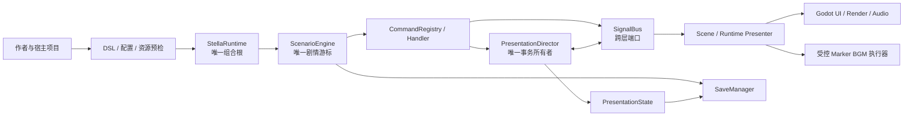

# Stella

Stella 是面向 Godot 4.6 的视觉小说框架，以 typed `.stla` 作者 DSL、单一运行时所有权和
可独立替换的表现系统为核心。

本仓库是引擎/框架，而不是某个游戏的兼容层。下游游戏用于验证 Stella 的真实能力：缺失能力
应在 Stella 中设计和实现，不得通过项目专用 parser、重复调度器或素材编码技巧掩盖。

## 主要能力

- **作者 DSL**：`.stla` 剧本、严格 closed grammar、带源码位置的 fail-close 诊断；
- **剧情引擎**：命令模式、可取消的 `ScenarioContext`、变量、条件、跳转与并行；
- **对话系统**：打字机、ADV/NVL/overlay、内联等待/速度/表情、`@combine`；
- **命名舞台**：任意人物/事件/SD/前景层，独立素材通道、变换、滤镜、转场与存档投影；
- **背景与特效**：独立背景层、fade/dissolve/wipe、shake/flash；
- **音频系统**：BGM、one-shot SE、persistent loop-SE、多层语音、DSP、回放；
- **Marker BGM**：在同一 BGM transport 中按音频 sample marker 原子切换 2..32 路 OGG stem；
- **原生电影**：typed `@movie` OGV 播放、独立音量、精确存读档位置；
- **事务化演出**：`PresentationDirector` 统一 JOIN/FNF、typed receipt、取消和选择性回滚；
- **存档系统**：多槽、自动/快速存档、继续游戏、canonical value snapshot；
- **播放控制**：Auto、仅已读 Skip、Backlog、语音重播和已读标记；
- **设置、动作与输入**：typed setting registry、稳定 action ID、键鼠/手柄与 UI 统一语义；
- **流程与扩展**：标题/游戏/overlay 状态、回想、收藏、解锁、本地化和可替换 UI。

## 技术基础

- Godot 4.6；CI 固定 Godot 4.6.1；
- 主要使用 GDScript；
- Marker BGM 因 Godot 公共 API 缺口使用受控的 C++17/godot-cpp GDExtension；
- GUT 单元/集成测试、Rendering Pixel Tests、三平台 native 构建和导出/PCK smoke。

## 快速开始

1. 克隆本仓库；
2. 使用 Godot 4.6 打开 `project.godot`；
3. 按 F5 运行公开 demo。

宿主项目安装、配置和 Facade 示例见 [使用指南](docs/USAGE.md)。

## 目录结构

```text
addons/stella/
├── autoload/             # StellaRuntime 组合根与 SignalBus 跨层端口
├── core/                 # parser、剧情、命令、事务、状态、存档、设置
├── presentation/         # Godot UI、渲染、音频和输入 Presenter
├── scenes/               # bootstrap 与默认场景
├── editor/               # 编辑器集成
└── native/               # GDExtension descriptor 模板

native/marker_bgm/        # Marker BGM 原生执行器与可复现构建
examples/demo/            # 可再分发 demo
tests/unit/               # 聚焦契约测试
tests/integration/        # 跨层与生命周期测试
docs/                     # DSL、使用、输入、架构与架构评审
```

## 架构速览



架构核心不是“所有东西都走 signal”，而是：

- `StellaRuntime` 是唯一组合根；
- `ScenarioEngine` 是唯一剧情执行游标；
- `PresentationDirector` 是阻塞演出的唯一事务/回执所有者；
- `SignalBus` 是跨层传输与兼容边界，不是第二套 Runtime；
- Core 保存逻辑 ID 和 canonical value，Presenter 拥有 Godot 节点与物理执行；
- 原生执行器只解决测量过的 Godot API 缺口，不拥有剧情或演出调度。

## 文档

- [架构设计](docs/ARCHITECTURE.md)：模块所有权与运行时数据流；
- [架构评审](docs/ARCHITECTURE_REVIEW.md)：当前判断、风险和演进方案；
- [DSL 规范](docs/DSL.md)：作者语法、默认值和错误行为；
- [使用指南](docs/USAGE.md)：宿主安装、配置、资源和 Facade；
- [输入设计](docs/INPUT_DESIGN.md)：输入优先级与一次输入边界；
- [竞品调研](docs/RESEARCH.md)：视觉小说引擎与语法对比。

文档发生冲突时：作者语法以 `DSL.md` 为准，宿主接入以 `USAGE.md` 为准，运行时所有权以
`ARCHITECTURE.md` 为准；源码和测试始终是最终可执行事实。

## 许可证

Stella 使用 [MIT License](LICENSE)。第三方组件保留各自许可证与 notice。
