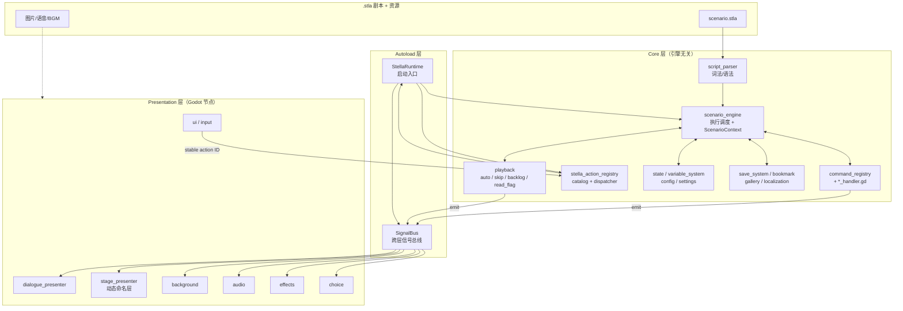
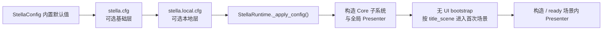
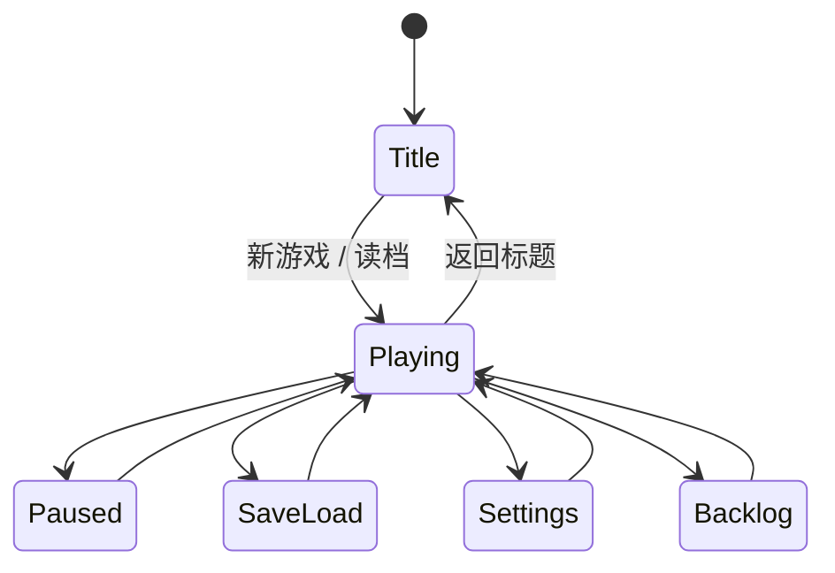

# Stella — Godot AVG / Galgame 框架架构设计

> 框架名称：**Stella**
> 仓库：`github.com/butter-stella/stella`
> 引擎：Godot 4 + GDScript

## 概述

Stella 是基于 Godot 4 的视觉小说 / Galgame 框架。设计目标：

- **架构清晰**：Core / Presentation 两层分离，Core 层与 Godot API 解耦，可独立单测
- **DSL 驱动**：自定义 `.stla` 脚本格式，引擎直接解析为内部数据结构
- **API 优先**：游戏项目自带 UI 场景，框架以 API + 信号的方式提供能力，不强加 UI
- **可扩展**：命令处理器、转场效果、舞台图片渲染方式均通过基类/注册表插拔扩展

---

## 一、架构总览

Stella 采用分层架构，由下至上：

- **Autoload 层**：`StellaRuntime`（启动入口）+ `SignalBus`（全局信号总线）
- **Core 层**：脚本解析、剧情引擎、命令处理、稳定 action catalog/dispatcher、变量、存档、设置、播放控制、已读、Backlog、收藏、鉴赏。引擎无关，可独立单测
- **Presentation 层**：对话、动态舞台、背景、音频、选择、特效、UI。基于 Godot 节点，订阅 SignalBus 渲染

Core 命令与 Presentation 事件通过 `SignalBus` 解耦；用户 UI/input 的稳定语义 intent 先经
Runtime-owned action registry，再由 Runtime 的 canonical callback 进入相同 subsystem 或
Presenter owner。

### 1.1 模块依赖与数据流



**数据流说明**：
- 正向：`.stla` → `script_parser` → `scenario_engine` 调度 → `command_registry` 分发到各 `*_handler` → 通过 `SignalBus` 广播给 Presentation 层 presenter
- 反向：Button 与 `presentation/input` 把稳定 action ID 交给同一个 registry；Runtime callback
  再推进 exact Presenter/engine owner 或发出兼容 `SignalBus` 事件
- `playback` 子模块（auto/skip/backlog/read_flag）状态独立，与 engine 协作并通过 SignalBus 与 UI 联动

#### Runtime-owned action catalog

`StellaRuntime` 在 composition root 中同步构造唯一 `StellaActionRegistry`。构造使用只存在于
调用栈内的私有 capability，一次性注册 18 个 canonical built-in ID；unknown、duplicate、
missing definition、invalid metadata 或 callback 会清空全部 entry，使 Runtime 明确报错并拒绝
部分 catalog 启动。公开持有 `StellaRuntime` 或 `action_registry` 不能取得该 capability，也不能
注册或替换 built-in ID。

每个 entry 保存 immutable generation、exact Node owner ID 与 weak owner reference。项目 action
只能使用 lowercase namespaced ID，callback 必须属于 live tree-bound exact owner；owner 的
`tree_exiting` 自动注销其全部 entry 并断开连接。registry 不以 bound Callable 反向延长
RefCounted owner 生命周期。catalog/metadata/context 都以 defensive copy 越过公开边界；
`can_execute` 与 `is_active` 是严格返回 bool 的无副作用 query，execute 只有返回 true 才是
成功。

execute/query/confirmation 与 catalog lifecycle 允许同步重入，但每个用户 callback 后都会重取
并校验 exact generation/owner receipt。`action_state_changed` 是只读投影边界：listener 可同步
查询 metadata、availability、active state，但在该 signal 栈内再次 execute 会明确 `FAILED`。
因此产生通知的 Runtime/Presenter transaction 不会被 Binding listener 半途重入；也不需要
deferred call、polling、timer 或第二 scheduler。catalog add/remove 的 signal 不会把 retired
entry 的 state event 投到同 ID replacement；全量 state 通知按 ID/generation/owner snapshot
遍历。action state 由 game state、Auto/Skip、存档、choice、voice、Presenter、ScenarioEngine
的 typed command-position edge 和 custom owner 的显式 signal 驱动。

`disruptive` / `destructive` 第一次 dispatch 只创建 single-use opaque confirmation token 并发出
request；confirmed dispatch 必须携带 exact token，且 token 在 execute callback 前消费。新的
top-level request 会退休该 action 的旧未确认 receipt；同一同步 confirmation dispatch 内的
nested receipt 相互独立，但有明确的 8 个上界，超过即 fail-close。多个同步或异步 listener
竞争时至多一个能执行；request signal 返回后也会复验 receipt，不能给已注销或 replacement
的 action 误报 confirmation required。legacy Inspector enum 仅是一对一
canonical ID adapter；它为既有 destructive scene 同步消费该次专用 receipt，并用 context
marker 让正常 confirmation UI 忽略，不形成第二 dispatcher 或永久 bypass。

`StellaAction` 是任意 `BaseButton` 的声明式 Presentation binding。它和内建
`DialoguePresenter` 工具栏都消费上述同一 registry，事件驱动投影 label、availability 和
active。场景 authored Button 的视觉与 geometry 保持不变；动态换成 non-toggle 或 action
注销时会清除陈旧 pressed state，catalog label 消失时恢复 ready 时保存的 authored fallback。
exact built-in DialoguePresenter 只有在 clear/avatar/clip 三项 typed admission 以及背景/Profile
校验完成后才发布到 Runtime 的 action weak view，然后绑定 authored toolbar children；非空
Toolbar 不清空、不重建，空 Toolbar 的默认产品 UI 也只创建相同 Binding。项目 Presenter
subclass 不进入该 view，exact-script registry 检查不放宽。scene replacement overlap 时由最新
publish 且仍 live 的 exact Presenter 接管 action；它退出后恢复下一位仍 live 的 older owner，
无效 WeakRef 会逆序原地清除。最终 publication 失败会原子注销已取得的 clear/avatar/clip 三项
capability，不留下 half-connected participant。

### 1.2 启动配置数据流

项目配置必须在任何消费者构造前解析为一个一致的快照。`StellaRuntime._init()` 先解析并应用配置，随后 `_ready()` 才构造子系统；因此即使插件保留宿主自定义主场景，该场景的成员初始化器与 `_init()` 也能读取最终快照。启动顺序是：



每一层都按 key 合并，优先级为 `defaults < base < local`。来源不存在时是无副作用的 no-op；目录或悬空软链仍算“存在但不可读”，必须诊断。来源存在时，`StellaConfig.load_from_path()` 会先读完整文件并校验文件中声明的 section、key 和值类型，只有全部成功才提交这一来源及其来源记录。未知 section/key、类型错误、NUL、非法 UTF-8 或语法损坏都会原子拒绝整个来源。因此损坏的本地层不会留下半套覆盖，基础层仍保持完整；损坏的基础层保持 defaults，报告错误并阻止本地层掩盖共享配置错误。每个来源最多 1 MiB，每个 quoted String 的原始 UTF-8 表示最多 256 KiB；解析器按连续片段线性组装字符串，先检查字节编码、NUL 和上限，再创建 resolved value。语法诊断只保留来源、安全的行列位置和预期修复提示，schema 诊断只保留相关 section/key（类型错误另带预期类型），均不回显配置值。`get_applied_config_sources()` 只返回成功提交的来源，并保持实际应用顺序。标量值和字符串转义继续兼容 Godot 4.6 `ConfigFile`，注释则只使用其稳定的分号 `;` 语法；`#` 不作为行尾注释。`StellaConfig.SCHEMA_VERSION == 2` 是此次严格 closed schema 的可识别迁移边界：v1 直接加载时会忽略的未知 section/key 在 v2 中整源拒绝，宿主自定义元数据必须迁出 Stella 配置文件。

解析不是在旧对象上反复打补丁。`_load_project_config()` 每次都从新的 `StellaConfig` 和内置默认值开始，`_apply_config()` 则无条件完整复制 resolved snapshot（即使没有来源成功应用），因此删除或禁用配置来源后重新解析不会让 Runtime 镜像残留上一次的路径或其他值；需要复用配置对象的调用方可用 `StellaConfig.reset()` 恢复默认值，并同时清空 `has_config_file`、来源列表和错误元数据。完成解析和应用后才创建 Core 子系统与全局 Presenter；项目默认主场景是无 UI 的 `bootstrap.tscn`，它随后按最终 `title_scene` 进入首次场景。所有 configured scene（title、game、overlay）共用递归 PackedScene 预检，并在状态提交前拒绝不存在、声明类型与实际资源不兼容、现存但不可解析、依赖退化、无节点、bootstrap 行为、脚本原生基类与节点类型不兼容、脚本不可实例化或有效 `_init()` 仍需实参的候选场景；title 失败时统一回退内置标题。源码 `.tscn`/`.tres` 依赖先由脱敏 metadata/Variant parser 校验，包含构造器参数以及 ExtResource/SubResource 声明引用关系；parser 同时按格式验证 tag、顺序和必填字段：`.tscn` 只接受 `ext_resource`、`sub_resource`、`node`、`connection`、`editable`，`.tres` 只接受 `ext_resource`、`sub_resource`、唯一的 `resource`。单个 tag 最多 512 KiB、单个 quoted attribute 最多 256 KiB，quoted value 用连续片段线性组装，避免启动路径的二次复杂度。Godot 4.6 不接受资源文件的 UTF-8 BOM，因此 parser 会在任何 `ResourceLoader` 调用前安全拒绝 BOM，并只跳过 header 前的空行和分号注释，任意其他非 header 文本都直接拒绝，不把 malformed 私有值交给 Godot 会回显原文的 resource parser。依赖类型检查复用同一套 byte/header gate；只有明确的 `RSRC` / `RSCC` magic 或导出 remap 才进入结构化依赖读取。继承场景按完整相对 NodePath 归并最终 effective script override（包括 inherited child 或普通 nested editable child 上的 `script = null` 或安全替换），仍继续检查未被覆盖的 base children；custom `script_class` Resource 按全局脚本继承链参与声明类型匹配。首次启动和之后返回标题使用同一个 resolver；`return_to_title()` 会延迟整个切换事务以避开场景根 `_ready()` 的 busy-parent 阶段，并且只在 `SceneTree.scene_changed` 后确认最终 `current_scene` 是目标标题，才清理运行状态、切到 `TITLE` 和播放标题 BGM。SceneTree 最终仍拒绝已预检的自定义场景时，返回路径会再尝试内置 fallback。已有项目若使用自定义主场景，插件不会覆盖；旧版内置标题主场景会迁移到 bootstrap。场景内 Presenter 在此之后构造或进入 ready，不会观察到部分应用的配置。

Core 的 `TextResourceInspector.inspect()` 是源码 `.tscn` / `.tres` 无副作用预检的单一 typed API；`StellaRuntime` 只消费 `InspectionResult`，不再承载资源 grammar。Inspector 会在任何 Godot resource parser 调用前校验 tag 与 attribute key 的 identifier token、node/sub-resource 类型是否存在并继承正确的 `Node` / `Resource` 基类（包括注册到 ClassDB 的 GDExtension class）。quoted tag attribute 和 Variant String 共用 Godot 4.6 兼容的 decoder，包括 `\u` / `\U`、引号、反斜杠和未知转义；resource ID 则按 Godot 4.6 numeric Variant 语义规范化到同一无歧义 key：numeric token 先转换为 Godot 的 canonical String，quoted ID 保留 decoded 原文并进入同一 key 域。因此正负整数、int64 边界外字面量、decimal、exponent、有限值格式化和浮点溢出的 `inf` / `-inf` 都能与同值 canonical quoted ID 匹配，而 `"01"` 等非 canonical 文本仍保持独立；quoted 空 ID 是合法的独立 key，缺少 token 的 unquoted 空 ID 仍非法。tokenizer 不接受的前导 `+` 和 hex 继续拒绝。文本、binary `.scn` 和导出 remap 的 PackedScene 统一转换为紧凑 SceneState model；Inspector 不展开每个 nested instance 的完整子树，只在 parent、owner、connection、editable 或 property-only override 实际查询某条完整 NodePath 时惰性解析 inherited/nested tree。单次顶层 inspection 按 canonical path + expected type memoize 已完成结果，所以同一 nested scene 被重复实例化不会指数级重复预检。

标题依赖和 Runtime scene destination 带 UID 时优先跟随 UID registry 的当前规范路径，只有依赖 UID 不可用才采用序列化 fallback，避免资源移动后被旧 fallback 误判为缺失，也避免以 `uid://` 请求后拿 canonical `res://` 比较而永久占用导航槽。所有 Runtime 场景入口（包括 legacy `start_scenario`）共享单一 navigation generation 和在途场景请求槽：每次先无副作用地解析 scenario、按目标 `ScenarioData` 校验存档中全部内置 provider schema（scenario/scene/command 边界、return/NVL 数组、变量/表现/解锁/流程图字段类型），再深度加载目标 PackedScene；校验失败不会取得所有权，也不会改变当前 scene、context、overlay、state 或路径。`DslParser.parse(tokens, id, source_path)` 在公开 parser 边界就从规范化剧本来源路径生成带版本前缀的 SHA-256 identity 并存入 `ScenarioData`；Runtime 与扩展调用该 API 得到同一语义。程序化构造的 `ScenarioData` 可用 `set_authored_identity(stable_key)` 显式生成另一个带域前缀的 hashed identity 并存入 scenario snapshot，因此不同目录中同名 `.stla` 不会互相接收存档，存档本身也不暴露私有来源路径或 authored key。缺少该 identity 的旧存档无法无歧义迁移，Runtime 的 `load_game` / quick / continue 路径统一 fail-closed；需要迁移的宿主工具可先用不传 `ScenarioData` 的通用读取 API 检查 JSON，再按自己的旧版本映射显式重写。有效的后调用会接管所有权，使旧 ScenarioEngine run generation 同步失效，等待旧场景请求落地后再发出自己的目标请求；只有确认最终 scene 后才脱离旧 context、发 abort 并提交新运行状态。旧 continuation 每次 await 后必须验证所有权，因此最终 destination 与状态遵循 last-call-wins。

`ScenarioEngine` 自己也为每次 `run()` 维护独立世代。`scenario_started`、`scene_changed`、`command_executed` 等外部可重入 signal 返回后，以及最终发送 `scenario_ended` 前，都必须复查同一 context 与世代；Runtime 只接受 engine 正在为当前 active run 同步发送的 end event，并在公开 `SignalBus.scenario_ended_event` 返回后再次复查再决定是否返回标题。这样 signal callback 内发起的新导航可以立即取消旧控制流，旧 run 或 bridge tail 都不会覆盖新 owner。

测试隔离属于同一启动边界。CI 和标准测试命令必须显式设置
`STELLA_DISABLE_LOCAL_CONFIG=1` 与 `STELLA_DISABLE_IMPLICIT_SETTINGS_LOAD=1`；两者只跳过
隐式的 `res://stella.local.cfg` 和 `user://settings.json`，显式传给测试辅助路径的 synthetic
配置及显式 settings load/save 仍正常走 production parser/manager。CI 的 GUT 与 rendering job
都会在项目根创建合法的 poison local 配置；完整 GUT 还直接断言 Runtime 的 `game_title` 未采用
poison 值，而不是只依赖来源记录。

配置中的 scene override 与 settings schema 是字符串形式的动态依赖，Selected
Scenes/Resources 导出无法自动追踪；宿主导出 preset 必须显式收录 schema JSON 和
title/game/各 overlay scene。bootstrap 对内置 fallback title 使用静态 PackedScene 依赖，确保即使只选择 bootstrap 也能安全回退。CI 另以 Godot 4.6.1 把 Binary Tokens、Compressed Binary Tokens 和 Selected Scenes 三种 PCK 导出后从源码目录外启动；export 前会创建被 include filter 选中、必须由 exclude filter 剔除的 synthetic `stella.local.cfg`，每个运行态 probe 都直接断言包内不存在该文件，再检查最终 `current_scene` 与配置 consumer 的真实值。Compressed Binary Tokens 还运行 UID/superseding/失败事务/lifecycle-reentrancy 导航探针，以及 existing-but-wrong-type 与 existing-but-unloadable 私有依赖 fallback 探针，避免“导出成功但运行态配置、导航或依赖校验损坏”的假绿。

Compressed PCK 的真实进程回归同时覆盖 signed、int64 边界外、exponent、non-finite、quoted 空 ExtResource/SubResource ID，以及 finite big / negative small numeric 与 canonical quoted resource ID 的双向匹配；还覆盖 binary `.scn` nested child 的 property override，以及 unknown native type、无效 parent/owner/attribute 的 title、game 与 overlay 目标。失败路径断言旧 scene/context/overlay/state owner 不变，外层日志 gate 则确认私有 sentinel 没有进入 Godot parser。

---

## 二、核心设计

### 2.1 命令模式 — 整个框架的基石

```gdscript
# 命令处理器基类
class_name CommandHandler extends RefCounted

func get_command_type() -> String:
    return ""

func execute(data: CommandData, context: ScenarioContext) -> void:
    pass
```

```gdscript
# 命令注册表
class_name CommandRegistry extends RefCounted

var _handlers: Dictionary = {}  # String -> CommandHandler

func register(handler: CommandHandler) -> void:
    _handlers[handler.get_command_type()] = handler

func get_handler(command_type: String) -> CommandHandler:
    return _handlers.get(command_type)
```

新增指令只需继承 `CommandHandler`，注册到 `CommandRegistry`，符合开闭原则。当前框架内置的 handler 见 `addons/stella/core/commands/`，覆盖对话、命名舞台层、背景、音频、选择、跳转、条件、变量赋值、特效、并行和调用等指令。

阻塞型 handler 必须加入传入 `ScenarioContext` 所代表的执行代际。等待普通 Godot signal 时应使用 `await CommandHandler.await_with_abort(target, context)`；这样载入、重启或回滚替换 context 后，只会取消旧代际的等待，不会留下能响应后续输入的旧连接。仅等待全局 `engine_abort_requested` 不能覆盖所有 context 替换路径。

Timed `WaitHandler` 在同一个 Core handler 内把 `SceneTreeTimer.timeout`、可选的普通玩家 advance、persistent Skip activation 与 context/global cancellation 合成为一次 exact race；它不创建第二 scheduler。每个 waiter 在安装时记录 `SignalBus.current_advance_dispatch_serial()`，只接受更晚的 dispatch，因此结束当前 wait 的 signal tail 不能同时结束同步创建的下一条 wait。首个 terminal 会断开 timer、advance、Skip 与 cancellation 的所有其余 listener；load、rollback、restart、return-to-title、session reset 和 scenario replacement 都通过相同 `ScenarioContext` generation 退休旧 owner。Auto 不属于 player skip，保持 authored duration。

### 2.2 剧情引擎

主循环：`LoadScenario → SetScene → FetchCommand → Dispatch → WaitForCompletion → Next`

```
core/scenario_engine/
├── scenario_engine.gd       -- 主引擎
├── scenario_context.gd      -- 运行时上下文（场景、指令指针、调用栈、变量存储）
├── scenario_playback_context.gd -- Runtime-only story/recollection caller contract
├── wait_controller.gd       -- 等待控制（点击/动画/选择）
└── expression_timeline.gd   -- 对话头像标记与打字机内联效果时间线
```

```gdscript
# ScenarioEngine 核心流程（简化版）
class_name ScenarioEngine extends RefCounted

signal scenario_started(scenario_id: String)
signal scenario_ended(scenario_id: String)
signal scene_changed(scene_id: String)
signal command_executed(command_data: CommandData)

var context: ScenarioContext
var registry: CommandRegistry

func load_scenario(data: ScenarioData) -> void:
    context = ScenarioContext.new(data)

func run() -> void:
    while not context.is_finished:
        if context.pending_jump != "":
            _jump_to_scene(context.pending_jump)
            continue

        var cmd := context.current_command()
        if cmd == null:
            _advance_to_next_scene()
            continue

        var handler := registry.get_handler(cmd.type)
        if handler:
            await handler.execute(cmd, context)
            command_executed.emit(cmd)

        context.advance()

    scenario_ended.emit(context.scenario_data.id)
```

`ScenarioPlaybackContext` 是每次 ScenarioContext execution 的 Runtime-only owner：story 没有 caller；recollection 只持有入口已验证的零参数 continuation。入口接受状态在 scene handoff 前封存；target 随后失效不能把已接受的 execution 降级成 story 或绕开 return cleanup，只会令 cleanup 后的最终 callback validation fail-close。它不进入 `ScenarioContext.capture_snapshot()`，因为 Callable 无法跨 scene/process/script revision 安全重建。`@recollection_exit` handler 在 story 中同步 no-op，在 recollection 中只标记当前 context terminal 并记录 authored line；它不直接调用项目代码。ScenarioEngine 仍从唯一的 canonical `scenario_ended` bridge 交回 Runtime，因此 DSL exit、自然耗尽和 `return_from_recollection()` 竞争同一 `ACTIVE → RETURNING → RETURNED|CANCELLED` exact-once claim。

Return claim 必须先于任何可重入 cleanup signal。获胜 generation 取得现有 Runtime navigation ownership，退休 engine/choice execution，清 PresentationDirector、Stage、clip、chapter、dialogue、BGM/loop-SE、canonical state、Backlog/choice history 与 Auto/Skip，最后将 game state 置为 PAUSED 并结束该 navigation；之后才重新验证并调用 continuation。入口后 target 即使失效，也必须完成同样清理，再以触发位置 `source_path:line` fail-close。settlement 在 callback 前提交且 callback 是函数的最后一个副作用，因此 callback 同步启动 story、新 recollection 或 title 时，旧 return 没有 cleanup tail 能误杀新 owner。

任何成功的 normal start/load/title replacement 都通过现有 navigation generation 取消 recollection caller，而不是调用它。Recollection 内禁止 manual/quick/auto save 与所有 rollback cursor mutation；Backlog read-only、Auto 与 Skip 则沿用普通 execution policy。实际正常完成的 Dialogue 仍按同一 source identity/command UID 写入 monotonic read flags；return cleanup 不回滚 read flags 或 UnlockManager，且 playback entry/exit 本身不猜测、创建任何 gallery unlock。Runtime 不保存 caller、不推导返回 scene、不引入 Timer/第二 scheduler，也不提供 KAG/legacy alias。

### 2.3 信号总线

利用 Godot 原生信号机制，通过 Autoload 单例实现全局事件总线：

```gdscript
# autoload/signal_bus.gd
extends Node

# 对话；typed request 是内建主链，三参数信号只作兼容通知
signal dialogue_requested(request: DialogueRequest)
signal show_dialogue(character: String, segments: Array, mode: String)
signal hide_dialogue()
# 已确认 request 的表现层兼容通知；不负责完成剧情命令
signal advance_requested()

# 对话可见性；target-scoped state apply 只用于失败事务的 cut rollback
signal dialogue_visibility_operations_requested(operations: Array, force_cut: bool)
signal dialogue_visibility_targets_state_apply_requested(visibility: Dictionary, targets: Array)
signal dialogue_visibility_transition_receipt_started(presenter_instance_id: int, target: String, token: int, operation_request_id: int, generation: int)
signal dialogue_visibility_transition_terminal(presenter_instance_id: int, target: String, token: int, operation_request_id: int, generation: int, outcome: StringName)
signal dialogue_clear_validate_requested(request: DialogueClearOperationRequest)
signal dialogue_clear_accept_requested(request: DialogueClearOperationRequest)
signal dialogue_clear_apply_requested(request: DialogueClearOperationRequest)
signal dialogue_content_state_apply_requested(content: Dictionary, runtime_binding: Dictionary)

# 可寻址对话头像；固定 dialogue:avatar channel 的 typed participant barrier
signal dialogue_avatar_validate_requested(request: DialogueAvatarOperationRequest)
signal dialogue_avatar_accept_requested(request: DialogueAvatarOperationRequest)
signal dialogue_avatar_apply_readiness_requested(request: DialogueAvatarOperationRequest)
signal dialogue_avatar_apply_requested(request: DialogueAvatarOperationRequest)
signal dialogue_avatar_operation_committed(operation: DialogueAvatarPresentationOperation)
signal dialogue_avatar_transition_receipt_started(presenter_instance_id: int, token: int, operation_request_id: int, generation: int)
signal dialogue_avatar_transition_terminal(presenter_instance_id: int, token: int, operation_request_id: int, generation: int, outcome: StringName)
signal dialogue_avatar_visuals_reset_requested(epoch: int)
signal dialogue_avatar_state_apply_requested(state: Dictionary, epoch: int)

# 当前章节；public metadata 与内部 typed barrier 分离
signal current_chapter_changed(chapter_id: String, title: String)
signal chapter_indicator_validate_requested(request: ChapterIndicatorRequest)
signal chapter_indicator_accept_requested(request: ChapterIndicatorRequest)
signal chapter_indicator_apply_requested(request: ChapterIndicatorRequest)
signal chapter_indicator_request_finished(request_id: int, success: bool)
signal chapter_indicator_transition_receipt_started(presenter_instance_id: int, token: int, operation_request_id: int, generation: int)
signal chapter_indicator_transition_terminal(presenter_instance_id: int, token: int, operation_request_id: int, generation: int, outcome: StringName)

# 动态命名舞台层
signal stage_operations_requested(operations: Array, force_cut: bool)
signal stage_operation_request_finished(request_id: int, delivered: bool)
signal stage_visuals_reset_requested()
signal stage_state_apply_requested(layers: Dictionary)
signal stage_transition_started(presenter_instance_id: int, layer_id: String, token: int, operation_request_id: int)
signal stage_transition_receipt_started(presenter_instance_id: int, layer_id: String, token: int, operation_request_id: int, generation: int)
signal stage_transition_terminal(presenter_instance_id: int, layer_id: String, token: int, operation_request_id: int, generation: int, outcome: StringName)
signal stage_transitions_finish_requested(transitions: Array)
signal stage_transition_receipts_finish_requested(transitions: Array)

# 背景
signal bg_changed(asset: String, transition: String, duration: float)

# BGM：与其他 typed presentation child 共用唯一 Director queue
signal bgm_validate_requested(request: BgmOperationRequest)
signal bgm_accept_requested(request: BgmOperationRequest)
signal bgm_apply_requested(request: BgmOperationRequest)
signal bgm_operation_committed(operation: BgmPresentationOperation, state: Dictionary)
signal bgm_transition_receipt_started(presenter_instance_id: int, token: int, operation_request_id: int, generation: int)
signal bgm_transition_terminal(presenter_instance_id: int, token: int, operation_request_id: int, generation: int, outcome: StringName)
signal bgm_projection_reset_requested(epoch: int)
signal bgm_state_apply_requested(state: Dictionary, generation: int)

# 其他音频
signal se_play(asset: String)
signal loop_se_validate_requested(request: LoopSeOperationRequest)
signal loop_se_accept_requested(request: LoopSeOperationRequest)
signal loop_se_apply_requested(request: LoopSeOperationRequest)
signal loop_se_transition_receipt_started(presenter_instance_id: int, channel_id: String, token: int, operation_request_id: int, generation: int)
signal loop_se_transition_terminal(presenter_instance_id: int, channel_id: String, token: int, operation_request_id: int, generation: int, outcome: StringName)
signal loop_se_projection_reset_requested(epoch: int)
signal loop_se_state_apply_requested(channels: Dictionary, generation: int)
signal voice_play(asset: String, character: String)
signal voice_started(character: String, asset: String)
signal voice_progress(position: float, duration: float)
signal voice_finished()

# 选择
signal choice_show(prompt: String, options: Array)
signal choice_selected(option_id: String)

# 特效
signal effect_requested(effect_type: String, params: Dictionary)
signal fade_requested(direction: String, duration: float)

# 系统
signal scenario_started_event(scenario_id: String)
signal scenario_ended_event(scenario_id: String)
signal scene_changed_event(scene_id: String)
signal variable_changed(var_name: String, value: Variant)
signal settings_changed(key: String, value: Variant)
```

舞台写操作统一通过 `SignalBus.emit_stage_operations()` 提交；该入口会深拷贝并串行派发同步重入的批次。每批有唯一 request ID，转场开始回执携带同一 ID，因此对话补全只会终止自己发出的 Tween。`stage_operations_requested` 是内部投递信号，状态跟踪器和 Presenter 因而始终按相同顺序观察操作，不会因监听器连接顺序产生存档与画面分叉。`reset_and_apply_stage_state()` 把旧舞台 generation 的 reset 与 canonical state cut 投影放在同一原子边界；恢复会同时取消队列并使正在投递的旧批次对后续消费者失效。旧四参 `stage_transition_started` 与旧三字段 `stage_transitions_finish_requested` 仍是扩展兼容面；`PresentationDirector` 只使用携带 Presenter generation 的 exact companion 信号建立和完成 receipt。

#### PresentationDirector 与 exact typed composition

`StellaRuntime` 作为唯一 composition root，只构造并持有一个 `PresentationDirector`。Stage、addressable dialogue avatar、dialogue visibility、dialogue content clear、declarative presentation clip、chapter indicator、persistent loop-SE 与 BGM 都通过这个 owner/lifecycle 边界：

- `PresentationOperation` 是只读 typed operation，暴露 kind、channel、deep-copy payload 和 source location。concrete kind 为 `StagePresentationOperation`（`stage:<layer_id>` / `stage:*`）、固定 channel `dialogue:avatar` 的 `DialogueAvatarPresentationOperation`、`DialogueVisibilityPresentationOperation`（`dialogue:surface` / `dialogue:quick_menu`）、固定 channel `dialogue:content` 的 `DialogueClearPresentationOperation`、唯一 `clip:<logical-id>` 的 `PresentationClipPresentationOperation`、固定 channel `chapter:indicator` 的 `ChapterIndicatorPresentationOperation`、`LoopSePresentationOperation`（`loop_se:<channel_id>`），以及固定 channel `bgm:main` 的 `BgmPresentationOperation`。
- `PresentationOperationReceipt` 用 `batch_id / presenter_instance_id / channel / token / generation` 五元组唯一标识 Presenter 真正拥有的转场；单独 layer ID 不能完成批次。
- `PresentationBatchRequest` 的 policy 为 `JOIN` / `FIRE_AND_FORGET`，outcome 为 `COMPLETED` / `CANCELLED` / `FAILED`。operation/receipt getter 返回 defensive container，`settled(batch_id, outcome)` 只发送一次。`_bind_authority()`、`_seal()` 和 `_settle()` 是 Director 内部 authority 方法，不是 caller API。
- `PresentationRequestReservation` 是 Director 签发、绑定签发 authority 且只能消费一次的内部 capability。`@combine` 可在同步投递前读取其单调 request ID 来登记 exact segment owner，但 `submit()` 只接受并消费同一 Director 当前持有的 capability；伪造、跨 Director、重复、取消、放弃或与 active raw queue 数值碰撞的 token 都会在建立 entry、入队或触发 callback 前 fail-close。任何本地 sidecar/context 失败会显式放弃 capability，Director reset 则取消全部尚未消费的 capability，不能留下裸整数 reservation 或悬挂 bookkeeping。

Parser 把整个 `@stage_batch` 编译为一个 addressable `CommandData(type="stage_batch")`，`declared_line` 是 block opening line，params 精确为 `policy / operations / operation_lines`。`operations` 中每项都是 `action / id / properties / transition / transition_params / duration` canonical six-field；`transition_params` 是参数顺序无关、primitive-only 的 typed Dictionary，内置 rule/mosaic 使用 closed schema，扩展 kind 到 Presenter-local registry 再完成 provider schema/resource validation。`operation_lines` 与 child 一一对应，保留在可执行 params 中供程序化调用在 runtime fail-close 时定位原始 child source line，但它只是诊断元数据，会从 `stage_batch` semantic content fingerprint 排除；`policy` 与 `operations` 仍参与 identity。

`submit()` 对普通调用会在自动分配 request ID 之前完成 authoritative typed schema/context preflight；`@combine` 为先登记本地 segment owner 而预留的 capability 也必须在这一步单次消费并从 reservation map 移除。preflight 检查所有 kind 的 canonical payload、duplicate channel、Stage clear 冲突，并以 canonical state 做 semantic reduce。chapter 即使已经处于 authored target 也不会跳过 binding validation；avatar、loop-SE/BGM 也必须进入 Bus，让唯一 Runtime-owned Presenter 证明 logical resource、完整 loop region 与当前投影都可用。invalid 与不含 Stage/dialogue avatar/dialogue clear/loop-SE/BGM live ownership 的真实 no-work 路径不进入 Bus，也不分配 receipt、token 或 Tween；这类 no-work 会以 `batch_id=0`、`receipts=[]` 同步 `COMPLETED`。每条 Stage（包括 same-target、unknown remove）、dialogue avatar、dialogue clear 与每条 loop-SE/BGM 都是 live projection ownership exception：它们不能仅凭 canonical Dictionary 相等而短路；Stage 仍须让本轮 Runtime-owned Presenter quorum 重验 provider、资源与 viewport/budget，avatar 则重验 source asset 与内部固定 binding，稳定对齐时以 positive batch、零 receipt/Tween 同步完成。dialogue clear 即使页面已为空也取得 positive batch id，并由 Runtime-owned Presenter quorum 完成 validate → accept → synchronous apply；clear 是 cut-only content boundary，不创建 transition receipt、token、Tween 或 wall-clock wait，headless 零 Presenter 同样以正向零 receipt 完成。BGM same playing asset+cue+volume+stem mix 仍取得 positive Presenter/resource preflight；稳定物理投影才以零 receipt 完成，只改 volume 或 stem mix 则保留 player/stream/cursor。若同 target 仍在 fade，Presenter 先 exact-complete 旧 receipt 到 canonical endpoint，再让当前 positive batch 继续；paused `play` 重启 cue，`resume` 才保留 cursor。

有工作的操作在同一 `SignalBus` dispatch boundary 中原子派发。Bus 在任何 child apply 前收集并验证完整 Stage/dialogue/chapter Presenter registry，并让唯一 AudioPresenter 对每个 loop-SE/BGM resource 完成 typed validate/accept。每个连续 Stage run 建立一个 `StageOperationRequest`：Runtime admission snapshot 绑定 exact Presenter+capability 与 capability-bound transaction callable；同一 generic batch 的所有 Stage run还共享一条 authored-order preflight chain，因此即使中间隔着 dialogue/chapter/audio child，Presenter 也先在私有 shadow state 中依次 reduce，后一条 Stage 的 source snapshot 可以来自前一条 sealed target，但 live state 仍保持未变。Presenter-local transition registry 同步验证 provider、Shader、逻辑资源、viewport/预算，并在 live layer mutation 前构造 sealed source/target projection snapshots；零 StagePresenter、validate/accept/apply 任一 quorum 缺失都 fail-close。apply 前先经过 readiness 与 claim 两道无 mutation barrier：所有捕获的 StagePresenter 都重验 viewport、expected-before 与 sealed holder/material；全员 claim 且 capability/liveness/epoch 仍有效后，Bus 才进入不再广播普通 apply signal 的私有 hold→commit 段。所有 Presenter 的 receipt/start/terminal 都在 whole quorum private commit 完成前保持队列化；全员 commit 后 Bus 再检查 exact participant、capability 与 Stage epoch，先把 Stage rollback ownership 交给 Director，然后才逐 Presenter 释放 publication hold。每次 publication 返回后仍重验相同 authority；同步 receipt listener 若 reset、替换 scene 或退休其他 Presenter，旧 request 会禁止 public raw notification，epoch 仍 current 才由 Director rollback，epoch 已变化则由新 lifecycle boundary 收敛且旧 rollback 不得覆盖。所有 hold、queued event 与 applying slot 在每个 terminal path exact 清理。任一资源、cue、marker 缺失/非法或 participant 拒绝都会在第一个 child mutation 前令整批 `FAILED`。seal 后按 authored child order 跨 kind 派发，operation source line、channel 与 receipt 一一保持。Bus 在每个连续 typed Stage run whole private commit 成功后才把实际 channels 交给 Director。`JOIN` 只等待 dispatch tail 封存的 exact receipt union；零 receipt 同步完成，current owner 的任一 superseded/cancelled receipt 都使该 JOIN fail-close。`FIRE_AND_FORGET` 在 dispatch seal 后释放剧情，但 Director 继续持有 receipts 直到 terminal cleanup。连续 batch 经 Bus 串行；同 channel 重叠时由 Presenter generation 决定 winner，late、foreign 或 duplicate terminal 不能完成新 batch。

Director 还统一拥有 blocking presentation waiter。所有 typed operation 共享 Runtime 的 generic lifecycle 判断，不再各自维护 sibling flag。dialogue clear 提交显式 `cleared=true` 的 versioned content state，同时只推进 NVL page epoch；它不通过空字符串推断，也不改 mode/profile/visibility/backlog。Presenter 只退休当前 dialogue-content 拥有的 typewriter、voice 与 inline stage-cue callback，绝不触碰独立 Stage owner。session reset、load、rollback、restart、return-to-title 或 context replacement 先退休旧 generation/owner，再 reset 并在需要时 cut canonical state；旧 callback 不能复活。纯 Presentation SceneTree/UI replacement 不清 persistent loop-SE/BGM canonical state：旧 AudioPresenter 同步提交 canonical incoming 的物理 position、退休自己的 projection/callback，新 Runtime-owned Presenter 再从该 state cut-project 一次，不能重复 player。context/global abort 会把仍有 exact BGM receipt 的 Tween cut 到已提交 stable target，不能留下无 Director owner 的 player。可逆导航被拒绝时，Runtime 恢复该命令之前的 canonical state，然后在 retained cursor 重新派发，不会 resume 已取消的 coroutine。

Presentation clip 是一条短 DSL 对一个 data-only definition，而不是把 source macro 展开为 runtime 参数。resolver 只在 configured logical root 下接受 `.tres`，scene 只接受 `.tscn`。安全边界分成两个真实阶段：首次 `ResourceLoader.load()` 前，`TextResourceInspector` 与递归 dependency graph 拒绝 external/embedded Script、binary scene/resource、malformed/undeclared dependency；dependency walk 本身也有独立 depth/resource-work 上限，循环或恶意深链不会先耗尽递归栈。definition 被 deep-isolated load 后、任何 scene instantiate 前，`SceneState` 继续拒绝 script、独立 clock、nested render surface 与 3D owner，并按每个实际 nested instance 的展开 multiplicity 保留最多 512 个 node path（重复引用不按 resource 去重）；SceneState walk 同样以 ancestry 与 node-work 双上限 fail-close 循环、深链和展开溢出。最后只在 detached、尚未入树的实例上验证 node count 与预留结果一致，并验证 autoplay、audio/video/Timer/AnimationTree/particle/AnimatedTexture owner、`TIME` shader、nested Animation track 与越界/无效 track target；成功前不产生 UI、audio 或 scene-tree mutation。deep-isolated definition 在 seal 时变成 private immutable value/scene plan；Request 公开 getter 只返回 primitive defensive snapshot，任何 signal listener、全局 cache alias 或 settled 后 mutation 都不能更改 active cue/skip/transition/resource budget。

唯一 main AnimationPlayer 是 bounded timeline authority：main loop 与非正/非有限 speed 预检失败。单一 ordered cue 数组携带 stable ordinal 和可选 importer provenance；state cue player固定为 manual callback mode，并只按 `main_position - offset` seek（loop state也按 main local time取模），不能指向 main player或自行前进。audio cue 仍由唯一 AudioPresenter预加载并按 ordinal ownership 播放；same-offset cross-kind 顺序严格等于 authored array。Skip/finish 只投影 pending state cue并取消 pending audio。

typed audio-choice cue 不扩大 scenario grammar。definition 内每个 ordered candidate 只有 stable ID、logical asset、authored enabled、可选 character binding 与 provenance；single-asset cue保持独立最短类型。每 cue 32 / definition 256 的 cumulative work cap 在 detached load 前封顶预期资源工作；AudioPresenter仍预检全部candidate stream与authoritative settings schema，但只有最终 selected item能创建并进入树的player。eligibility与gain严格分离：system candidate只看authored enabled，character candidate另看`character_voice_enabled`；master/system-SE/voice/character volume为0仍选择并真实启动静音player。publication 后settings不触发重选或RNG，cue前character disable只使该sealed cue永久no-op。

一个 Runtime-owned、snapshot-capable Park–Miller 31-bit authority是唯一选择RNG。显式config seed可复现；seed 0只在fresh playthrough通过Crypto/OS entropy初始化一次，不使用Time或global rand。Bus把它作为现有clip whole-quorum的capability-bound hold→commit→abort participant：所有visual/dialogue/audio publication preparation及liveness重验后，AudioPresenter才给出final ordered eligibility，authority按严格升序cue ordinal commit selection与state/last-ID；selected-player install仍在可abort区间，失败恢复A与old RNG。事务complete前，save/rollback capture仍只看见上一个已发布快照，外部start/clear/restore也不能抢走活跃事务；complete才公开B。完成后AudioPresenter取得private selected map，visual publish才可能发offset-zero cue。trigger不抽取；0 eligible不消费，N>=1 exact消费一个，no-repeat key为logical clip asset+cue ordinal。Backlog/choice-history/flowchart facade在移动cursor、truncate history或改写path前先验证mandatory authority provider；load的unvisited-flowchart初始点由已存initial seed重建，不使用load期间临时fresh entropy。

authority同时是current save provider。manual/quick/auto与rollback/flowchart/backlog snapshot必须包含exact version/initialized/initial-seed/state/last map；SaveManager在任何provider或scene mutation前拒绝缺失/非法schema。fresh start/restart重置seed并清last，return-title在autosave后清成unstarted且不预取entropy，load/rollback原子恢复，same-scenario scene replacement只退休active clip而保留authority。active player/timeline不恢复。

typed particle layer同样不拥有 clock。preflight 先按 authored interval domain 在 `1/spawn_rate_min..1/spawn_rate_max` 为 `rate` 的每个 interval 重新采样，或为`burst`采样一次性 count，再连同每个 spawn 的position/shared motion scalar/scale/rotation，按 `(seed, authored layer ordinal, spawn ordinal, channel)` 封存到六条packed numeric arrays；运行期对sorted spawn time做二分，只遍历当前最多1024个live instance，再把normalized-life `offset_motion_keys + scaled_motion_keys * shared_scalar` 与opacity/scale/rotation投影到每层唯一 `MultiMeshInstance2D`。只有scaled curve乘scalar，因此任意方向的velocity displacement与不缩放local wiggle能同时保真。同一main position重复或倒退seek得到同一transform/color/order。texture/mask filter、alpha/inverse mask、mix/add/sub/mul都是closed typed值；原生GPU/CPU particle node仍属于独立clock owner并fail-close。每层 `teardown_policy` 是 closed `fully_contained|cut`：所有 sealed spawn 都必须位于 bounded main；默认 fully-contained 还要求 last sealed spawn+lifetime 不越界，显式 cut 只放宽 lifetime tail 并保留完整 authored spawn/lifetime，但 main 结束时同步把该层 fixed pool 归零。归零 marker 属于 sealed projection owner，后续 process/stale seek 不能复活，最终 normal/Skip/cancel/replace/restore/restart/scene retirement 只会幂等释放同一 pool。预算按去重texture backing、exact two surfaces、64-byte sealed event reservation、官方2D MultiMesh transform+color 48-byte payload上取整到64 bytes/instance、每层64 KiB owner/header reserve及curve keys一并计算；maximum live、projection/mask/spawn bounds任一超限都在claim前以definition index/provenance诊断拒绝，cut 不放宽这些预算。

visual、DialoguePresenter 与 AudioPresenter使用语义独立的 clip-composition capability。whole plan在任何 live mutation前完成 data/resource/audio/viewport validation，并按texture bytes + 两个 target viewport RGBA surface在configurable 预算内 reservation。视觉 claim 明确分配一个只承载 clip scene 的透明 `SubViewportTexture` 和一个 validation 时封存的 under `ImageTexture`；全屏 projector shader 只采样这两个显式 surface，不把 `CanvasGroup.TEXTURE`、默认白 sampler 或动态 screen texture 当作 clip/under 来源。renderer-less headless gate 使用同尺寸透明 under 仅验证 lifecycle/export/budget，真实图形后端必须同步取得 exact viewport pixels。claim 是 hidden/inert/silent，active A 保持；private hold→commit→finalize 后先让 callback-capable main animation prepare仍保持B hidden，每个 participant 返回都重验 exact binding/epoch。全员成功后才把 apply ownership交给Director并固定 Dialogue→Audio→Visual complete；失败只 abort B、释放scene/player/surface/budget并恢复A。entry/exit exact turn使用实际viewport的64×64 tile count、2-pixel phase wavefront、fixed-point source projection与straight RGBA byte-domain gloss；sampler 不做色彩空间变换，projector 不做额外 alpha blend，0/1 endpoint不保留中间snapshot。同步 receipt/cue/animation listener、reset、participant replacement、load/rollback/restart/return-to-title/scene replacement均由request ID+generation阻止old tail写回。

章节标题指示器在 typed operation 内使用短生命周期的 `ChapterIndicatorRequest`，而不是共享可变 `Dictionary` 收集 quorum，也不拥有另一条 scheduler。validation 阶段每个 Presenter 以自身对象注册或 reject；Bus seal 参与者集合后要求同一 request 的每个 sealed participant 显式 accept，且 apply-time binding 与实例仍有效。所有 child 全量 preflight+seal 后才允许第一个 child apply。完整 ordered apply tail 成功后，Director 才提交 `ScenarioContext.chapter_indicator_visible`；JOIN 随后等待各 Presenter 的 exact receipt terminal。getter 返回 defensive copy，任意 listener 修改副本、释放别的 Presenter 或同步 reset 都只能使整批确定性成功/失败/取消，不会缩小 authoritative barrier、留下 preflight partial mutation 或永久悬挂。

request start、hard reset 与 cut state projection 共用 owner-checked generation；同步 listener 若在外层 signal 中替换 context、读档或发起新请求，后续 built-in consumer 会拒绝 stale outer tail。普通 advance 还记录 request 的接受 serial，因而一次 physical/semantic dispatch 最多结束一个 blocking command。所有 operation 共享 receipt、generation、cancel 与 settlement 规则。standalone chapter/dialogue 命令由 parser lowering 为单 child JOIN，standalone loop-SE/BGM 则 lowering 为单 child FNF；程序化 `ChapterIndicatorHandler` 也委托同一 Director。不存在 BGM handler、raw BGM SignalBus API、第二 scheduler、第二等待链或第二 composition root。visibility 省略 authored target 时在 Core 边界 canonicalize 为明确的 `target=surface`，typed operation 和 runtime 从不推断默认 target。

SceneTree 导航交接另有一个只属于 `StellaRuntime` 的 per-serial broadcast receipt：open 时保留唯一 creator reservation，superseded navigation 与 recovery continuation 必须在任何 yield/公开重入边界前登记各自 waiter lease。中央 `scene_changed` observer 先封存不可变结果并清除 active slot，再广播唤醒；只有 receipt 已 settled、creator 已释放且 waiter 数归零时才删除记录。creator 可以消费一次 settle-before-await 的结果，其他未知、迟到或已过期 serial 都同步返回失败，不能复活历史或形成无 owner waiter。它只是 SceneTree 生命周期记账，不是 #166 的通用 extension receipt。

### 2.4 变量系统

三个作用域：
- `global`：跨存档变量（例如项目自定义的长期解锁状态）
- `scenario`：当前存档变量（好感度、flag）
- `temp`：临时变量（不入存档）

```gdscript
class_name VariableStore extends RefCounted

enum Scope { GLOBAL, SCENARIO, TEMP }

func set_var(name: String, value: Variant, scope: int = Scope.SCENARIO) -> void: ...
func get_var(name: String, default: Variant = null) -> Variant: ...
func capture_snapshot() -> Dictionary: ...
func restore_snapshot(snapshot: Dictionary) -> void: ...
```

`get_var` 优先级：`Temp → Scenario → Global`。

`ExpressionEvaluator` 支持比较（`>=, >, <, <=, ==, !=`）与逻辑（`&&, ||, !`）。求值与内容指纹共享同一份规范化表达式 IR；运算符周围空白和等价数值写法（如 `1` / `1.0`）不会改变 read identity，运算符或操作数语义变化仍会 fail-closed 到新的内容版本。

### 2.5 存档系统

各子系统通过统一的快照协议（duck typing）接入 `SaveManager`：

```gdscript
# 任何需要存档的子系统实现这三个方法
func get_provider_id() -> String: ...
func capture_snapshot() -> Dictionary: ...
func restore_snapshot(snapshot: Dictionary) -> void: ...
```

`SaveManager` 维护 provider 列表，存档时遍历调用 `capture_snapshot()` 聚合为 JSON 写入 `user://saves/save_<slot>.json`，读档时反向恢复。Scenario snapshot 同时保存剧本 ID 与版本化来源 identity；scenario-aware 读取必须二者都与目标 `ScenarioData` 一致，缺少来源 identity 的旧存档由 Runtime 拒绝，不能仅凭同名文件猜测目标。`ScenarioContext` 还只保存 chapter indicator 的 authored visibility `bool`；chapter ID/title 始终从恢复后的执行 cursor 与 `TranslationServer` 重算，Tween、Presenter/Label identity 和 barrier ticket 都不进入 JSON。缺少该 bool 的旧快照按 hidden 恢复，存在但非 bool 的快照在 restore 前原子拒绝。除了变量系统，`PresentationState` 也作为 provider 捕获基础背景、动态舞台层、addressable dialogue avatar、BGM 与 persistent loop-SE 等表现层状态，实现真正的“所见即所存”。运行中读档、快读或回退会先把 `ScenarioEngine.context` 所有权交给新 context，再只通知转移前捕获的 abort audience，最后 hard hide 旧 Presenter；同步创建的替换 handler 不会收到旧代际的 abort。旧阻塞命令的同步取消因此只能观察到 stale owner，不能把取消误报为 `scenario_ended` 或抢回最终 context。导航会先 invalidate engine run generation，再取消 Director-owned generic blocking presentation waiter；winning context 按 reset-hidden → metadata → cut target → `engine.run()` 的顺序投影，failed/superseded navigation 则 cut 恢复保留 context。

Recollection playback 是显式非持久 session：它的 continuation 不属于任何 provider，且 Runtime 在整个 session 中拒绝 manual/quick/auto save 及 Backlog/Choice/flowchart rollback mutation。不能通过“忽略 Callable 字段后照常存档”得到可恢复语义；若产品需要跨进程场景鉴赏进度，应持久化解锁/选择等业务 ID，再重新调用 `start_recollection()` 建立新的 caller contract。

动态舞台层以 `stage_layers: Dictionary` 保存：键是稳定业务 ID，值是经过 `StageLayerState` 归一化的完整 JSON-safe 状态。人物、事件图和其他舞台图片都使用这一份状态，不存在第二套人物快照。`PresentationState` 与 `StagePresenter` 使用同一 reducer，所以 patch 语义不会漂移。JOIN 动画进行中仍可存档；存档只包含已原子提交的 final canonical `stage_layers` 和 scenario cursor，绝不保存 operation、policy、request/batch、receipt、token、generation、Tween、barrier 或 progress，也不新增 in-flight schema。恢复顺序是 cancel old generation → reset + atomic cut canonical target → same-cursor re-dispatch；已满足的 Stage 目标仍以 positive typed batch 重验 Presenter/provider/resource binding，但以零 receipt/token/Tween 同步完成，不重播旧动画。clear 同样经过 typed dispatch 取得 live projection ownership；它以 positive batch、同步 participant apply、零 transition receipt 完成。

Addressable dialogue avatar 以固定 `dialogue_avatar: Dictionary` 保存完整 JSON-safe target：source、visible、position/origin/scale/rotation/z-index/opacity 与 `present` 都是 sealed stable state。`position` / `origin` 是 avatar-container 本地画布中的有符号像素，`origin` 以源纹理左上角为基准并投影为负 offset；`scale` 无单位，`rotation` 使用弧度，任何源格式无符号/定点/角度编码都必须在 importer 边界先解码。line-local `[expr:]` marker、内部 Sprite、outgoing crossfade、Tween、receipt、token 与 generation 不入档。load/rollback/restart 先取消旧 avatar generation，再由 Runtime-owned DialoguePresenter 验证 logical resource 并 cut-project target；Backlog 只恢复文字，绝不重新派发 avatar operation。当前 `presentation_state` 的 dialogue envelope 必须同时含完整 `dialogue_visibility`、`dialogue_content` 与 `dialogue_avatar`；缺少任一项（包括三项全缺）在任何 provider mutation 前 fail-close，不存在无版本旧形状 fallback。若未来需要磁盘迁移，必须由独立、显式版本化的 migration boundary 完成。

loop-SE 以 `loop_se_channels: Dictionary` 保存，键为 authored stable channel，值精确为 `{asset, loop: true, volume, position}`。save capture 同步询问唯一 AudioPresenter 的 canonical incoming position；outgoing voice、fade progress、receipt/generation、Tween 与 wall-clock 都不入 JSON。load/rollback 取消旧 generation 后按 position cut-project 单 player；same cursor 重派同 asset+volume 仍走 Presenter/resource preflight，live projection 完全对齐时不 seek、不复制也不创建 receipt。session/new-game/title reset 清空该 Dictionary；普通 scenario scene 变化和 AudioPresenter replacement 保留它。

BGM 使用同一 `PresentationState` 中的单一 `bgm` stable Dictionary：stopped 为 `{}`，active 精确为 `{asset, cue, loop, position, status, stem_mix, volume}`，其中 status 只允许 `playing` / `paused`；single-stream 的 `stem_mix` 必须是 `{}`，multi-stem 保存完整 name→gain。save capture 采样 canonical incoming player 的当前 cursor；crossfade/mix Tween progress、receipt 与 wall-clock 不入档。pause fade 中保存会采样当下 cursor，但恢复直接投影稳定 paused；crossfade 中保存只投影 incoming target/current cursor，stem mix 保存已原子提交的 final target。这是有意的 cut projection，不尝试猜测或恢复旧 Tween 进度。恢复会要求存档 `stem_mix` 的完整 key set 与当前 resource 精确一致，并在新 synchronized stream 上按 stem name 映射 gain；增删/重命名 stem 会在物理 mutation 前 fail-close，单纯 reorder 可安全重建。恢复会重新验证资源、cue、stem schema/metadata 与 loop metadata 后，以一个 `AudioStreamPlayer(AudioStreamSynchronized)` cut-project multi-stem；每个 stem 在同一 playback 内相位对齐，gain `0` 以 mixer exact silence 投影，settings 只乘 player 总 gain。live same-resource 原地复用还要求 ordered stem/default/source/marker signature 精确不变。旧版 String `bgm` snapshot 不是版本化公共 schema，`SaveManager` 在任何 provider mutation 或场景替换前 fail-close；没有第二套 runtime compatibility handler。

### 2.6 选择系统

选择的本质是「暂停引擎 → 等待玩家做出选择 → 返回选中的 option id」。

`ChoiceHandler` 在发布 `choice_show` 前安装 selection/cancel/abort listener，并向
`StellaRuntime` 取得一枚 generation-scoped policy session。该 session 对
`auto_play_pause_on_choice` 与 `skip_stop_on_choice` 各快照一次；菜单显示期间修改设置
只影响下一次 choice。Auto 的 `is_active` 保留用户 intent，choice token 仅把 effective
状态暂停；有效选项的 jump/set 全部提交后才释放 exact token，且 positive effective
edge 不会复活上一句的 Auto timer，下一命令自行建立新 tail。Skip 的 stop 策略则是
同步且不恢复；关闭该策略时 intent 虽保留，choice 仍是 hard blocker。

只有当前 options 中首个匹配 id/label 的 `choice_selected` 能完成命令。未知、重复和
迟到 payload 都不会断开当前 listener 或提交 effects。context cancel、读档、回退、
restart、abort 与返回标题会先使 policy generation 失效，再转移/清空
`ScenarioEngine.context` owner；旧 handler 的取消 listener 全部释放后才 fail-closed
停止 Auto/Skip、清 retired token 并发布旧 presentation HIDE。替换 context 若在取消
回调中同步建立 fresh choice，其 exact token 与 UI generation 都不会被旧 cleanup
清除。普通存档不会取消当前 choice。

```gdscript
class_name ChoicePresenter extends Control

func show_and_wait(data: ChoiceData) -> String:
    # 子类实现具体 UI，返回选中的 option id
    return ""
```

框架内置 `TextChoicePresenter` 作为默认实现。游戏项目可继承基类实现自定义风格（如地图选点）。DSL 通过 `#style:xxx` 与额外 hashtag 参数传递差异化数据：

```
# 经典文字选项
@choice "你该怎么回应？"
  - "你好，我叫..." -> scene_002a {sakura_affection += 5}
  - "......" -> scene_002b

# 地图选点（通过 hashtag 传递坐标）
@choice "去哪里？" #style:map #bg:map_school
  - "图书馆" -> scene_library #x:0.3 #y:0.6
  - "天台" -> scene_rooftop #x:0.7 #y:0.2
```

### 2.7 指令并行执行

```
@parallel
  @bg bg_sunset dissolve 1.0
  @stage sakura update position=960,80 transition=move duration=0.5
  @stage kaito update opacity=0.5 transition=fade duration=0.5
@end
```

`parallel` 只接受非阻塞演出指令。Parser 会原子拒绝包含 dialogue、choice、wait 或
chapter_indicator 的 block，程序化构造的非法 block 也会在执行任何 child 前被 runtime
拒绝。合法 child 在同一调用栈内发起，各 Presenter 的 Tween/播放因而并行，
wrapper 不等待表现动画结束。`@parallel` 不 join 任何转场，不是 `@stage_batch` 的别名，也不能用来模拟 Stage JOIN。

---

## 三、表现层

### 3.1 对话系统

- 打字机效果：`RichTextLabel` + `visible_characters` 逐字递增。每条真正进入
  active SHOW 的对话一次性快照 `character_interval` 与
  `punctuation_pause`（毫秒设置转为秒）；每个 parsed-text codepoint 的计时为
  当前基础间隔，加上固定集合 `，。！？；：、,.!?;:…—` 的可选标点停顿。
  当前行不观察后续设置变更，排队行则到激活时才快照
- 内联标签：`{wait:500}` 在字符前独立暂停 500ms、`{speed:30}` 将当前行后续
  每字基础间隔设为 30ms；二者与标点停顿按时间相加
- 句内头像提示：`[expr:surprised]` 在打字到达该位置时更新对话框头像，不修改舞台层
- Backlog 数据由 Core 层 `BacklogManager` 管理，UI 层订阅显示；Core 在写入时移除 expression/effect marker 与 BBCode 格式标签，并把换行、段落、列表转换成适合普通 Button 的可见纯文本

**对话框模式**：

Stella 的常规创作边界是：`.stla` 是唯一编程界面。布局和演出能力应优先进入 DSL；只有自定义 Godot 控件、第三方插件集成等无法由通用 DSL 描述的极特殊需求，才进入场景或脚本扩展层。

| 模式 | 说明 |
|------|------|
| `adv`（默认） | 底部对话框，标准 Galgame 模式 |
| `nvl` | 全屏文本，文字逐行累积，适合独白、旁白、信件 |
| `overlay` | 无对话框，文字直接叠在画面上（内心独白、回忆闪回） |

布局策略首先由 STLA 的 `@dialogue_profile` 声明，并通过 `@adv profile=name` / `@nvl profile=name` / `@overlay profile=name` 选择。编译器把已验证、已解析的 Profile 与诊断 provenance 分别存入当前 `ScenarioData` 的显式 registry；对话命令本身不烘焙解析时的线性 Profile 状态。DialogueHandler 从 `ScenarioContext` 的实际运行路径取得 Profile 名，再从当前 scenario registry 解析表现数据，并在保持原有三参数 `show_dialogue` 信号兼容的同时把同步元数据交给 Presenter。registry 随 scenario 生命周期存在，不是隐藏的全局状态。

模式指令还必须保留运行时控制流语义。Parser 先把嵌套 `@if` / `@elif` / `@else` 构造成仅在编译期存在的条件 AST，再以共享 continuation 递归生成显式 CFG；每条分支尾都通过 condition 或 jump 转移，避免依赖 synthetic scene 的物理顺序。每个 `@adv` / `@nvl` / `@overlay` 同时记录为包含 action、mode 与 Profile 名的内部 presentation-selection 事件，在 CFG 展开后再降级到下一个真实 `CommandData` 的 sidecar；仅含事件的空分支挂在 condition edge，场景末尾事件则由 `SceneData` 单独保存。它们不占用 `scene.commands` 的索引、不分配 UID。ScenarioContext 按实际执行路径维护当前模式、当前/ADV Profile 选择、NVL page epoch，以及当前页可 JSON 序列化的 authored entries；每条 entry 只保存当时选择的 Profile 名，恢复时再从当前 `ScenarioData` registry 分别解析，所以一页中途换 Profile 不会改写更早记录的 prefix/separator。provenance、已解析 Profile Dictionary 和 `RichTextLabel` 渲染字符串都不进入存档。DialogueHandler 将 context 实例与 epoch 组成 page key，并通过只读 typed `DialogueRequest` 把一次性恢复页交给 Presenter。因此同一源码块经 `@jump` 循环或 `@call` 重入仍会得到新页面；条件分支可以选择不同 mode/Profile，continuation 会继承真正执行的那条分支，而不会被未执行分支的源码顺序污染。

Profile 可声明 panel anchors/offsets、文字矩形与 margin、对齐/行距/溢出、背景可见性/颜色、场景内命名分组的显示策略、仅用于 NVL 累积显示的 entry prefix/separator，以及可选的 end-of-text advance indicator。Presenter 就绪时捕获场景编排基线，并在每次声明式模式切换前恢复，再叠加当前模式的 opt-in 覆盖；`off` 因而能精确恢复 ADV。未声明 Profile 时使用内置兼容布局，NVL 条目使用空前缀和换行分隔，也不会创建 indicator 节点。

对话背景只有一个场景声明式 ownership：`DialoguePresenter.dialogue_background_path`
必须显式指向该 Presenter 的严格后代 `Control`（不含 Presenter 自身），默认空值不按
`DialogueBg` 名称、group 或其他 scene-tree 路径猜测；解析结果为 Presenter 自身（`.`）、
ancestor（如 `..`）、sibling 或 Presenter subtree 外节点的路径都 fail-close。内置场景、
demo 与 custom-scene public fixture 都显式 author
这条 binding；空、失效、类型错误或 ownership 逃逸只产生带 scene resource 与 authored
field/path 的确定诊断，ownership 诊断还列出 resolved target，并禁用背景专属 Profile/设置
投影。Presenter ready 时一次捕获该 Control 的 authored
`self_modulate`，`GameSettings.text_window_opacity` 仅把 alpha 投影为
`authored_self_alpha * setting`；Profile 的 `background_modulate` 继续独立占有
`modulate`。最终背景 alpha 因而是 theme/style alpha、Profile/authored `modulate.a`、
authored `self_modulate.a` 与 setting 的乘积，`setting=1` 保留 authored 透明度，反复
profile restore/live change 不会累乘。panel、正文、姓名、avatar 与 focusable controls
不在这个 target 上，因此设置为 `0` 时也保持各自 authored alpha。Presenter 在 ready（包括 settings
隐式 load 已完成后的首个 scene）读取初值，并通过唯一 `settings_changed` 链响应 active
direct set、显式 load 与 reset；退场时断开该订阅，新 scene/Presenter 实例从 live registry
重投影，不保留旧 UI owner、callback、Timer 或第二 scheduler。

NVL 的前缀和分隔符属于表现元数据：Presenter 按“记录间分隔符 → 当前记录前缀 → 可选角色名 → 正文”拼装屏幕累积文本，并把新增装饰字符纳入打字机可见字符偏移。纯文本页通过 `RichTextLabel.append_text()` 只解析新增 entry 并沿用累计的 parsed-character boundary；含 BBCode 或存档重建时才进入完整引擎解析路径。它不会把这些装饰写回 Core 的 segment、CommandData 正文或 Backlog 记录，`@combine` 也只构成一条 NVL 记录。Backlog 保存正文的玩家可见纯文本：BBCode 只贡献可见字符、段落/列表结构，不保存格式标签；expression 与 typewriter effect marker 也不保存。离开 NVL 会清除 ScenarioContext 的 canonical page；运行时 hard hide 会退休 Presenter 的派生显示状态，并 abort 仍由该 UI 持有的 typed owner；存读档或 Backlog 回退仍可从同一 page key 的 authored entries 恢复完整当前页。右键临时隐藏 UI 不会清页。`DialoguePresentationProfile` Resource 和 `set_presentation_profile()` 只保留为高级程序化兜底，不是普通项目的必需入口。完整语法见 [DSL.md](DSL.md#33-对话框模式切换)。

Advance indicator 同样只存在于 Presentation 层。Canonical `DialogueRequest` 在 Core → Presentation 主链中自包含 Profile、provenance、NVL page state、内容版本化的 authored identity，以及只属于该命令激活的 `DialogueActivation`。Presenter、自动播放、快进和无界面 consumer 必须调用当前 request 的 `advance()` / `abort()`；同步 SHOW 回调也不会丢确认。`ScenarioContext` 同时校验 engine owner 与 active activation；context 替换会取消旧 activation，同一 context 的重入则拒绝新 activation，避免窃取仍在执行的 command owner。Presenter 对 current、queued、incoming 和 lifecycle 使用同一退休原则：typed SHOW 被更新的 typed/raw SHOW 替换、被 hard hide、场景切换或节点退出时，都会在丢失引用前明确 abort 尚未完成的 activation；清引用先于回调，因此同步发布的新 owner 不会被旧退休路径误取消。如果退休 A 的回调同步发布 C 并使外层 incoming B 失去接受资格，B 也必须在确认自己不属于 current/queue 后 abort，不能留下 pending Handler。正常推进先验证 owner、写入已读并释放 owner，再发送带 activation ID 的 `dialogue_advance_committed` 给内建 Presenter，最后广播无参数 `advance_requested` 兼容通知；因此兼容 listener 的同步重入不能改变提交结果，旧通知也不能 finalize 另一条 typed request。`request.abort()` 会终止当前 context，不会被 Engine 当作成功完成而跳到下一条。没有 pending dialogue owner 时，输入层会退回无参通知，以解除 `@wait click` 或声明了 `skippable=true` 的定时 `@wait`。公开三参数 `show_dialogue` 与无参数 `advance_requested` 仍是兼容 adapter，raw advance 不拥有 DialogueHandler 的命令完成权。文字完成后等待布局边界（threaded label 等到排版完成并跨过一次完整绘制帧），再使用一个透明、非交互且不改动 live label 状态的 `RichTextLabel` 镜像；镜像使用相同 BBCode、theme、尺寸与滚动条占宽，并以 no-op `RichTextEffect` 从 Godot 最终 glyph transform 捕获逻辑末端。纯文本 NVL 复用镜像并只追加新条目；BBCode、自定义效果或布局输入变化会触发完整重建。由此 `[indent]`、列表前缀、段落对齐、BiDi shaping 与内部滚动条占宽都由引擎本身计算，纵向行度量、滚动位置和裁剪可见范围再由 live label 校验。动态 RichTextEffect 在每次 ready/reflow 边界采样一次，marker 在该 ready 周期内保持稳定。一个懒创建的 holder 在 ADV、NVL 和 overlay 间复用并负责 `none/pulse/bob` 动画，切换 source 时才替换内容，Presenter 退出树时终止 tween；helper 的 mutation revision 保证自定义 `set_advance_ready()` 同步重入时以新 SHOW/HIDE 为准。marker 从不拼入 `RichTextLabel.text`，因此也不会进入 segment、Backlog 或存档；系统 overlay 和右键 soft hide 保留 ready 状态，而对话式 `@overlay off` 由前一行的 advance 同步隐藏。

Parser 同时为 Profile 字段生成仅供诊断使用的 provenance registry：Profile 名、STLA 来源路径及每个字段的声明行。DialogueHandler 按当前运行时 Profile 名把 Profile 与 provenance 放入 typed `DialogueRequest`；Presenter 在回调首次 `await` 前复制并绑定到 `DialogueModeProfile`。indicator 的运行时警告因此可用 Profile + 字段声明行 + indicator 资源路径作为去重和定位键，并附带修复动作；多个同模式 Profile 不会互相吞掉诊断。公开三参数 `show_dialogue` 仅作为边缘兼容 adapter，不是内建 metadata 主链；诊断数据不进入 segment、Backlog 或存档。

Core → Presentation 的 canonical 对话与语音链均使用只读 typed DTO。集合 getter 返回 defensive copy；同步 `VoicePlaybackRequest` 携带 1..8 个 authored-order layer，每层为稳定 id、asset、character、可选 DSP logical preset 与 source location，整组共用 owner validator、接受结果、token 与 `VoicePlaybackCompletion`。所有 layer 都在 live mutation 前完成资源/DSP/private-bus preflight；enabled layer 的物理 player、effect tail 和 `LAYER_FINISHED` 独立，整组只在最后一个 enabled tail 结束后发送 `FINISHED`。全 disabled 仍验证每层后同步完成。普通 `#voice` 只在 parser boundary lower 为一层，runtime 不保留另一套 single schema；Backlog 保存 segment 的 canonical ordered groups。物理与逻辑语音分别使用 `VoicePlaybackEvent` / `DialogueVoicePlaybackEvent`；旧 `voice_*`、`dialogue_voice_*` 信号只作为单组 notification view，不承载多层选择、DSP selection 或内建状态。Backlog 记录使用 `DialogueRequest.entry_id` 定位 enrichment，不重新读取可变的 ScenarioContext 当前命令或 cursor。

**对话框头像同步**：
- `[expr:surprised]` 等句内标记随打字进度更新头像
- 头像状态与舞台层相互独立；舞台人物差分必须通过 `@stage` 更新

`@combine` 的每个 segment 只有一个 `presentation_ops` ordered list，Stage 与 addressable avatar 共用一份等长 `presentation_operation_lines` authored source-line sidecar；不存在按 domain 平行的兼容字段。DialoguePresenter 在对应 voice 开始前把每项构造成 source-located typed operation，并提交到唯一 Runtime-owned `PresentationDirector`。点击补全或快进仍按顺序归约全句待处理操作，但以 typed `force_cut` intent 通过同一 Stage provider/resource/viewport/budget 与 avatar logical-resource preflight，绝不把 authored transition payload 改写为 cut。同步 preflight 失败也会 exact settle segment owner，隐藏、替换或取消则复用同一 request id 与 Director queue/generation。隐藏/读档会递增 dialogue generation，使已取消的字符基础间隔、标点停顿、内联 wait、voice 或 skip await 不能在新上下文中继续推进。

**SD / 插画**与人物、事件图使用同一套命名层 API：

```
@stage chibi show kind=sd asset=stage:sakura_chibi_angry position=1450,700 z=30
@stage chibi update asset=stage:sakura_chibi_laugh transition=fade duration=0.2
@stage chibi remove transition=fade duration=0.2
```

### 3.2 动态舞台系统

`StagePresenter` 是背景碎片、人物、事件图、SD 和特效图片共用的单一动态渲染器。它按稳定 ID 创建任意数量的层，不预设位置或容量。每层包含稳定的 `Asset`、`Body`、`Face` Sprite；face-only patch 不会重建或重新加载未变化的 body/背景资源。外部格式的独立深度原点必须在 importer 边界显式映射到 canonical `depth_origin`，不能由项目 Presenter、素材烘焙或二维 transform 兼容。

- 规范状态：素材引用、offset、position/origin、scale/zoom/depth_scale、rotation、整数 `z_index`、独立有限浮点 `depth_origin`、visible、opacity、fit、有序 redraw 操作列表与 metadata
- 生命周期：`show` / `update` / `hide` / `remove` / `clear`
- 动画：每层独立 generation 与 Tween，支持 cut、fade/crossfade、move 和 slide；批量 cut 先归约最终状态再投影
- redraw：按作者顺序复合 color_overlay（normal/soft-light）、brightness_contrast、byte-exact grayscale、tint、可重复的矩形 box-average blur 与 alpha-mask clip；每个 blur 都读取上一操作的输出，整列替换和 JSON 快照完整保留独立 pass 的顺序；单层上限为 16 个操作、4 个 blur 和 1 个 clip
- 渲染：只有逐像素操作时，稳定 `Composite` CanvasGroup/ShaderMaterial 直接处理 `Source`；存在 blur 时，`Source` 进入按依赖反向嵌套的 SubViewport 链，每个 authored blur 都由 HDR 横向整数和与 RGBA8 纵向量化两个独立 pass 完成，最后由稳定的 output/material 显示；该结构不依赖多个 screen-read CanvasGroup 的非确定 backbuffer 顺序
- 坐标：`flip_x` / `flip_y` 是围绕 authored origin 的几何变换；clip 在层合成空间中按遮罩 alpha 相乘，遮罩矩形外始终透明
- 深度：唯一排序键为 `float(z_index) + depth_origin`。`depth_origin` 不进入二维 origin、position、scale/zoom、depth_scale、crop/clip 或通道状态；Presenter 保留并在 transform Tween 中连续插值完整浮点键，只把 floor/clamp 后的整数 bucket 写给 CanvasItem，再用稳定 sibling order 保存同 bucket 和超范围值的精确关系。cut、Skip、restore、abort、projection transition holder 与 stale-generation cleanup 都复用同一排序投影
- 资源：素材与 clip 遮罩都用逻辑 ID 和 `ResourceLoader.CACHE_MODE_REUSE`；只改 face 或数值操作不重载未变的 body/背景/遮罩；blur 离屏目标受设备纹理轴上限、8192 轴上限、每层 256 MiB 估算预算，以及静态每次 268,435,456 / 连续每帧 67,108,864 次纹理采样预算共同约束，超限 fail-closed；隐藏层保留规范状态与源纹理但释放派生目标，动态源或遮罩尺寸变化时重新投影 bounds/fit/clip

人物层与其他命名层使用完全相同的生命周期和状态；`kind=character` 只是用途标记，不会启用另一套 presenter、位置槽或存档结构。句内方括号表情只属于对话框头像，舞台上的 `Asset` / `Body` / `Face` 必须通过 `@stage` 更新。

默认场景 CanvasLayer 顺序为 Background=0、Stage=1、Fade=2、UI=3；Stage 初始为空。`@bg` 与 `BackgroundPresenter` 保持独立，负责单一基础背景；StageLayer 承载人物、前景和可独立变换的场景图片。BackgroundLayer 与 StageLayer 都在全屏 `ShakeRoot` 下承载可见内容，`ScreenEffects` 因而能让二者同步震动而不移动 UI。

`ScreenEffects` 在进入场景时快照 `effect_enabled`，随后只订阅该 key 的设置通知。
内置 shake/flash 请求在队列中携带 policy epoch：禁用边缘先退休旧队列，再通过同一套
可重入 cleanup 同步恢复 shake baseline、断开 resize/process 并移除 flash；迟到 Tween
callback 只能匹配自己的旧 token，不能清理重新开启后的新效果。禁用时的请求仍由
EffectHandler fire-and-forget 发布给 `SignalBus`，但不会进入内置视觉队列。`off`、engine
abort 与场景退出复用 cleanup；fade、stage、dialogue、audio 和自定义 listener 保持独立。

### 3.3 背景系统

- 双缓冲（front/back `TextureRect`）
- 转场效果基于 Shader（fade/dissolve/wipe 等），可扩展
- 通过 `Tween` + `ShaderMaterial` 参数驱动转场动画

### 3.4 音频系统

`AudioPresenter` 统一管理 BGM / one-shot SE / persistent loop-SE / Voice：

- **BGM**：单一 `bgm:main` typed channel；play/mix/pause/resume/stop 的 authored fade、最多 incoming+outgoing 两个 player 的整段 track crossfade、稳定 paused cursor、resource/named-cue loop region、exact receipt/generation、save/restore cut projection。原始 OGG/MP3/WAV 默认循环到 stream end并保留 native marker；`BgmTrackDefinition` 是 single stream / synchronized 2..32 stems 的严格 sum schema，并提供完整 default 与不继承的 named `BgmCueDefinition`。definition 的 `loop_end_position=-1.0` 解析为 physical end；显式 end 仅写 duplicate：WAV 写 sample loop end，OGG/MP3 写 mixer beat boundary并校验小于一 source sample 的 round-trip error。multi-stem 对每个 child 应用同一 region，并在一个 `AudioStreamSynchronized` player 内淡变 gain，不用每 stem player、轮询或第二 scheduler。
- **one-shot SE**：`se_play(asset)` 多通道并行，不可寻址；不存在素材子串 stop 或假 loop 参数
- **persistent loop-SE**：以 stable channel 寻址；OGG/WAV duplicate 后开启格式循环并保留既有 marker；同 asset 音量变化复用 player/position，asset replacement 最多保留 canonical incoming + 一个 outgoing 交叉淡变
- **Voice**：对话同步，单 segment 是最多 8 个 addressable layer 的 authored-order typed group；普通 `#voice` lower 为单层，只有同时发声才写 `#voice_layer`。组内所有 stream/DSP（包括 disabled 角色）先 detached preflight，再在同一 AudioServer mix window 启动 enabled players；每层独立 player/private bus/tail，成员结束不截断 sibling，最后一个 tail 才完成组 token 并允许 Auto/下一个 combine segment。每层 post-effect bus 独立服从 master/voice/per-character/enabled，player 保持 unity gain。缺失资源、非法 preset 或任一完整 chain 安装失败按 exact bus identity 释放且整组 0 mutation，不预混、不串行、不干声 fallback。FINISHED 的同步 replacement 会使 stale outer staged group 丧失 authority，不覆盖新组。band-pass 以有序 HighPass+LowPass 实现，delay 的 `mix` 是不衰减 dry=1.0 的 wet tap linear gain；该 Stella/Godot primitive 不宣称与任意外部 Butterworth 实现逐 sample 等价。Skip/click、owned hide/clear、abort、load/rollback/restart、return-to-title、scene replacement、quiesce 与 tree exit用同一个 group owner精确退休全部 player/Timer/bus；Backlog 保存原 authored layer/segment 顺序并经同一 typed group 回放。既有公开 unowned dry single playback 保持物理生命周期，但不形成并行 raw API；unowned processed playback在硬边界整体退休。
- 提供 `voice_progress` 信号供 UI 实现进度条

退出也是 Runtime-owned 音频生命周期边界。AudioPresenter 在 `_ready()` 中先原子取得 BGM+loop-SE 双 capability，成功后才创建 player、连接 raw/typed signal 并 announce；普通 duplicate 若任一 owner slot 已占用，会在产生第二个 SE/Voice/system consumer 前完全 inert。标题按钮、`StellaAction.QUIT`、宿主性能模式和 OS close 都调用唯一的 `StellaRuntime.request_quit()`；OS close 先 autosave。首次 quiesce 先设置 Bus-global terminal latch，随后仅由该唯一全音频 owner 无条件、各一次推进两个 canonical epoch并退休 fixed SE/Voice；即使 Presenter 还没有 dynamic player map，queued/validation/pre-apply/JOIN owner 也会被取消且不能 rollback 或在 ack 后迟到 apply。Runtime 只接受该 owner 在 player/map/cache 与 Director entries 清空、Bus queue/dispatch/apply/epoch stack 全部 idle 后完成 capability handshake；mix wait 期间创建的 replacement Presenter 从 `_ready()` 起即继承 terminal latch，不取得 capability、不创建 player、不连接或 announce，所有 title/state/raw audio admission 保持 inert。Runtime 随后观察 `AudioServer.get_time_since_last_mix()` 的真实回绕，并再跨一个主线程 process boundary 后才调用 `SceneTree.quit()`。该请求幂等，driver/timing/ack 缺失或在有界 process-frame 内没有新 mix 时 fail-close；没有 timer、固定 wall-clock sleep、第二 scheduler 或 CI-only 分支。Godot 4.6.1 的 raw `--quit-after` 会先停止 audio driver，使 `AudioStreamPlayer.stop()` 标记的 playback 来不及在下一次 mix 删除（godotengine/godot#76745 / #122742），因此不能代替产品 graceful boundary 做 active-audio clean-shutdown 验证。

#### 当前章节标题 Presenter

`ChapterIndicatorPresenter` 是可复用的 skinnable `Control` binding。项目提供根 Control 的几何、Theme/装饰和一个 exported `title_label_path`；框架只写 Label 文本、目标可见性和 alpha tween。当前 chapter ID/title 来自 Runtime 执行 cursor，标题在发布前由 `TranslationServer` 解析；显式空标题会令视觉保持隐藏，但不改变 Context 中的 authored target。

standalone `@chapter_indicator` 由 parser lowering 为单 child JOIN，和 mixed batch 共用 Director path。validation seal 与完整 apply acceptance 之前不改变 Context；ordered apply tail 成功后提交 bool，JOIN 再等待 fade receipt。cut、零时长、无视觉工作和零 Presenter 同步完成。左键、Space、Enter、toolbar Skip 都只 finish 当前 sealed Director owner；advance serial 防止同一 input signal tail 顺带 finish 下一条 operation。Presenter exit、binding mutation、context replacement、load/rollback/restart/title 和 scene exit 都通过统一 generation 取消旧 Tween/owner，迟到 callback 不得覆盖 fresh context。

### 3.5 游戏设置

`SettingsManager` 是唯一设置 registry、live value owner、validator 与 JSON persistence
owner。它始终注册全部 `GameSettings` built-ins；可选的 project schema 只以数据形式贡献
authored built-in defaults、namespaced typed definitions 和 contiguous rename/remove
migrations，不创建另一套 manager、callback 或存储模型。UI 由游戏项目自行实现（或使用
`addons/stella/scenes/settings.tscn` 默认场景），并通过 Runtime Facade 查询 definition 和
registered key，而不是 introspect 项目脚本。

```gdscript
# core/settings/game_settings.gd
class_name GameSettings extends RefCounted

# 文字显示
var character_interval: int = 50  # 每个字符的基础毫秒数，0 合法
var punctuation_pause: int = 200  # 固定标点 codepoint 的额外毫秒数，0 合法
var click_to_complete: bool = true
var text_window_opacity: float = 0.8

# 自动播放
var auto_play_delay: float = 1.5
var auto_play_wait_voice: bool = true
var auto_play_pause_on_choice: bool = true
var auto_play_click_interrupt: bool = true

# 快进
var skip_interval: int = 50
var skip_only_read: bool = true
var skip_unread_confirm: bool = true
var skip_stop_on_choice: bool = true

# 音量
var master_volume: float = 1.0
var bgm_volume: float = 0.8
var se_volume: float = 1.0
var system_se_volume: float = 1.0
var voice_volume: float = 1.0
var character_voice_volume: Dictionary = {}
var character_voice_enabled: Dictionary = {}

# 语音行为
var voice_continue_on_advance: bool = false
var voice_replay_on_backlog: bool = true

# 画面
var fullscreen: bool = false
var resolution: String = "1920x1080"
var effect_enabled: bool = true
```

`stella.cfg [settings] schema` 指向最多 1 MiB 的严格 JSON schema。普通 schema 为
`{version, settings}`；optional `defaults` 只能命中 exact built-in key，project setting key
必须是 lowercase namespace 且不能 shadow built-in。支持 boolean/integer/number/enum/
dictionary；range 必须有限，dictionary value 使用同一 scalar validator。schema 在 composition
root 创建 Presenter 和加载 live values 前整份验证；无 schema 时也构造相同的 built-in
registry，不存在 compatibility manager 分支。

integer scalar（含 dictionary child）只允许 JSON-safe 闭区间
`[-9007199254740991, 9007199254740991]`；schema default/range、live write、save validation、
load 与迁移后的 target validation 共用同一 normalizer。边界外或已被 JSON 浮点解析落到
`±2^53` 的 token 都是 invalid，不能静默舍入或分叉出字符串整数格式；内置 typewriter
毫秒项仍在这次统一 invalid 判定后走其既有 warning + authored-default policy。

持久化使用 `user://settings.json` 的 exact `{schema_version, values}` envelope，各子系统订阅
`SignalBus.settings_changed` 动态响应。信号的 `value` 始终是触发通知时该设置的完整当前值；
字典的 get/set/default/persistence/signal 都使用 defensive deep copy。load 先在 detached map
完成 strict shape、future-version、contiguous rename/remove migration 和 typed validation，随后
原子提交 present registered values；省略项保留，unknown/unregistered 或任一非法 sibling
使整份候选零写入、零通知。成功 load/reset 按 built-in canonical order 后接 sorted project
keys，只通知真实变化；同步 listener 重入时 payload 重新读取 live current value。旧 flat JSON
位于明确 clean version boundary 之外，不保留 legacy read branch。

`character_interval` 与 `punctuation_pause` 都是不设游戏上限的非负整数毫秒，
`0` 合法。SettingsManager 在 direct set 与持久化 load 的原始值边界校验这两项；
非法的负数、非整数或非数值会产生 warning，并分别写回 registry 的 authored
50 / 200ms 默认值。JSON load 中可无损表示整数毫秒的浮点数会先归一化为整数，
保持 save/load roundtrip。DialoguePresenter 在 active SHOW 边界原子协调两项
settings-backed cache、转换为秒并再次做防御性校验，因此 reset 的同步重入不会
取得新旧混合值，也绝不创建负时长计时器。direct set、reset 或成功 load 发出的通知
更新下一行；启动阶段在创建 Presenter 前载入的值用于首行。

DialoguePresenter 的字符/标点间隔、内联 wait、句尾 wait、Skip 延迟与 Auto 延迟
共用唯一的 Presenter-owned Timer authority。每个 idle Timer child 精确绑定 dialogue
generation、用途以及必要时的 Auto attempt，继承 SceneTreeTimer 的 time scale 与 pause
行为；自然 timeout 与主动取消都先从 authority 擦除并停止 Timer，再 exact-once 唤醒
await continuation。新句、hide/clear、load/rollback、场景替换和 tree exit 会退休旧
generation 的全部 waiter；Skip/Auto 的局部取消只退休对应 owner，不会误杀同代际其他
用途。因而取消不是简单 free Timer 后留下悬挂函数，也不需要第二 scheduler、wall-clock
轮询或测试专用清理路径。

语音完成等待同样由该 DialoguePresenter 的单一 cancellable authority 管理，而不是让
queue/Auto coroutine 直接悬挂在全局 signal。每个 voice-event waiter 绑定 dialogue
generation、`queue`/`auto` 用途，以及对应 queue generation 或 Auto attempt；物理事件
回调先快照 entry waiter，再按 canonical token/currentness 更新物理状态，最后只结算该
快照。无效或 stale 事件仍会唤醒既有 waiter，由 continuation 过滤并重新登记，因此同步
重入的新 waiter 不会被外层事件重复消费。新 queue generation 会在取消旧 waiter 前先
发布，Auto retirement 只取消 exact attempt；新句、hide/clear、load/rollback、场景替换
和 tree exit 则 exact-once 唤醒旧 generation 的全部 waiter，退出后 authority 必为空。
SHOW 进入 typewriter 前的首个主线程帧边界也由 Presenter-owned next-frame waiter
管理，而不是直接悬挂在 `SceneTree.process_frame`。该 waiter 绑定 exact dialogue
generation；自然帧、replacement 与 tree exit 都先断开 one-shot callback、从 authority
map 删除，再同步结算 continuation，因此退场节点不会由局部 ExpressionTimeline 反向
保活，旧帧 callback 也不能消费 replacement generation 新登记的 waiter。

### 3.6 播放控制

- **AutoPlayController**：文本显示完后按设定延迟自动推进，语音播放中暂缓；
  `is_active` 是用户 intent，choice-owned suspension 只改变 internal effective gate
- **SkipController**：快进模式，可配置仅跳已读；choice 的 stop policy 关闭时可保留
  intent，但任何旧 skip timer 都不能穿过 modal boundary
- **ReadFlagManager**：记录已读对话。新记录使用完整 STLA source path + 规范化、已验证的语义 IR 指纹形成内容版本，再与 scene ID、该版本内递归分配的 command UID 组成结构化、无分隔符碰撞的 v2 身份。空白、注释、等价数字/字符串拼写，以及条件表达式中的等价空白/数值写法和 parser 生成的条件场景行号不改变指纹；插入、删除、移动或修改实际 authored behavior 会切换内容版本，使旧记录 fail-closed 为未读，而不会映射到 UID 相同的新台词。v2 UID 只接受非负且不超过 `2^53 - 1` 的精确 JSON 整数；公开 `mark_read()` / `mark_dialogue_read()` 与 restore 共用这一验证，调用者不能先写入一个随后无法 JSON 恢复的状态。越界或不能精确 Float→int round-trip 的恢复记录会令整份快照原子拒绝。旧 `scenario:scene:index` 格式有固有冒号歧义，恢复时保留 raw key 并只按原字符串兼容查询，不猜测 tuple；未知版本或损坏 v2 会明确拒绝且不部分应用。`DialogueHandler` 仅在当前 engine/context 所有者的 request 被正常 `advance()` 后写入，因此无界面、UI、context 替换与 abort 语义一致。记录随 save provider 进入各存档并在加载时单调合并；当前尚无独立 global progress 文件，所以进程重启后直接“新游戏”不会自动载入其他槽位的已读历史
- **BacklogManager**：记录对话历史，支持语音重播

### 3.7 游戏状态机

`core/state/game_state_machine.gd` 管理宏观流程：



状态机在 Core 层维护，便于单测；状态切换通过信号通知 UI 层切换场景。

### 3.8 输入抽象

固定物理输入与 scene-authored Button 共用 `StellaActionRegistry` 的稳定字符串 ID。完整
catalog 由 Runtime 枚举；输入面使用的 ID 为：

```gdscript
&"advance"    # 推进 exact current semantic owner
&"hide_ui"    # 隐藏/恢复对话 UI
&"flowchart"  # 打开流程图
&"cancel"     # 关闭当前 overlay
```

当前内建物理输入面覆盖左键、右键、Space、Enter、F9、手柄 A，以及 Ctrl。工具栏另 author
`voice_replay`、`auto`、`skip`、`backlog`、`prev_choice`、`quick_save`、`quick_load`、
`save`、`load`、`settings`。语义 advance 会完成当前 exact blocking owner，不会跨越到同一
signal tail 中创建的下一命令。#133 的持久可重绑物理输入仍属后续工作；action registry 不
引入 binding persistence 或第二套 input scheduler。

---

### Runtime-owned native movie channel

Movie 使用唯一 `movie:main` typed channel 和 Runtime-owned `MoviePresenter(VideoStreamPlayer)`。DSL lowering、mixed batch preflight、receipt/generation/cancellation、JOIN/FNF settlement 与 rollback 都复用 `PresentationDirector`；没有项目 Presenter subclass、第二 scheduler、Timer 或 position polling。canonical state 是空字典或 `{asset, loop, skippable, length, position, status="playing"}`，只接受 `[paths] movies/<id>.ogv` 的 `VideoStreamTheora`。

Presenter 同 Runtime 生命周期常驻，不随 game scene 重建。movie-to-movie replacement 先完整预检新 stream，再 exact 退休旧 receipt/resource；movie 与 presentation clip 共享互斥 fullscreen surface，整批同时包含二者会在任何 mutation 前失败。shared layer contract 固定 media=90、screen flash=100，避免 scene-tree insertion order 决定遮挡。

save/load/rollback 使用 ticket/request-id scoped sealed resource plan与同步 physical acknowledgement。非循环 position 必须严格小于 authoritative length，loop position规范化；native stopped/finished 尚未交付 typed terminal时 snapshot不稳定并禁止保存。所有 semantic COMPLETED 先退休旧 physical generation，再在可嵌套 completion token boundary 清 canonical state，最后发送旧 receipt terminal，因此同步 callback 新建/完成另一个 movie 不会被旧 tail 覆盖。可逆 navigation 的 recovery resource 只持有到 exact rejection consume；winning title/new-game 会显式 discard，避免长视频被 Runtime 缓存长期 pin。

`movie_volume`、`movie_right_click_skip`、`movie_skip_on_skip` 是 `GameSettings` 的独立持久字段；音量实时消费 `master * movie` 一次，输入 policy 仍由中央 InputHandler/Director authority执行。

## 四、扩展功能

### 4.1 对话头像内联表情切换

一句对话中，头像可以随文字进度切换。编剧直接在文本中用 `[expr:expression]` 标记切换点：

```
sakura「我本来很开心的...[expr:surprised]但是听到这个消息之后...[expr:cry]呜呜...」 #voice:sakura_042
```

`ExpressionTimeline`（`core/scenario_engine/`）把标记解析为字符位置；打字机到达对应位置时更新对话头像。它不发出舞台操作，也不改变任何 Stage layer。

### 4.2 语音收藏 / 鉴赏

- `VoiceBookmarkManager`（`core/bookmark/`）：游戏中收藏语音 → 收藏界面浏览/重播 → 可跳转回对应场景继续游玩。依赖快照机制，收藏时自动捕获状态快照。
- `UnlockManager`（`core/gallery/`）：CG / 音乐 / 场景的解锁进度 provider。`StellaRuntime` 的 CG Facade 是 `[features].cg_gallery` 的生产消费者：关闭时拒绝新 CG 解锁并隐藏查询结果，同时继续保留 provider 中已有进度，避免临时关闭功能破坏存档兼容性；框架不内置 Gallery UI。

### 4.3 本地化

`LocalizationManager`（`core/localization/`）。对话文本可用 `text_key` 引用本地化表，配合 Godot 内置 `TranslationServer` 工作。

---

## 五、项目目录结构

```
stella/
├── project.godot
├── addons/
│   └── stella/                            -- 框架（Godot Plugin）
│       ├── plugin.cfg
│       ├── stella_plugin.gd
│       ├── autoload/
│       │   ├── signal_bus.gd
│       │   └── stella_runtime.gd          -- 框架入口
│       ├── core/                          -- 核心层（引擎无关）
│       │   ├── config/
│       │   │   └── stella_config.gd
│       │   ├── script_parser/
│       │   │   ├── dsl_token.gd
│       │   │   ├── dsl_lexer.gd
│       │   │   └── dsl_parser.gd
│       │   ├── scenario_engine/
│       │   │   ├── scenario_engine.gd
│       │   │   ├── scenario_context.gd
│       │   │   ├── wait_controller.gd
│       │   │   └── expression_timeline.gd
│       │   ├── commands/                  -- 所有指令处理器
│       │   │   ├── command_handler.gd     -- 基类
│       │   │   ├── command_registry.gd
│       │   │   ├── dialogue_handler.gd
│       │   │   ├── bg_handler.gd
│       │   │   ├── choice_handler.gd
│       │   │   ├── jump_handler.gd
│       │   │   ├── condition_handler.gd
│       │   │   ├── set_handler.gd
│       │   │   ├── presentation_batch_handler.gd
│       │   │   ├── se_handler.gd
│       │   │   ├── voice_handler.gd
│       │   │   ├── fade_handler.gd
│       │   │   ├── wait_handler.gd
│       │   │   ├── effect_handler.gd
│       │   │   ├── stage_layer_handler.gd
│       │   │   ├── stage_batch_handler.gd
│       │   │   ├── parallel_handler.gd
│       │   │   └── call_handler.gd
│       │   ├── data/
│       │   │   ├── scenario_data.gd
│       │   │   ├── scene_data.gd
│       │   │   ├── command_data.gd
│       │   │   ├── choice_data.gd
│       │   │   ├── character_config.gd
│       │   │   ├── stage_layer_state.gd
│       │   │   ├── presentation_operation.gd
│       │   │   ├── bgm_presentation_operation.gd
│       │   │   ├── bgm_channel_state.gd
│       │   │   ├── bgm_track_definition.gd
│       │   │   ├── bgm_cue_definition.gd
│       │   │   ├── stage_presentation_operation.gd
│       │   │   ├── dialogue_avatar_state.gd
│       │   │   ├── dialogue_avatar_presentation_operation.gd
│       │   │   ├── dialogue_avatar_operation_request.gd
│       │   │   ├── chapter_indicator_presentation_operation.gd
│       │   │   ├── dialogue_visibility_state.gd
│       │   │   ├── dialogue_visibility_presentation_operation.gd
│       │   │   ├── dialogue_clear_presentation_operation.gd
│       │   │   ├── dialogue_clear_operation_request.gd
│       │   │   ├── loop_se_channel_state.gd
│       │   │   ├── loop_se_presentation_operation.gd
│       │   │   ├── loop_se_operation_request.gd
│       │   │   ├── loop_se_state_capture_request.gd
│       │   │   ├── presentation_operation_receipt.gd
│       │   │   ├── presentation_batch_request.gd
│       │   │   └── character_config_loader.gd
│       │   ├── commands/
│       │   │   └── presentation_batch_handler.gd
│       │   ├── presentation/
│       │   │   └── presentation_director.gd
│       │   ├── variable_system/
│       │   │   ├── variable_store.gd
│       │   │   └── expression_evaluator.gd
│       │   ├── save_system/
│       │   │   ├── save_manager.gd
│       │   │   └── presentation_state.gd
│       │   ├── settings/
│       │   │   ├── game_settings.gd
│       │   │   ├── settings_schema.gd
│       │   │   ├── settings_manager.gd
│       │   │   └── display_helper.gd
│       │   ├── playback/
│       │   │   ├── auto_play_controller.gd
│       │   │   ├── skip_controller.gd
│       │   │   ├── read_flag_manager.gd
│       │   │   └── backlog_manager.gd
│       │   ├── state/
│       │   │   └── game_state_machine.gd
│       │   ├── bookmark/
│       │   │   └── voice_bookmark_manager.gd
│       │   ├── gallery/
│       │   │   └── unlock_manager.gd
│       │   └── localization/
│       │       └── localization_manager.gd
│       ├── presentation/                  -- 表现层
│       │   ├── dialogue/
│       │   │   └── dialogue_presenter.gd
│       │   ├── stage/
│       │   │   ├── stage_presenter.gd
│       │   │   └── shaders/stage_redraw.gdshader
│       │   ├── background/
│       │   │   ├── background_presenter.gd
│       │   │   └── shaders/
│       │   ├── audio/
│       │   │   └── audio_presenter.gd
│       │   ├── choice/
│       │   │   └── text_choice_presenter.gd
│       │   ├── effects/
│       │   │   ├── screen_effects.gd
│       │   │   └── fade_presenter.gd
│       │   ├── input/
│       │   │   └── input_handler.gd
│       │   └── ui/
│       │       ├── stella_action.gd
│       │       ├── title_screen.gd
│       │       ├── save_load_screen.gd
│       │       ├── settings_screen.gd
│       │       └── backlog_screen.gd
│       ├── scenes/                        -- 默认 UI 场景（游戏可替换）
│       │   ├── title.tscn
│       │   ├── game.tscn
│       │   ├── save_load.tscn
│       │   ├── settings.tscn
│       │   └── backlog.tscn
│       └── editor/                        -- 编辑器辅助
│           └── stla_editor.gd             -- .stla 文件高亮/编辑支持
├── examples/
│   └── demo/                              -- 演示项目
└── tests/                                 -- GUT 测试
    ├── unit/                              -- 单元测试
    └── integration/                       -- 集成测试
```

---

## 六、技术选型

| 类别 | 选择 | 说明 |
|------|------|------|
| 引擎 | Godot 4 | 开源、2D/UI 强、GDScript 一等公民 |
| 语言 | GDScript | 融入生态，文档丰富，社区活跃 |
| 文本渲染 | RichTextLabel | 排版由 Dialogue Profile 与 Theme 控制；`[expr:name]` 是 Stella 标签，项目启用 BBCode 时其余内置/已注册效果交给 Godot 渲染 |
| 缓动动画 | Tween | Godot 内置，API 简洁 |
| 资源管理 | Godot Resource 系统 | 内置延迟加载、引用计数 |
| 音频 | AudioStreamPlayer | 内置，支持多通道 |
| 转场 Shader | GDShader | Godot 着色器语言 |
| 测试 | GUT 9.6+ | GDScript 测试框架 |

---

## 七、测试策略

### 测试框架

使用 **GUT**（Godot Unit Test），通过 `addons/gut` 安装。

### 测试分类

| 类型 | 用途 | 位置 |
|------|------|------|
| 单元测试 | 纯逻辑（Core 层全部、表现层可测部分） | `tests/unit/` |
| 集成测试 | DSL → Engine → Presentation 端到端 | `tests/integration/` |

### 测试覆盖目标

| 层 | 目标覆盖率 | 说明 |
|----|-----------|------|
| Core 层 | ≥ 90% | 纯逻辑，必须高覆盖 |
| Presentation 层 | ≥ 70% | 行为逻辑可测，视觉效果靠人工验收 |
| 集成 | 关键路径 100% | 测试剧本覆盖所有指令类型和流程分支 |

### 运行测试

`addons/gut` 的 CLI runner 与 editor GUI 共享同一 vendored package，但 headless
import 不会构造 editor GUI。字体、PNG 和 SVG 的文本资源引用只保留 canonical
`res://` path，不提交项目本地生成的 import UID；因此全新 consumer materialization
可以一次完成 import，随后直接运行 GUT，不需要重启或改写同步后的 addon。

```bash
godot --audio-driver Dummy --headless --import
STELLA_DISABLE_LOCAL_CONFIG=1 STELLA_DISABLE_IMPLICIT_SETTINGS_LOAD=1 \
	GODOT_BIN=godot tests/run_gut.sh full
STELLA_DISABLE_LOCAL_CONFIG=1 STELLA_DISABLE_IMPLICIT_SETTINGS_LOAD=1 \
	GODOT_BIN=godot tests/run_gut.sh focused \
	res://tests/unit/test_scenario_engine.gd
```

标准 CLI 和 CI 不读取 `.gutconfig.json`：Stella-owned runner 先独立解析并收集显式
manifest，再要求 requested、collected、ran 的方法集合完全相等且每个请求脚本至少运行
一个方法。parse/load/collector 诊断、零脚本/零方法、未处理 warning 和其他诊断都会返回
非零；测试可按完整 message 与 production backtrace identity 精确声明预期 warning，但 raw
warning 仍原样输出。runner 的结构化 final marker 之后由 shell gate 检查完整进程尾，任何
非空 shutdown diagnostic 都失败。raw log 默认持久保存在 `.godot/stella_test_logs/`。
Editor GUT 继续通过 `.gutconfig.json` 使用共享的 audio quiesce 与 warning gate，但不会伪造
CLI exact manifest 能力。rendering job 同样走 `tests/run_gut.sh rendering`，并继续由 Xvfb
和 Mesa Lavapipe 提供真实渲染环境。

---

## 八、设计模式汇总

| 模式 | 应用 |
|------|------|
| **命令模式** | 剧本指令抽象与执行（`CommandHandler` + `CommandRegistry`） |
| **信号/观察者** | Core ↔ Presentation 层间通信（Godot Signal + `SignalBus`） |
| **状态机** | 游戏宏观流程（`GameStateMachine`） |
| **策略模式** | 转场效果、舞台层动画、选择风格可插拔 |
| **快照/备忘录** | 存档系统状态捕获与恢复（`SaveManager` + provider duck typing） |
| **Autoload 单例** | 全局服务注册与访问（`SignalBus` / `StellaRuntime`） |

---

## 九、未实现 / 未来扩展

| 方向 | 当前状态 | 备注 |
|------|---------|------|
| **节点式剧情编辑器** | 未实现 | 当前仅有 `.stla` 文件级编辑器（`addons/stella/editor/stla_editor.gd`）。完整的 GraphEdit 节点编辑器作为后续可选项 |
| **Live2D 人物** | 未实现 | 当前动态舞台层使用 Sprite2D 通道。后续可通过自定义 Stage presenter/资源类型接入 GDCubism |
| **Rust 性能扩展** | 未实现 | DSL 解析器接口已稳定，后续如需可用 gdext 重写性能热点 |
