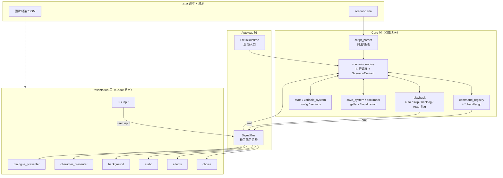
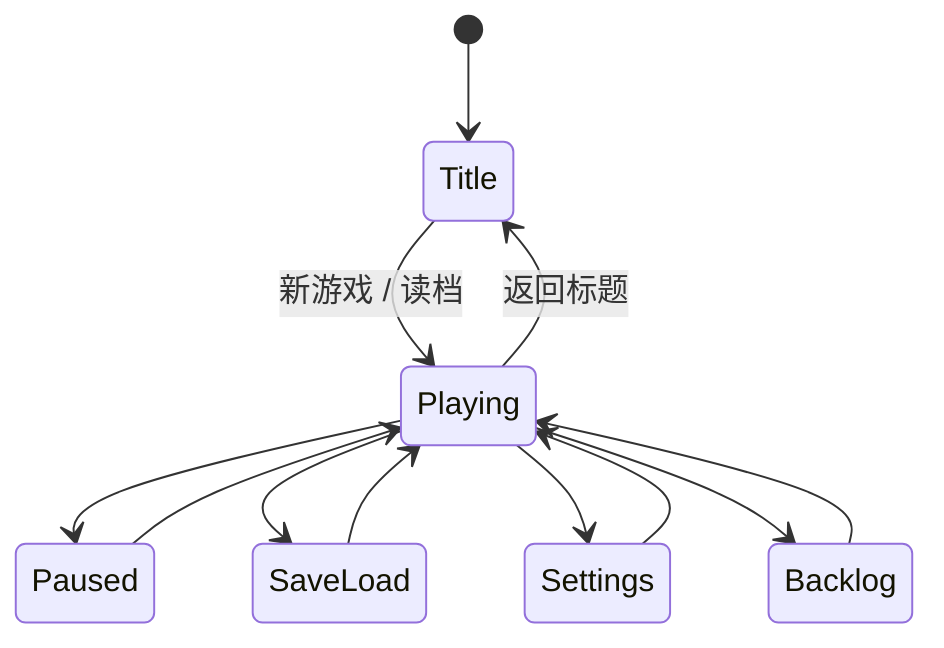

# Stella — Godot AVG / Galgame 框架架构设计

> 框架名称：**Stella**
> 仓库：`github.com/butter-stella/stella`
> 引擎：Godot 4 + GDScript

## 概述

Stella 是基于 Godot 4 的视觉小说 / Galgame 框架。设计目标：

- **架构清晰**：Core / Presentation 两层分离，Core 层与 Godot API 解耦，可独立单测
- **DSL 驱动**：自定义 `.stla` 脚本格式，引擎直接解析为内部数据结构
- **API 优先**：游戏项目自带 UI 场景，框架以 API + 信号的方式提供能力，不强加 UI
- **可扩展**：命令处理器、转场效果、立绘渲染方式均通过基类/注册表插拔扩展

---

## 一、架构总览

Stella 采用分层架构，由下至上：

- **Autoload 层**：`StellaRuntime`（启动入口）+ `SignalBus`（全局信号总线）
- **Core 层**：脚本解析、剧情引擎、命令处理、变量、存档、设置、播放控制、已读、Backlog、收藏、鉴赏。引擎无关，可独立单测
- **Presentation 层**：对话、立绘、背景、音频、选择、特效、UI。基于 Godot 节点，订阅 SignalBus 渲染

Core 与 Presentation 通过 Godot 信号（Signal）解耦，所有跨层通信经由 `SignalBus` 单例。

### 1.1 模块依赖与数据流



**数据流说明**：
- 正向：`.stla` → `script_parser` → `scenario_engine` 调度 → `command_registry` 分发到各 `*_handler` → 通过 `SignalBus` 广播给 Presentation 层 presenter
- 反向：用户输入（点击/选择）从 `presentation/input` 经 `SignalBus` 回到 `scenario_engine` 推进剧情
- `playback` 子模块（auto/skip/backlog/read_flag）状态独立，与 engine 协作并通过 SignalBus 与 UI 联动

---

## 二、核心设计

### 2.1 命令模式 — 整个框架的基石

```gdscript
# 命令处理器基类
class_name CommandHandler extends RefCounted

func get_command_type() -> String:
    return ""

func execute(data: CommandData, context: ScenarioContext) -> void:
    pass
```

```gdscript
# 命令注册表
class_name CommandRegistry extends RefCounted

var _handlers: Dictionary = {}  # String -> CommandHandler

func register(handler: CommandHandler) -> void:
    _handlers[handler.get_command_type()] = handler

func get_handler(command_type: String) -> CommandHandler:
    return _handlers.get(command_type)
```

新增指令只需继承 `CommandHandler`，注册到 `CommandRegistry`，符合开闭原则。当前框架内置的 handler 见 `addons/stella/core/commands/`，覆盖对话、立绘、背景、音频、选择、跳转、条件、变量赋值、CG、特效、动画、移动、并行、调用等指令。

### 2.2 剧情引擎

主循环：`LoadScenario → SetScene → FetchCommand → Dispatch → WaitForCompletion → Next`

```
core/scenario_engine/
├── scenario_engine.gd       -- 主引擎
├── scenario_context.gd      -- 运行时上下文（场景、指令指针、调用栈、变量存储）
├── wait_controller.gd       -- 等待控制（点击/动画/选择）
└── expression_timeline.gd   -- 语音驱动表情时间线
```

```gdscript
# ScenarioEngine 核心流程（简化版）
class_name ScenarioEngine extends RefCounted

signal scenario_started(scenario_id: String)
signal scenario_ended(scenario_id: String)
signal scene_changed(scene_id: String)
signal command_executed(command_data: CommandData)

var context: ScenarioContext
var registry: CommandRegistry

func load_scenario(data: ScenarioData) -> void:
    context = ScenarioContext.new(data)

func run() -> void:
    while not context.is_finished:
        if context.pending_jump != "":
            _jump_to_scene(context.pending_jump)
            continue

        var cmd := context.current_command()
        if cmd == null:
            _advance_to_next_scene()
            continue

        var handler := registry.get_handler(cmd.type)
        if handler:
            await handler.execute(cmd, context)
            command_executed.emit(cmd)

        context.advance()

    scenario_ended.emit(context.scenario_data.id)
```

### 2.3 信号总线

利用 Godot 原生信号机制，通过 Autoload 单例实现全局事件总线：

```gdscript
# autoload/signal_bus.gd
extends Node

# 对话
signal show_dialogue(character: String, text: String, voice: String, mode: String)
signal hide_dialogue()
signal advance_requested()

# 立绘
signal char_show(character: String, expression: String, position: String)
signal char_hide(character: String)
signal char_expression_changed(character: String, expression: String)
signal char_anim_requested(character: String, anim: String, intensity: String)
signal char_move_requested(character: String, position: String, duration: float)

# 背景
signal bg_changed(asset: String, transition: String, duration: float)

# 音频
signal bgm_play(asset: String, fade_duration: float)
signal bgm_stop(fade_duration: float)
signal se_play(asset: String, loop: bool)
signal se_stop(asset: String)
signal voice_play(asset: String)
signal voice_started(character: String, asset: String)
signal voice_progress(progress: float, current_time: float)
signal voice_finished()

# 选择
signal choice_show(prompt: String, options: Array)
signal choice_selected(option_id: String)

# CG / 特效
signal cg_show(asset: String, mode: String, transition: String, duration: float)
signal cg_hide(transition: String, duration: float)
signal effect_requested(effect_type: String, params: Dictionary)
signal fade_requested(direction: String, duration: float)

# 系统
signal scenario_started_event(scenario_id: String)
signal scenario_ended_event(scenario_id: String)
signal scene_changed_event(scene_id: String)
signal variable_changed(var_name: String, value: Variant)
signal settings_changed(key: String, value: Variant)
```

### 2.4 变量系统

三个作用域：
- `global`：跨存档永久变量（CG 解锁、已读标记）
- `scenario`：当前存档变量（好感度、flag）
- `temp`：临时变量（不入存档）

```gdscript
class_name VariableStore extends RefCounted

enum Scope { GLOBAL, SCENARIO, TEMP }

func set_var(name: String, value: Variant, scope: int = Scope.SCENARIO) -> void: ...
func get_var(name: String, default: Variant = null) -> Variant: ...
func capture_snapshot() -> Dictionary: ...
func restore_snapshot(snapshot: Dictionary) -> void: ...
```

`get_var` 优先级：`Temp → Scenario → Global`。

`ExpressionEvaluator` 支持：比较（`>=, >, <, <=, ==, !=`）、逻辑（`&&, ||, !`）、算术运算。

### 2.5 存档系统

各子系统通过统一的快照协议（duck typing）接入 `SaveManager`：

```gdscript
# 任何需要存档的子系统实现这三个方法
func get_provider_id() -> String: ...
func capture_snapshot() -> Dictionary: ...
func restore_snapshot(snapshot: Dictionary) -> void: ...
```

`SaveManager` 维护 provider 列表，存档时遍历调用 `capture_snapshot()` 聚合为 JSON 写入 `user://saves/save_<slot>.json`，读档时反向恢复。除了变量系统，`PresentationState` 也作为 provider 捕获背景/立绘/CG/BGM 等表现层状态，实现真正的"所见即所存"。

### 2.6 选择系统

选择的本质是「暂停引擎 → 等待玩家做出选择 → 返回选中的 option id」。

```gdscript
class_name ChoicePresenter extends Control

func show_and_wait(data: ChoiceData) -> String:
    # 子类实现具体 UI，返回选中的 option id
    return ""
```

框架内置 `TextChoicePresenter` 作为默认实现。游戏项目可继承基类实现自定义风格（如地图选点）。DSL 通过 `#style:xxx` 与额外 hashtag 参数传递差异化数据：

```
# 经典文字选项
@choice "你该怎么回应？"
  - "你好，我叫..." -> scene_002a {sakura_affection += 5}
  - "......" -> scene_002b

# 地图选点（通过 hashtag 传递坐标）
@choice "去哪里？" #style:map #bg:map_school
  - "图书馆" -> scene_library #x:0.3 #y:0.6
  - "天台" -> scene_rooftop #x:0.7 #y:0.2
```

### 2.7 指令并行执行

```
@parallel
  @bg bg_sunset dissolve 1.0
  @show sakura smile center
  @anim kaito shake
@end
```

引擎遇到 `parallel` 指令时同时启动所有子指令，`await` 全部完成后继续。

---

## 三、表现层

### 3.1 对话系统

- 打字机效果：`RichTextLabel` + `visible_characters` 逐字递增
- 内联标签：`{wait:0.5}` 暂停、`{speed:30}` 变速
- 句内表情切换：`[expr:surprised]` 在打字到达该位置时触发表情变更
- Backlog 数据由 Core 层 `BacklogManager` 管理，UI 层订阅显示

**对话框模式**：

| 模式 | 说明 |
|------|------|
| `adv`（默认） | 底部对话框，标准 Galgame 模式 |
| `nvl` | 全屏文本，文字逐行累积，适合独白、旁白、信件 |
| `overlay` | 无对话框，文字直接叠在画面上（内心独白、回忆闪回） |

**对话框头像同步**：
- 有立绘时：自动同步当前立绘表情
- CG/无立绘场景：通过 `#face:happy` 参数独立指定

**SD 插画**用于对话中插入 Q 版角色小图、表情包：

```
@cg sakura_chibi_angry sd
@cg sakura_chibi_laugh sd 1.5s    // 自动消失
```

### 3.2 立绘系统

- 渲染：当前为 sprite 模式（整张图替换 + 表情差分切换）
- 位置预设（left/center/right + 自定义坐标）
- 入场/退场动画（fade、slide）
- 通过 Godot `Tween` 实现所有动画效果

**立绘动画预设**：

| 预设 | 效果 | 典型用途 |
|------|------|---------|
| `jump` | 上下弹跳 | 惊讶、开心 |
| `shake` | 左右震动 | 受惊、愤怒 |
| `nod` | 小幅下移回弹 | 点头 |
| `bounce` | 缩放弹跳 | 兴奋 |
| `fade_in` / `fade_out` | 透明度渐变 | 入场/退场 |
| `slide_in` / `slide_out` | 从屏幕外滑入/滑出 | 入场/退场 |

### 3.3 背景系统

- 双缓冲（front/back `TextureRect`）
- 转场效果基于 Shader（fade/dissolve/wipe 等），可扩展
- 通过 `Tween` + `ShaderMaterial` 参数驱动转场动画

### 3.4 音频系统

`AudioPresenter` 统一管理 BGM / SE / Voice 三类播放：

- **BGM**：淡入淡出、循环播放、交叉混合
- **SE**：多通道并行
- **Voice**：对话同步，角色独立音量控制；语音未播完可阻止自动推进
- 提供 `voice_progress` 信号供 UI 实现进度条

### 3.5 CG 系统

通过 `@cg` 指令统一管理：

| 模式 | 关键字 | 行为 |
|------|--------|------|
| 全屏 | （默认） | 替换背景层，自动隐藏立绘，点击推进后恢复 |
| SD | `sd` | 小图弹出在对话框旁，不影响背景和立绘 |
| 动态 | `animated` | 全屏 CG + 附加动画效果 |
| 差分 | `asset:variant` | 切换同一张 CG 的不同状态 |

### 3.6 游戏设置

框架提供设置数据模型 `GameSettings`、持久化 `SettingsManager`、信号通知。UI 由游戏项目自行实现（或使用 `addons/stella/scenes/settings.tscn` 默认场景）。

```gdscript
# core/settings/game_settings.gd
class_name GameSettings extends Resource

# 文字显示
@export var character_interval: int = 50
@export var punctuation_pause: int = 200
@export var click_to_complete: bool = true
@export var text_window_opacity: float = 0.8

# 自动播放
@export var auto_play_delay: float = 1.5
@export var auto_play_wait_voice: bool = true
@export var auto_play_pause_on_choice: bool = true

# 快进
@export var skip_interval: int = 50
@export var skip_only_read: bool = true
@export var skip_unread_confirm: bool = true
@export var skip_stop_on_choice: bool = true

# 音量
@export var master_volume: float = 1.0
@export var bgm_volume: float = 0.8
@export var se_volume: float = 1.0
@export var system_se_volume: float = 1.0
@export var voice_volume: float = 1.0
@export var character_voice_volume: Dictionary = {}
@export var character_voice_enabled: Dictionary = {}

# 语音行为
@export var voice_continue_on_advance: bool = false
@export var voice_replay_on_backlog: bool = true

# 画面
@export var fullscreen: bool = false
@export var effect_enabled: bool = true

# 操作
@export var key_bindings: Dictionary = {}
```

持久化使用 `user://settings.json`，各子系统订阅 `SignalBus.settings_changed` 动态响应。信号的 `value` 始终是触发通知时该设置的完整当前值；字典设置发送独立的完整快照，而不是单角色 patch。监听器可以在同步回调中再次修改设置，后续通知也会重新读取当前值，不会发送已过期的缓存值。

### 3.7 播放控制

- **AutoPlayController**：文本显示完后按设定延迟自动推进，语音播放中暂缓
- **SkipController**：快进模式，可配置仅跳已读
- **ReadFlagManager**：记录已读对话（基于 `scenario_id + scene_id + command_index`），持久化到 global 变量
- **BacklogManager**：记录对话历史，支持语音重播

### 3.8 游戏状态机

`core/state/game_state_machine.gd` 管理宏观流程：



状态机在 Core 层维护，便于单测；状态切换通过信号通知 UI 层切换场景。

### 3.9 输入抽象

通过 `StellaAction` 枚举将物理输入映射为语义动作：

```gdscript
enum {
    ADVANCE,         # 推进对话
    CANCEL,          # 取消/返回
    SHOW_MENU,       # 打开菜单
    HISTORY_PREV,    # 回看上一条
    HISTORY_NEXT,    # 回看下一条
    TOGGLE_AUTO,     # 切换自动播放
    TOGGLE_SKIP,     # 切换快进
    HIDE_UI,         # 隐藏文本框
    QUICK_SAVE,      # 快速存档
    QUICK_LOAD,      # 快速读档
}
```

利用 Godot 内置 `InputMap` + `InputEvent`，PC / 移动 / 手柄自动适配。

---

## 四、扩展功能

### 4.1 语音驱动差分切换

一句对话中，角色表情随语音/文字进度自动切换。编剧在文本中用 `[expr:xxx]` 内联标记切换点：

```
sakura「我本来很开心的...[surprised]但是听到这个消息之后...[cry]呜呜...」 #voice:sakura_042
```

**双定位模式**：

| 字段 | 来源 | 用途 |
|------|------|------|
| `at_char` | DSL 解析自动生成 | 无语音时：打字机到达该字符位置触发切换 |
| `at` | 手动标注 | 有语音时：精确秒数，优先级高于 `at_char` |

`ExpressionTimeline`（`core/scenario_engine/`）负责解析和调度时间轴。

### 4.2 语音收藏 / 鉴赏

- `VoiceBookmarkManager`（`core/bookmark/`）：游戏中收藏语音 → 收藏界面浏览/重播 → 可跳转回对应场景继续游玩。依赖快照机制，收藏时自动捕获状态快照。
- `UnlockManager`（`core/gallery/`）：CG / 音乐 / 场景的解锁与鉴赏，依赖 global 变量持久化。

### 4.3 本地化

`LocalizationManager`（`core/localization/`）。对话文本可用 `text_key` 引用本地化表，配合 Godot 内置 `TranslationServer` 工作。

---

## 五、项目目录结构

```
stella/
├── project.godot
├── addons/
│   └── stella/                            -- 框架（Godot Plugin）
│       ├── plugin.cfg
│       ├── stella_plugin.gd
│       ├── autoload/
│       │   ├── signal_bus.gd
│       │   └── stella_runtime.gd          -- 框架入口
│       ├── core/                          -- 核心层（引擎无关）
│       │   ├── config/
│       │   │   └── stella_config.gd
│       │   ├── script_parser/
│       │   │   ├── dsl_token.gd
│       │   │   ├── dsl_lexer.gd
│       │   │   └── dsl_parser.gd
│       │   ├── scenario_engine/
│       │   │   ├── scenario_engine.gd
│       │   │   ├── scenario_context.gd
│       │   │   ├── wait_controller.gd
│       │   │   └── expression_timeline.gd
│       │   ├── commands/                  -- 所有指令处理器
│       │   │   ├── command_handler.gd     -- 基类
│       │   │   ├── command_registry.gd
│       │   │   ├── dialogue_handler.gd
│       │   │   ├── bg_handler.gd
│       │   │   ├── char_show_handler.gd
│       │   │   ├── char_hide_handler.gd
│       │   │   ├── char_expr_handler.gd
│       │   │   ├── choice_handler.gd
│       │   │   ├── jump_handler.gd
│       │   │   ├── condition_handler.gd
│       │   │   ├── set_handler.gd
│       │   │   ├── bgm_handler.gd
│       │   │   ├── se_handler.gd
│       │   │   ├── voice_handler.gd
│       │   │   ├── fade_handler.gd
│       │   │   ├── wait_handler.gd
│       │   │   ├── cg_handler.gd
│       │   │   ├── effect_handler.gd
│       │   │   ├── anim_handler.gd
│       │   │   ├── move_handler.gd
│       │   │   ├── parallel_handler.gd
│       │   │   └── call_handler.gd
│       │   ├── data/
│       │   │   ├── scenario_data.gd
│       │   │   ├── scene_data.gd
│       │   │   ├── command_data.gd
│       │   │   ├── choice_data.gd
│       │   │   ├── character_config.gd
│       │   │   └── character_config_loader.gd
│       │   ├── variable_system/
│       │   │   ├── variable_store.gd
│       │   │   └── expression_evaluator.gd
│       │   ├── save_system/
│       │   │   ├── save_manager.gd
│       │   │   └── presentation_state.gd
│       │   ├── settings/
│       │   │   ├── game_settings.gd
│       │   │   ├── settings_manager.gd
│       │   │   └── display_helper.gd
│       │   ├── playback/
│       │   │   ├── auto_play_controller.gd
│       │   │   ├── skip_controller.gd
│       │   │   ├── read_flag_manager.gd
│       │   │   └── backlog_manager.gd
│       │   ├── state/
│       │   │   └── game_state_machine.gd
│       │   ├── bookmark/
│       │   │   └── voice_bookmark_manager.gd
│       │   ├── gallery/
│       │   │   └── unlock_manager.gd
│       │   └── localization/
│       │       └── localization_manager.gd
│       ├── presentation/                  -- 表现层
│       │   ├── dialogue/
│       │   │   └── dialogue_presenter.gd
│       │   ├── character/
│       │   │   └── character_presenter.gd
│       │   ├── background/
│       │   │   ├── background_presenter.gd
│       │   │   └── shaders/
│       │   ├── audio/
│       │   │   └── audio_presenter.gd
│       │   ├── choice/
│       │   │   └── text_choice_presenter.gd
│       │   ├── effects/
│       │   │   ├── screen_effects.gd
│       │   │   └── fade_presenter.gd
│       │   ├── input/
│       │   │   └── input_handler.gd
│       │   └── ui/
│       │       ├── stella_action.gd
│       │       ├── title_screen.gd
│       │       ├── save_load_screen.gd
│       │       ├── settings_screen.gd
│       │       └── backlog_screen.gd
│       ├── scenes/                        -- 默认 UI 场景（游戏可替换）
│       │   ├── title.tscn
│       │   ├── game.tscn
│       │   ├── save_load.tscn
│       │   ├── settings.tscn
│       │   └── backlog.tscn
│       └── editor/                        -- 编辑器辅助
│           └── stla_editor.gd             -- .stla 文件高亮/编辑支持
├── examples/
│   └── demo/                              -- 演示项目
└── tests/                                 -- GUT 测试
    ├── unit/                              -- 单元测试
    └── integration/                       -- 集成测试
```

---

## 六、技术选型

| 类别 | 选择 | 说明 |
|------|------|------|
| 引擎 | Godot 4 | 开源、2D/UI 强、GDScript 一等公民 |
| 语言 | GDScript | 融入生态，文档丰富，社区活跃 |
| 文本渲染 | RichTextLabel + BBCode | 内置富文本，支持自定义效果 |
| 缓动动画 | Tween | Godot 内置，API 简洁 |
| 资源管理 | Godot Resource 系统 | 内置延迟加载、引用计数 |
| 音频 | AudioStreamPlayer | 内置，支持多通道 |
| 转场 Shader | GDShader | Godot 着色器语言 |
| 测试 | GUT 9.6+ | GDScript 测试框架 |

---

## 七、测试策略

### 测试框架

使用 **GUT**（Godot Unit Test），通过 `addons/gut` 安装。

### 测试分类

| 类型 | 用途 | 位置 |
|------|------|------|
| 单元测试 | 纯逻辑（Core 层全部、表现层可测部分） | `tests/unit/` |
| 集成测试 | DSL → Engine → Presentation 端到端 | `tests/integration/` |

### 测试覆盖目标

| 层 | 目标覆盖率 | 说明 |
|----|-----------|------|
| Core 层 | ≥ 90% | 纯逻辑，必须高覆盖 |
| Presentation 层 | ≥ 70% | 行为逻辑可测，视觉效果靠人工验收 |
| 集成 | 关键路径 100% | 测试剧本覆盖所有指令类型和流程分支 |

### 运行测试

```bash
godot --headless --import 2>&1 | tail -1
godot -s addons/gut/gut_cmdln.gd --headless 2>&1
```

---

## 八、设计模式汇总

| 模式 | 应用 |
|------|------|
| **命令模式** | 剧本指令抽象与执行（`CommandHandler` + `CommandRegistry`） |
| **信号/观察者** | Core ↔ Presentation 层间通信（Godot Signal + `SignalBus`） |
| **状态机** | 游戏宏观流程（`GameStateMachine`） |
| **策略模式** | 转场效果、立绘动画、选择风格可插拔 |
| **快照/备忘录** | 存档系统状态捕获与恢复（`SaveManager` + provider duck typing） |
| **Autoload 单例** | 全局服务注册与访问（`SignalBus` / `StellaRuntime`） |

---

## 九、未实现 / 未来扩展

| 方向 | 当前状态 | 备注 |
|------|---------|------|
| **节点式剧情编辑器** | 未实现 | 当前仅有 `.stla` 文件级编辑器（`addons/stella/editor/stla_editor.gd`）。完整的 GraphEdit 节点编辑器作为后续可选项 |
| **Live2D 立绘** | 未实现 | 当前 `CharacterPresenter` 只支持 sprite 模式。后续可通过引入渲染基类 + GDCubism 插件扩展 |
| **Rust 性能扩展** | 未实现 | DSL 解析器接口已稳定，后续如需可用 gdext 重写性能热点 |
| **CI 自动化** | 未实现 | 后续可加 GitHub Actions + GUT 自动测试 |
