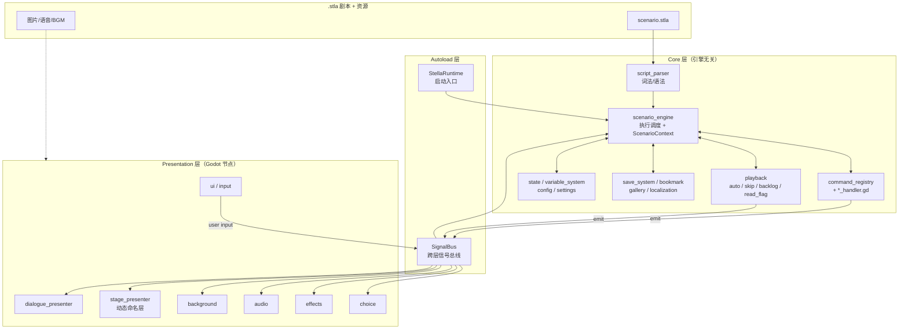
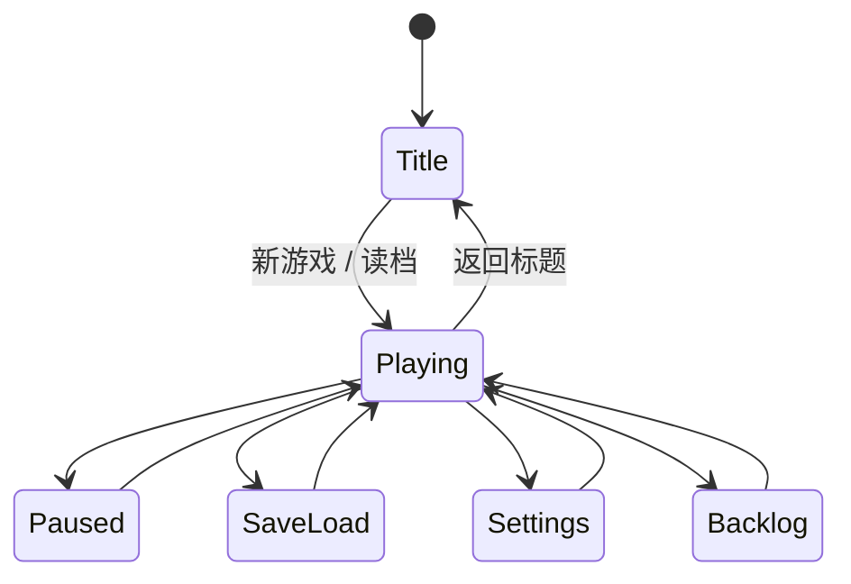

# Stella — Godot AVG / Galgame 框架架构设计

> 框架名称：**Stella**
> 仓库：`github.com/butter-stella/stella`
> 引擎：Godot 4 + GDScript

## 概述

Stella 是基于 Godot 4 的视觉小说 / Galgame 框架。设计目标：

- **架构清晰**：Core / Presentation 两层分离，Core 层与 Godot API 解耦，可独立单测
- **DSL 驱动**：自定义 `.stla` 脚本格式，引擎直接解析为内部数据结构
- **API 优先**：游戏项目自带 UI 场景，框架以 API + 信号的方式提供能力，不强加 UI
- **可扩展**：命令处理器、转场效果、舞台图片渲染方式均通过基类/注册表插拔扩展

---

## 一、架构总览

Stella 采用分层架构，由下至上：

- **Autoload 层**：`StellaRuntime`（启动入口）+ `SignalBus`（全局信号总线）
- **Core 层**：脚本解析、剧情引擎、命令处理、变量、存档、设置、播放控制、已读、Backlog、收藏、鉴赏。引擎无关，可独立单测
- **Presentation 层**：对话、动态舞台、背景、音频、选择、特效、UI。基于 Godot 节点，订阅 SignalBus 渲染

Core 与 Presentation 通过 Godot 信号（Signal）解耦，所有跨层通信经由 `SignalBus` 单例。

### 1.1 模块依赖与数据流



**数据流说明**：
- 正向：`.stla` → `script_parser` → `scenario_engine` 调度 → `command_registry` 分发到各 `*_handler` → 通过 `SignalBus` 广播给 Presentation 层 presenter
- 反向：用户输入（点击/选择）从 `presentation/input` 经 `SignalBus` 回到 `scenario_engine` 推进剧情
- `playback` 子模块（auto/skip/backlog/read_flag）状态独立，与 engine 协作并通过 SignalBus 与 UI 联动

---

## 二、核心设计

### 2.1 命令模式 — 整个框架的基石

```gdscript
# 命令处理器基类
class_name CommandHandler extends RefCounted

func get_command_type() -> String:
    return ""

func execute(data: CommandData, context: ScenarioContext) -> void:
    pass
```

```gdscript
# 命令注册表
class_name CommandRegistry extends RefCounted

var _handlers: Dictionary = {}  # String -> CommandHandler

func register(handler: CommandHandler) -> void:
    _handlers[handler.get_command_type()] = handler

func get_handler(command_type: String) -> CommandHandler:
    return _handlers.get(command_type)
```

新增指令只需继承 `CommandHandler`，注册到 `CommandRegistry`，符合开闭原则。当前框架内置的 handler 见 `addons/stella/core/commands/`，覆盖对话、命名舞台层、背景、音频、选择、跳转、条件、变量赋值、特效、并行和调用等指令。

### 2.2 剧情引擎

主循环：`LoadScenario → SetScene → FetchCommand → Dispatch → WaitForCompletion → Next`

```
core/scenario_engine/
├── scenario_engine.gd       -- 主引擎
├── scenario_context.gd      -- 运行时上下文（场景、指令指针、调用栈、变量存储）
├── wait_controller.gd       -- 等待控制（点击/动画/选择）
└── expression_timeline.gd   -- 对话头像标记与打字机内联效果时间线
```

```gdscript
# ScenarioEngine 核心流程（简化版）
class_name ScenarioEngine extends RefCounted

signal scenario_started(scenario_id: String)
signal scenario_ended(scenario_id: String)
signal scene_changed(scene_id: String)
signal command_executed(command_data: CommandData)

var context: ScenarioContext
var registry: CommandRegistry

func load_scenario(data: ScenarioData) -> void:
    context = ScenarioContext.new(data)

func run() -> void:
    while not context.is_finished:
        if context.pending_jump != "":
            _jump_to_scene(context.pending_jump)
            continue

        var cmd := context.current_command()
        if cmd == null:
            _advance_to_next_scene()
            continue

        var handler := registry.get_handler(cmd.type)
        if handler:
            await handler.execute(cmd, context)
            command_executed.emit(cmd)

        context.advance()

    scenario_ended.emit(context.scenario_data.id)
```

### 2.3 信号总线

利用 Godot 原生信号机制，通过 Autoload 单例实现全局事件总线：

```gdscript
# autoload/signal_bus.gd
extends Node

# 对话；typed request 是内建主链，三参数信号只作兼容通知
signal dialogue_requested(request: DialogueRequest)
signal show_dialogue(character: String, segments: Array, mode: String)
signal hide_dialogue()
# 已确认 request 的表现层兼容通知；不负责完成剧情命令
signal advance_requested()

# 动态命名舞台层
signal stage_operations_requested(operations: Array, force_cut: bool)
signal stage_visuals_reset_requested()
signal stage_state_apply_requested(layers: Dictionary)
signal stage_transition_started(presenter_instance_id: int, layer_id: String, token: int, operation_request_id: int)
signal stage_transitions_finish_requested(transitions: Array)

# 背景
signal bg_changed(asset: String, transition: String, duration: float)

# 音频
signal bgm_play(asset: String, fade_duration: float)
signal bgm_stop(fade_duration: float)
signal se_play(asset: String, loop: bool)
signal se_stop(asset: String)
signal voice_play(asset: String, character: String)
signal voice_started(character: String, asset: String)
signal voice_progress(position: float, duration: float)
signal voice_finished()

# 选择
signal choice_show(prompt: String, options: Array)
signal choice_selected(option_id: String)

# 特效
signal effect_requested(effect_type: String, params: Dictionary)
signal fade_requested(direction: String, duration: float)

# 系统
signal scenario_started_event(scenario_id: String)
signal scenario_ended_event(scenario_id: String)
signal scene_changed_event(scene_id: String)
signal variable_changed(var_name: String, value: Variant)
signal settings_changed(key: String, value: Variant)
```

舞台写操作统一通过 `SignalBus.emit_stage_operations()` 提交；该入口会深拷贝并串行派发同步重入的批次。每批有唯一 request ID，转场开始回执携带同一 ID，因此对话补全只会终止自己发出的 Tween。`stage_operations_requested` 是内部投递信号，状态跟踪器和 Presenter 因而始终按相同顺序观察操作，不会因监听器连接顺序产生存档与画面分叉。完整恢复会提升舞台 epoch、取消队列并使正在投递的旧批次对后续消费者失效。

### 2.4 变量系统

三个作用域：
- `global`：跨存档变量（例如项目自定义的长期解锁状态）
- `scenario`：当前存档变量（好感度、flag）
- `temp`：临时变量（不入存档）

```gdscript
class_name VariableStore extends RefCounted

enum Scope { GLOBAL, SCENARIO, TEMP }

func set_var(name: String, value: Variant, scope: int = Scope.SCENARIO) -> void: ...
func get_var(name: String, default: Variant = null) -> Variant: ...
func capture_snapshot() -> Dictionary: ...
func restore_snapshot(snapshot: Dictionary) -> void: ...
```

`get_var` 优先级：`Temp → Scenario → Global`。

`ExpressionEvaluator` 支持：比较（`>=, >, <, <=, ==, !=`）、逻辑（`&&, ||, !`）、算术运算。

### 2.5 存档系统

各子系统通过统一的快照协议（duck typing）接入 `SaveManager`：

```gdscript
# 任何需要存档的子系统实现这三个方法
func get_provider_id() -> String: ...
func capture_snapshot() -> Dictionary: ...
func restore_snapshot(snapshot: Dictionary) -> void: ...
```

`SaveManager` 维护 provider 列表，存档时遍历调用 `capture_snapshot()` 聚合为 JSON 写入 `user://saves/save_<slot>.json`，读档时反向恢复。除了变量系统，`PresentationState` 也作为 provider 捕获基础背景、动态舞台层和 BGM 等表现层状态，实现真正的“所见即所存”。

动态舞台层以 `stage_layers: Dictionary` 保存：键是稳定业务 ID，值是经过 `StageLayerState` 归一化的完整 JSON-safe 状态。人物、事件图和其他舞台图片都使用这一份状态，不存在第二套人物快照。`PresentationState` 与 `StagePresenter` 使用同一 reducer，所以 patch 语义不会漂移。完整恢复先使旧舞台操作失效并清空当前投影，再用 `stage_state_apply_requested` 同步 cut 精确重建全部舞台层；投影信号不回写逻辑状态。

### 2.6 选择系统

选择的本质是「暂停引擎 → 等待玩家做出选择 → 返回选中的 option id」。

```gdscript
class_name ChoicePresenter extends Control

func show_and_wait(data: ChoiceData) -> String:
    # 子类实现具体 UI，返回选中的 option id
    return ""
```

框架内置 `TextChoicePresenter` 作为默认实现。游戏项目可继承基类实现自定义风格（如地图选点）。DSL 通过 `#style:xxx` 与额外 hashtag 参数传递差异化数据：

```
# 经典文字选项
@choice "你该怎么回应？"
  - "你好，我叫..." -> scene_002a {sakura_affection += 5}
  - "......" -> scene_002b

# 地图选点（通过 hashtag 传递坐标）
@choice "去哪里？" #style:map #bg:map_school
  - "图书馆" -> scene_library #x:0.3 #y:0.6
  - "天台" -> scene_rooftop #x:0.7 #y:0.2
```

### 2.7 指令并行执行

```
@parallel
  @bg bg_sunset dissolve 1.0
  @stage sakura update position=960,80 transition=move duration=0.5
  @stage kaito update opacity=0.5 transition=fade duration=0.5
@end
```

`parallel` 只接受非阻塞演出指令。Parser 会原子拒绝包含 dialogue、choice 或
wait 的 block，程序化构造的非法 block 也会在执行任何 child 前被 runtime
拒绝。合法 child 在同一调用栈内发起，各 Presenter 的 Tween/播放因而并行，
wrapper 不等待表现动画结束。

---

## 三、表现层

### 3.1 对话系统

- 打字机效果：`RichTextLabel` + `visible_characters` 逐字递增
- 内联标签：`{wait:500}` 暂停 500ms、`{speed:30}` 将每字间隔设为 30ms
- 句内头像提示：`[expr:surprised]` 在打字到达该位置时更新对话框头像，不修改舞台层
- Backlog 数据由 Core 层 `BacklogManager` 管理，UI 层订阅显示；Core 在写入时移除 expression/effect marker 与 BBCode 格式标签，并把换行、段落、列表转换成适合普通 Button 的可见纯文本

**对话框模式**：

Stella 的常规创作边界是：`.stla` 是唯一编程界面。布局和演出能力应优先进入 DSL；只有自定义 Godot 控件、第三方插件集成等无法由通用 DSL 描述的极特殊需求，才进入场景或脚本扩展层。

| 模式 | 说明 |
|------|------|
| `adv`（默认） | 底部对话框，标准 Galgame 模式 |
| `nvl` | 全屏文本，文字逐行累积，适合独白、旁白、信件 |
| `overlay` | 无对话框，文字直接叠在画面上（内心独白、回忆闪回） |

布局策略首先由 STLA 的 `@dialogue_profile` 声明，并通过 `@adv profile=name` / `@nvl profile=name` / `@overlay profile=name` 选择。编译器把已验证、已解析的 Profile 与诊断 provenance 分别存入当前 `ScenarioData` 的显式 registry；对话命令本身不烘焙解析时的线性 Profile 状态。DialogueHandler 从 `ScenarioContext` 的实际运行路径取得 Profile 名，再从当前 scenario registry 解析表现数据，并在保持原有三参数 `show_dialogue` 信号兼容的同时把同步元数据交给 Presenter。registry 随 scenario 生命周期存在，不是隐藏的全局状态。

模式指令还必须保留运行时控制流语义。Parser 先把嵌套 `@if` / `@elif` / `@else` 构造成仅在编译期存在的条件 AST，再以共享 continuation 递归生成显式 CFG；每条分支尾都通过 condition 或 jump 转移，避免依赖 synthetic scene 的物理顺序。每个 `@adv` / `@nvl` / `@overlay` 同时记录为包含 action、mode 与 Profile 名的内部 presentation-selection 事件，在 CFG 展开后再降级到下一个真实 `CommandData` 的 sidecar；仅含事件的空分支挂在 condition edge，场景末尾事件则由 `SceneData` 单独保存。它们不占用 `scene.commands` 的索引、不分配 UID。ScenarioContext 按实际执行路径维护当前模式、当前/ADV Profile 选择、NVL page epoch，以及当前页可 JSON 序列化的 authored entries；每条 entry 只保存当时选择的 Profile 名，恢复时再从当前 `ScenarioData` registry 分别解析，所以一页中途换 Profile 不会改写更早记录的 prefix/separator。provenance、已解析 Profile Dictionary 和 `RichTextLabel` 渲染字符串都不进入存档。DialogueHandler 将 context 实例与 epoch 组成 page key，并通过只读 typed `DialogueRequest` 把一次性恢复页交给 Presenter。因此同一源码块经 `@jump` 循环或 `@call` 重入仍会得到新页面；条件分支可以选择不同 mode/Profile，continuation 会继承真正执行的那条分支，而不会被未执行分支的源码顺序污染。

Profile 可声明 panel anchors/offsets、文字矩形与 margin、对齐/行距/溢出、背景可见性/颜色、场景内命名分组的显示策略、仅用于 NVL 累积显示的 entry prefix/separator，以及可选的 end-of-text advance indicator。Presenter 就绪时捕获场景编排基线，并在每次声明式模式切换前恢复，再叠加当前模式的 opt-in 覆盖；`off` 因而能精确恢复 ADV。未声明 Profile 时使用内置兼容布局，NVL 条目使用空前缀和换行分隔，也不会创建 indicator 节点。

NVL 的前缀和分隔符属于表现元数据：Presenter 按“记录间分隔符 → 当前记录前缀 → 可选角色名 → 正文”拼装屏幕累积文本，并把新增装饰字符纳入打字机可见字符偏移。纯文本页通过 `RichTextLabel.append_text()` 只解析新增 entry 并沿用累计的 parsed-character boundary；含 BBCode 或存档重建时才进入完整引擎解析路径。它不会把这些装饰写回 Core 的 segment、CommandData 正文或 Backlog 记录，`@combine` 也只构成一条 NVL 记录。Backlog 保存正文的玩家可见纯文本：BBCode 只贡献可见字符、段落/列表结构，不保存格式标签；expression 与 typewriter effect marker 也不保存。离开 NVL 会清除 ScenarioContext 的 canonical page；运行时 hard hide 只退休 Presenter 的派生显示状态，存读档或 Backlog 回退可从同一 page key 的 authored entries 恢复完整当前页。右键临时隐藏 UI 不会清页。`DialoguePresentationProfile` Resource 和 `set_presentation_profile()` 只保留为高级程序化兜底，不是普通项目的必需入口。完整语法见 [DSL.md](DSL.md#33-对话框模式切换)。

Advance indicator 同样只存在于 Presentation 层。Canonical `DialogueRequest` 在 Core → Presentation 主链中自包含 Profile、provenance、NVL page state、内容版本化的 authored identity，以及只属于该命令激活的 `DialogueActivation`。Presenter、自动播放、快进和无界面 consumer 必须调用当前 request 的 `advance()` / `abort()`；同步 SHOW 回调也不会丢确认。`ScenarioContext` 同时校验 engine owner 与 active activation；context 替换会取消旧 activation，同一 context 的重入则拒绝新 activation，避免窃取仍在执行的 command owner。正常推进先验证 owner、写入已读并释放 owner，再发送带 activation ID 的 `dialogue_advance_committed` 给内建 Presenter，最后广播无参数 `advance_requested` 兼容通知；因此兼容 listener 的同步重入不能改变提交结果，旧通知也不能 finalize 另一条 typed request。`request.abort()` 会终止当前 context，不会被 Engine 当作成功完成而跳到下一条。没有 pending dialogue owner 时，输入层会退回无参通知，以解除 `@wait click`。公开三参数 `show_dialogue` 与无参数 `advance_requested` 仍是兼容 adapter，raw advance 不拥有 DialogueHandler 的命令完成权。文字完成后等待布局边界（threaded label 等到排版完成并跨过一次完整绘制帧），再使用一个透明、非交互且不改动 live label 状态的 `RichTextLabel` 镜像；镜像使用相同 BBCode、theme、尺寸与滚动条占宽，并以 no-op `RichTextEffect` 从 Godot 最终 glyph transform 捕获逻辑末端。纯文本 NVL 复用镜像并只追加新条目；BBCode、自定义效果或布局输入变化会触发完整重建。由此 `[indent]`、列表前缀、段落对齐、BiDi shaping 与内部滚动条占宽都由引擎本身计算，纵向行度量、滚动位置和裁剪可见范围再由 live label 校验。动态 RichTextEffect 在每次 ready/reflow 边界采样一次，marker 在该 ready 周期内保持稳定。一个懒创建的 holder 在 ADV、NVL 和 overlay 间复用并负责 `none/pulse/bob` 动画，切换 source 时才替换内容，Presenter 退出树时终止 tween；helper 的 mutation revision 保证自定义 `set_advance_ready()` 同步重入时以新 SHOW/HIDE 为准。marker 从不拼入 `RichTextLabel.text`，因此也不会进入 segment、Backlog 或存档；系统 overlay 和右键 soft hide 保留 ready 状态，而对话式 `@overlay off` 由前一行的 advance 同步隐藏。

Parser 同时为 Profile 字段生成仅供诊断使用的 provenance registry：Profile 名、STLA 来源路径及每个字段的声明行。DialogueHandler 按当前运行时 Profile 名把 Profile 与 provenance 放入 typed `DialogueRequest`；Presenter 在回调首次 `await` 前复制并绑定到 `DialogueModeProfile`。indicator 的运行时警告因此可用 Profile + 字段声明行 + indicator 资源路径作为去重和定位键，并附带修复动作；多个同模式 Profile 不会互相吞掉诊断。公开三参数 `show_dialogue` 仅作为边缘兼容 adapter，不是内建 metadata 主链；诊断数据不进入 segment、Backlog 或存档。

Core → Presentation 的 canonical 对话与语音链均使用只读 typed DTO。集合 getter 返回 defensive copy；同步 `VoicePlaybackRequest` 只携带输入与 owner validator，接受/拒绝结果由 `SignalBus` 持有的 `VoicePlaybackResponse` 返回，accepted playback 的完成状态则通过只读 `VoicePlaybackCompletion` 观察。物理与逻辑语音分别使用 `VoicePlaybackEvent` / `DialogueVoicePlaybackEvent`；旧 `voice_*`、`dialogue_voice_*` 信号只作为兼容 notification adapter，不承载内建状态。Backlog 记录使用 `DialogueRequest.entry_id` 定位 enrichment，不重新读取可变的 ScenarioContext 当前命令或 cursor。

**对话框头像同步**：
- `[expr:surprised]` 等句内标记随打字进度更新头像
- 头像状态与舞台层相互独立；舞台人物差分必须通过 `@stage` 更新

`@combine` 的每个 segment 还可携带 `stage_ops`。DialoguePresenter 在对应 voice 开始前原子派发该批舞台操作；点击补全或快进会按顺序归约全句已声明的操作，再以单次 force-cut 投影最终画面。隐藏/读档会递增 dialogue generation，使已取消的 typewriter、voice 或 skip await 不能在新上下文中继续推进。

**SD / 插画**与人物、事件图使用同一套命名层 API：

```
@stage chibi show kind=sd asset=stage:sakura_chibi_angry position=1450,700 z=30
@stage chibi update asset=stage:sakura_chibi_laugh transition=fade duration=0.2
@stage chibi remove transition=fade duration=0.2
```

### 3.2 动态舞台系统

`StagePresenter` 是背景碎片、人物、事件图、SD 和特效图片共用的单一动态渲染器。它按稳定 ID 创建任意数量的层，不预设位置或容量。每层包含稳定的 `Asset`、`Body`、`Face` Sprite；face-only patch 不会重建或重新加载未变化的 body/背景资源。

- 规范状态：素材引用、offset、position/origin、scale/zoom/depth_scale、rotation、z_index、visible、opacity、fit、有序 redraw 操作列表与 metadata
- 生命周期：`show` / `update` / `hide` / `remove` / `clear`
- 动画：每层独立 generation 与 Tween，支持 cut、fade/crossfade、move 和 slide；批量 cut 先归约最终状态再投影
- redraw：按作者顺序复合 color_overlay（normal/soft-light）、brightness_contrast、byte-exact grayscale、tint、可重复的矩形 box-average blur 与 alpha-mask clip；每个 blur 都读取上一操作的输出，整列替换和 JSON 快照完整保留独立 pass 的顺序；单层上限为 16 个操作、4 个 blur 和 1 个 clip
- 渲染：只有逐像素操作时，稳定 `Composite` CanvasGroup/ShaderMaterial 直接处理 `Source`；存在 blur 时，`Source` 进入按依赖反向嵌套的 SubViewport 链，每个 authored blur 都由 HDR 横向整数和与 RGBA8 纵向量化两个独立 pass 完成，最后由稳定的 output/material 显示；该结构不依赖多个 screen-read CanvasGroup 的非确定 backbuffer 顺序
- 坐标：`flip_x` / `flip_y` 是围绕 authored origin 的几何变换；clip 在层合成空间中按遮罩 alpha 相乘，遮罩矩形外始终透明
- 资源：素材与 clip 遮罩都用逻辑 ID 和 `ResourceLoader.CACHE_MODE_REUSE`；只改 face 或数值操作不重载未变的 body/背景/遮罩；blur 离屏目标受设备纹理轴上限、8192 轴上限、每层 256 MiB 估算预算，以及静态每次 268,435,456 / 连续每帧 67,108,864 次纹理采样预算共同约束，超限 fail-closed；隐藏层保留规范状态与源纹理但释放派生目标，动态源或遮罩尺寸变化时重新投影 bounds/fit/clip

人物层与其他命名层使用完全相同的生命周期和状态；`kind=character` 只是用途标记，不会启用另一套 presenter、位置槽或存档结构。句内方括号表情只属于对话框头像，舞台上的 `Asset` / `Body` / `Face` 必须通过 `@stage` 更新。

默认场景 CanvasLayer 顺序为 Background=0、Stage=1、Fade=2、UI=3；Stage 初始为空。`@bg` 与 `BackgroundPresenter` 保持独立，负责单一基础背景；StageLayer 承载人物、前景和可独立变换的场景图片。BackgroundLayer 与 StageLayer 都在全屏 `ShakeRoot` 下承载可见内容，`ScreenEffects` 因而能让二者同步震动而不移动 UI。

### 3.3 背景系统

- 双缓冲（front/back `TextureRect`）
- 转场效果基于 Shader（fade/dissolve/wipe 等），可扩展
- 通过 `Tween` + `ShaderMaterial` 参数驱动转场动画

### 3.4 音频系统

`AudioPresenter` 统一管理 BGM / SE / Voice 三类播放：

- **BGM**：淡入淡出、循环播放、交叉混合
- **SE**：多通道并行
- **Voice**：对话同步，角色独立音量控制；语音未播完可阻止自动推进
- 提供 `voice_progress` 信号供 UI 实现进度条

### 3.5 游戏设置

框架提供设置数据模型 `GameSettings`、持久化 `SettingsManager`、信号通知。UI 由游戏项目自行实现（或使用 `addons/stella/scenes/settings.tscn` 默认场景）。

```gdscript
# core/settings/game_settings.gd
class_name GameSettings extends Resource

# 文字显示
@export var character_interval: int = 50
@export var punctuation_pause: int = 200
@export var click_to_complete: bool = true
@export var text_window_opacity: float = 0.8

# 自动播放
@export var auto_play_delay: float = 1.5
@export var auto_play_wait_voice: bool = true
@export var auto_play_pause_on_choice: bool = true

# 快进
@export var skip_interval: int = 50
@export var skip_only_read: bool = true
@export var skip_unread_confirm: bool = true
@export var skip_stop_on_choice: bool = true

# 音量
@export var master_volume: float = 1.0
@export var bgm_volume: float = 0.8
@export var se_volume: float = 1.0
@export var system_se_volume: float = 1.0
@export var voice_volume: float = 1.0
@export var character_voice_volume: Dictionary = {}
@export var character_voice_enabled: Dictionary = {}

# 语音行为
@export var voice_continue_on_advance: bool = false
@export var voice_replay_on_backlog: bool = true

# 画面
@export var fullscreen: bool = false
@export var effect_enabled: bool = true

# 操作
@export var key_bindings: Dictionary = {}
```

持久化使用 `user://settings.json`，各子系统订阅 `SignalBus.settings_changed` 动态响应。信号的 `value` 始终是触发通知时该设置的完整当前值；字典设置发送独立的完整快照，而不是单角色 patch。监听器可以在同步回调中再次修改设置，后续通知也会重新读取当前值，不会发送已过期的缓存值。

### 3.6 播放控制

- **AutoPlayController**：文本显示完后按设定延迟自动推进，语音播放中暂缓
- **SkipController**：快进模式，可配置仅跳已读
- **ReadFlagManager**：记录已读对话。新记录使用完整 STLA source path + 语义 token 指纹形成内容版本，再与 scene ID、该版本内递归分配的 command UID 组成结构化、无分隔符碰撞的 v2 身份。插入、删除、移动或修改 authored command 会切换内容版本，使旧记录 fail-closed 为未读，而不会映射到 UID 相同的新台词。旧 `scenario:scene:index` 格式有固有冒号歧义，恢复时保留 raw key 并只按原字符串兼容查询，不猜测 tuple；未知版本或损坏 v2 会明确拒绝且不部分应用。`DialogueHandler` 仅在当前 engine/context 所有者的 request 被正常 `advance()` 后写入，因此无界面、UI、context 替换与 abort 语义一致。记录随 save provider 进入各存档并在加载时单调合并；当前尚无独立 global progress 文件，所以进程重启后直接“新游戏”不会自动载入其他槽位的已读历史
- **BacklogManager**：记录对话历史，支持语音重播

### 3.7 游戏状态机

`core/state/game_state_machine.gd` 管理宏观流程：



状态机在 Core 层维护，便于单测；状态切换通过信号通知 UI 层切换场景。

### 3.8 输入抽象

通过 `StellaAction` 枚举将物理输入映射为语义动作：

```gdscript
enum {
    ADVANCE,         # 推进对话
    CANCEL,          # 取消/返回
    SHOW_MENU,       # 打开菜单
    HISTORY_PREV,    # 回看上一条
    HISTORY_NEXT,    # 回看下一条
    TOGGLE_AUTO,     # 切换自动播放
    TOGGLE_SKIP,     # 切换快进
    HIDE_UI,         # 隐藏文本框
    QUICK_SAVE,      # 快速存档
    QUICK_LOAD,      # 快速读档
}
```

利用 Godot 内置 `InputMap` + `InputEvent`，PC / 移动 / 手柄自动适配。

---

## 四、扩展功能

### 4.1 对话头像内联表情切换

一句对话中，头像可以随文字进度切换。编剧直接在文本中用 `[expr:expression]` 标记切换点：

```
sakura「我本来很开心的...[expr:surprised]但是听到这个消息之后...[expr:cry]呜呜...」 #voice:sakura_042
```

`ExpressionTimeline`（`core/scenario_engine/`）把标记解析为字符位置；打字机到达对应位置时更新对话头像。它不发出舞台操作，也不改变任何 Stage layer。

### 4.2 语音收藏 / 鉴赏

- `VoiceBookmarkManager`（`core/bookmark/`）：游戏中收藏语音 → 收藏界面浏览/重播 → 可跳转回对应场景继续游玩。依赖快照机制，收藏时自动捕获状态快照。
- `UnlockManager`（`core/gallery/`）：CG / 音乐 / 场景的解锁与鉴赏，依赖 global 变量持久化。

### 4.3 本地化

`LocalizationManager`（`core/localization/`）。对话文本可用 `text_key` 引用本地化表，配合 Godot 内置 `TranslationServer` 工作。

---

## 五、项目目录结构

```
stella/
├── project.godot
├── addons/
│   └── stella/                            -- 框架（Godot Plugin）
│       ├── plugin.cfg
│       ├── stella_plugin.gd
│       ├── autoload/
│       │   ├── signal_bus.gd
│       │   └── stella_runtime.gd          -- 框架入口
│       ├── core/                          -- 核心层（引擎无关）
│       │   ├── config/
│       │   │   └── stella_config.gd
│       │   ├── script_parser/
│       │   │   ├── dsl_token.gd
│       │   │   ├── dsl_lexer.gd
│       │   │   └── dsl_parser.gd
│       │   ├── scenario_engine/
│       │   │   ├── scenario_engine.gd
│       │   │   ├── scenario_context.gd
│       │   │   ├── wait_controller.gd
│       │   │   └── expression_timeline.gd
│       │   ├── commands/                  -- 所有指令处理器
│       │   │   ├── command_handler.gd     -- 基类
│       │   │   ├── command_registry.gd
│       │   │   ├── dialogue_handler.gd
│       │   │   ├── bg_handler.gd
│       │   │   ├── choice_handler.gd
│       │   │   ├── jump_handler.gd
│       │   │   ├── condition_handler.gd
│       │   │   ├── set_handler.gd
│       │   │   ├── bgm_handler.gd
│       │   │   ├── se_handler.gd
│       │   │   ├── voice_handler.gd
│       │   │   ├── fade_handler.gd
│       │   │   ├── wait_handler.gd
│       │   │   ├── effect_handler.gd
│       │   │   ├── stage_layer_handler.gd
│       │   │   ├── parallel_handler.gd
│       │   │   └── call_handler.gd
│       │   ├── data/
│       │   │   ├── scenario_data.gd
│       │   │   ├── scene_data.gd
│       │   │   ├── command_data.gd
│       │   │   ├── choice_data.gd
│       │   │   ├── character_config.gd
│       │   │   ├── stage_layer_state.gd
│       │   │   └── character_config_loader.gd
│       │   ├── variable_system/
│       │   │   ├── variable_store.gd
│       │   │   └── expression_evaluator.gd
│       │   ├── save_system/
│       │   │   ├── save_manager.gd
│       │   │   └── presentation_state.gd
│       │   ├── settings/
│       │   │   ├── game_settings.gd
│       │   │   ├── settings_manager.gd
│       │   │   └── display_helper.gd
│       │   ├── playback/
│       │   │   ├── auto_play_controller.gd
│       │   │   ├── skip_controller.gd
│       │   │   ├── read_flag_manager.gd
│       │   │   └── backlog_manager.gd
│       │   ├── state/
│       │   │   └── game_state_machine.gd
│       │   ├── bookmark/
│       │   │   └── voice_bookmark_manager.gd
│       │   ├── gallery/
│       │   │   └── unlock_manager.gd
│       │   └── localization/
│       │       └── localization_manager.gd
│       ├── presentation/                  -- 表现层
│       │   ├── dialogue/
│       │   │   └── dialogue_presenter.gd
│       │   ├── stage/
│       │   │   ├── stage_presenter.gd
│       │   │   └── shaders/stage_redraw.gdshader
│       │   ├── background/
│       │   │   ├── background_presenter.gd
│       │   │   └── shaders/
│       │   ├── audio/
│       │   │   └── audio_presenter.gd
│       │   ├── choice/
│       │   │   └── text_choice_presenter.gd
│       │   ├── effects/
│       │   │   ├── screen_effects.gd
│       │   │   └── fade_presenter.gd
│       │   ├── input/
│       │   │   └── input_handler.gd
│       │   └── ui/
│       │       ├── stella_action.gd
│       │       ├── title_screen.gd
│       │       ├── save_load_screen.gd
│       │       ├── settings_screen.gd
│       │       └── backlog_screen.gd
│       ├── scenes/                        -- 默认 UI 场景（游戏可替换）
│       │   ├── title.tscn
│       │   ├── game.tscn
│       │   ├── save_load.tscn
│       │   ├── settings.tscn
│       │   └── backlog.tscn
│       └── editor/                        -- 编辑器辅助
│           └── stla_editor.gd             -- .stla 文件高亮/编辑支持
├── examples/
│   └── demo/                              -- 演示项目
└── tests/                                 -- GUT 测试
    ├── unit/                              -- 单元测试
    └── integration/                       -- 集成测试
```

---

## 六、技术选型

| 类别 | 选择 | 说明 |
|------|------|------|
| 引擎 | Godot 4 | 开源、2D/UI 强、GDScript 一等公民 |
| 语言 | GDScript | 融入生态，文档丰富，社区活跃 |
| 文本渲染 | RichTextLabel | 排版由 Dialogue Profile 与 Theme 控制；`[expr:name]` 是 Stella 标签，项目启用 BBCode 时其余内置/已注册效果交给 Godot 渲染 |
| 缓动动画 | Tween | Godot 内置，API 简洁 |
| 资源管理 | Godot Resource 系统 | 内置延迟加载、引用计数 |
| 音频 | AudioStreamPlayer | 内置，支持多通道 |
| 转场 Shader | GDShader | Godot 着色器语言 |
| 测试 | GUT 9.6+ | GDScript 测试框架 |

---

## 七、测试策略

### 测试框架

使用 **GUT**（Godot Unit Test），通过 `addons/gut` 安装。

### 测试分类

| 类型 | 用途 | 位置 |
|------|------|------|
| 单元测试 | 纯逻辑（Core 层全部、表现层可测部分） | `tests/unit/` |
| 集成测试 | DSL → Engine → Presentation 端到端 | `tests/integration/` |

### 测试覆盖目标

| 层 | 目标覆盖率 | 说明 |
|----|-----------|------|
| Core 层 | ≥ 90% | 纯逻辑，必须高覆盖 |
| Presentation 层 | ≥ 70% | 行为逻辑可测，视觉效果靠人工验收 |
| 集成 | 关键路径 100% | 测试剧本覆盖所有指令类型和流程分支 |

### 运行测试

```bash
godot --headless --import 2>&1 | tail -1
godot -s addons/gut/gut_cmdln.gd --headless 2>&1
```

---

## 八、设计模式汇总

| 模式 | 应用 |
|------|------|
| **命令模式** | 剧本指令抽象与执行（`CommandHandler` + `CommandRegistry`） |
| **信号/观察者** | Core ↔ Presentation 层间通信（Godot Signal + `SignalBus`） |
| **状态机** | 游戏宏观流程（`GameStateMachine`） |
| **策略模式** | 转场效果、舞台层动画、选择风格可插拔 |
| **快照/备忘录** | 存档系统状态捕获与恢复（`SaveManager` + provider duck typing） |
| **Autoload 单例** | 全局服务注册与访问（`SignalBus` / `StellaRuntime`） |

---

## 九、未实现 / 未来扩展

| 方向 | 当前状态 | 备注 |
|------|---------|------|
| **节点式剧情编辑器** | 未实现 | 当前仅有 `.stla` 文件级编辑器（`addons/stella/editor/stla_editor.gd`）。完整的 GraphEdit 节点编辑器作为后续可选项 |
| **Live2D 人物** | 未实现 | 当前动态舞台层使用 Sprite2D 通道。后续可通过自定义 Stage presenter/资源类型接入 GDCubism |
| **Rust 性能扩展** | 未实现 | DSL 解析器接口已稳定，后续如需可用 gdext 重写性能热点 |
| **CI 自动化** | 未实现 | 后续可加 GitHub Actions + GUT 自动测试 |
