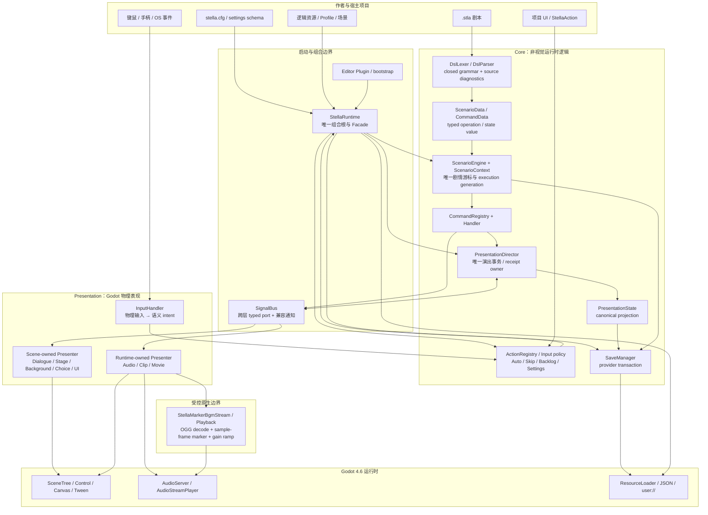
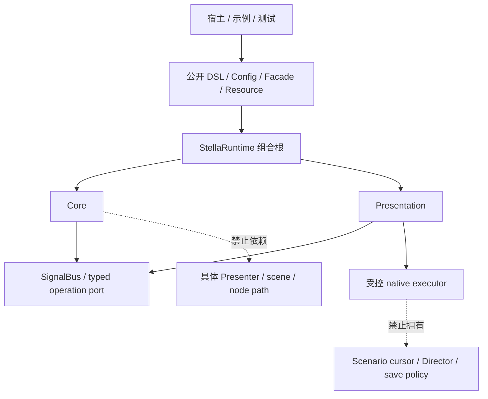
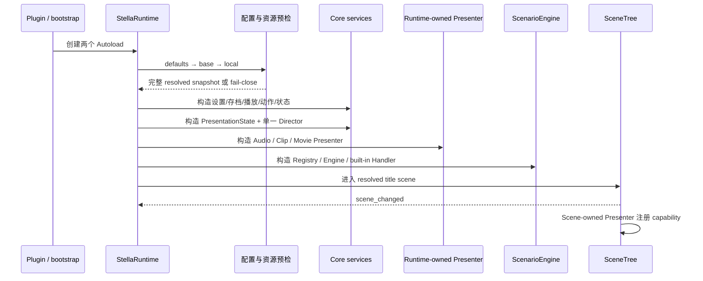
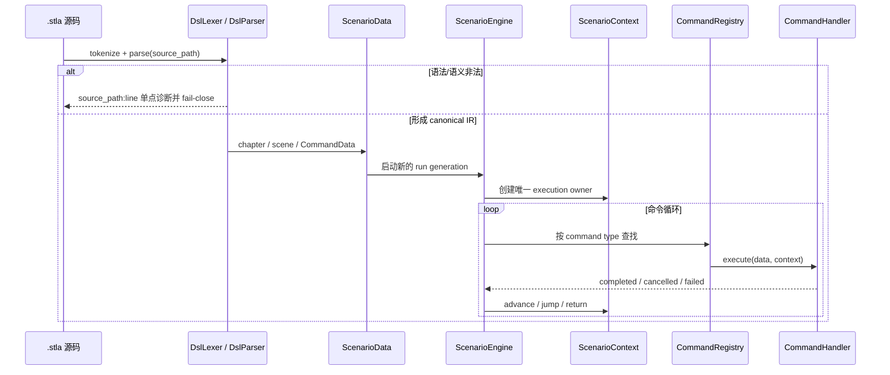
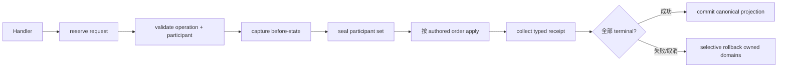
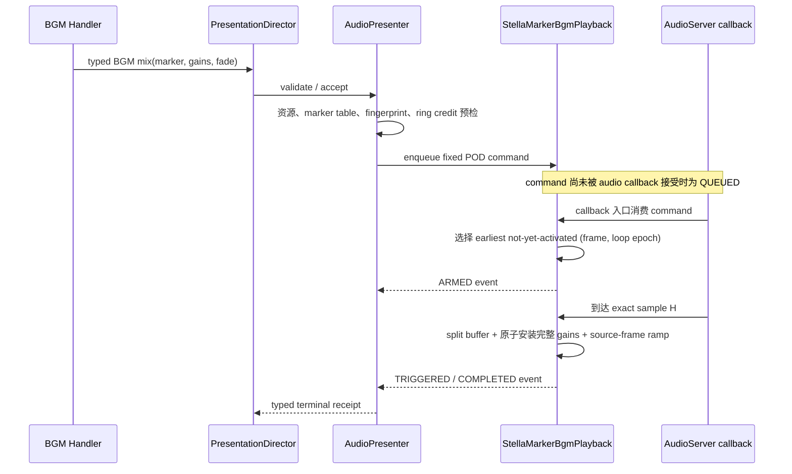
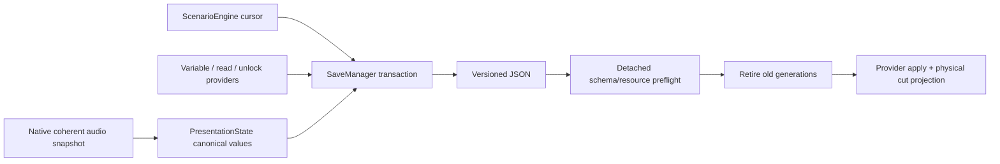

# Stella 架构设计

本文描述当前 `main` 已实现的模块所有权和运行时数据流，是 Stella 架构的权威说明。
它不重复完整 DSL 语法或所有 Facade 方法：

- 作者语法和默认值：[DSL.md](DSL.md)；
- 宿主接入和公开 API：[USAGE.md](USAGE.md)；
- 输入所有权：[INPUT_DESIGN.md](INPUT_DESIGN.md)；
- 架构判断、风险和演进顺序：[ARCHITECTURE_REVIEW.md](ARCHITECTURE_REVIEW.md)。

源码和测试是最终可执行事实。新功能改变所有权、数据流或兼容面时，必须在同一改动中更新
对应文档。

## 1. 一句话架构

Stella 是一个**单组合根、单剧情游标、单演出事务所有者**的 Godot 视觉小说框架：

- `StellaRuntime` 负责组合和生命周期；
- `ScenarioEngine` 负责唯一剧情执行游标；
- `PresentationDirector` 负责阻塞演出的批次、回执、取消和回滚；
- `SignalBus` 只承担跨层端口与兼容通知；
- Presenter 拥有 Godot 节点和物理表现；
- `SaveManager` 保存 canonical value，而不是节点、Tween 或 callback；
- 原生代码只作为受控执行器解决已确认的 Godot API 缺口。

## 2. 系统总览



图中最重要的约束是**箭头不能偷偷复制所有权**。`SignalBus` 可以传输事件，但不能因此成为
第二个 Director；原生 BGM callback 可以决定 sample-frame 物理切换，但不能因此成为剧情
scheduler；项目 UI 可以发出 action intent，但不能直接完成当前 blocking operation。

## 3. 分层与依赖规则



必须保持以下依赖规则：

1. 具体场景和节点行为属于 `presentation/` 或 `scenes/`；
2. Core 只通过 typed operation 或有文档约束的 `SignalBus` 端口请求表现，不搜索具体场景树；
3. `StellaRuntime` 是唯一生产组合根，任何子系统都不得并行构造 ScenarioEngine、
   PresentationDirector、输入路由或存档事务；
4. `core/` 是“非视觉运行时逻辑”，不是“完全引擎无关代码”：可以使用 `RefCounted`、
   Resource、signal 和 Variant，但不能依赖具体 Control/Node 布局；
5. 持久化状态只保存值、版本和稳定逻辑资源身份，不保存 Node、Callable、Tween、receipt 对象、
   音频 callback 或 wall-clock deadline；
6. 兼容 signal 是通知/adapter，不得成为内建 blocking command 的替代完成路径；
7. native extension 是例外实现细节，必须继续受 typed operation、Presenter、Director 和
   generation 生命周期约束。

## 4. 组件与所有权

| 组件 | 唯一职责 | 明确不负责 |
|---|---|---|
| `StellaRuntime` | 组合、Facade、启动、导航、生命周期桥接 | 具体 UI/音频渲染；第二套剧情执行 |
| `SignalBus` | Core↔Presentation 端口、typed 协议运输、公开通知 | 决定剧情顺序；创建 Director；保存状态 |
| `ScenarioEngine` | 当前 scenario/context 的命令循环与唯一剧情游标 | SceneTree 切换；具体表现实现 |
| `CommandRegistry` / Handler | 将 canonical CommandData 执行为 Core 变更或表现请求 | 扩展 DSL grammar；直接搜索 Presenter |
| `PresentationDirector` | batch ownership、authored order、receipt、JOIN/FNF、取消、选择性回滚 | 具体 channel 的节点/资源实现 |
| `PresentationState` | 持久表现域的 canonical value projection | live Node/Tween/player 所有权 |
| `SaveManager` | provider preflight、JSON 边界和原子恢复顺序 | 猜测损坏数据；保存 callback/节点 |
| `StellaActionRegistry` | 稳定 action catalog、确认与 owner generation | 物理输入优先级；直接推进剧情尾部 |
| Scene-owned Presenter | 当前场景中的 Dialogue/Stage/UI 等物理表现 | 跨场景持久 channel；剧情调度 |
| Runtime-owned Presenter | Audio/Clip/Movie 等跨场景 channel | 第二 Runtime/Director |
| Marker BGM native playback | audio callback 中的 OGG decode、marker 选择与 gain ramp | 资源语义、存档策略、receipt 语义、main-thread 调度 |

## 5. 启动与组合

`StellaRuntime._init()` 必须在宿主场景成员初始化消费配置前，完成分层配置解析：

```text
内置默认值 < res://stella.cfg < res://stella.local.cfg
```

每个来源都先完整解析和校验，再原子提交。未知 section/key、错误类型、非法编码或损坏语法会
拒绝整个来源，不留下半套覆盖。`stella.local.cfg` 只用于本机开发，不能进入发布包。



场景候选会在状态提交前经过资源、依赖、类型、构造器和退化路径预检。导航不是 Handler 直接
调用 `change_scene`，而是 Runtime-owned transaction；只有最终 `SceneTree.scene_changed`
确认目标后，才提交新的宏观状态。

## 6. 作者语法到剧情执行



Parser 拥有“作者语法 → canonical data”的映射。注册新 Handler **不会**自动扩展 `.stla`
语法。完整 DSL 功能通常需要同步修改：

1. grammar、tokenization 与源码定位诊断；
2. typed data 或严格 closed payload；
3. Handler 注册与执行；
4. 跨层端口与 Presenter；
5. 持久化投影和 JSON 边界（如适用）；
6. parser、lifecycle、same-process 与集成测试；
7. `DSL.md`、`USAGE.md`，以及所有权变化时的本文。

`ScenarioContext` 同时是 execution generation。新 run、load、rollback、restart 或 return-to-title
会退休旧 context；所有 `await` continuation 和公开 signal 返回后都必须复验 owner/generation。

## 7. 表现事务

Stella 当前保留两类跨层表现通信：

### 7.1 简单通知路径

非事务、无需 completion barrier 的操作可以通过有文档约束的 SignalBus notification 交给
Presenter。部分旧公开 signal 也继续作为兼容观察面存在。它们不能 settle typed batch，也不能
成为同一表现域的第二写入者。

### 7.2 类型化事务路径

Stage、对话显隐/清页/头像、章节标题、loop-SE、BGM、presentation clip 和 movie 通过单一
`PresentationDirector` 协调。普通对话激活使用独立的 typed `DialogueRequest` 生命周期，
不会被偷偷折叠成 presentation batch。



事务不变量：

- `JOIN` 阻塞剧情；`FIRE_AND_FORGET` 只释放剧情，projection 和 receipt 仍由 lifecycle 持有；
- participant 在 mutation 前捕获并 seal，迟到或 stale Presenter 不能扩大 barrier；
- operation 有稳定 channel，receipt 携带 request/token/generation/owner 身份；
- mixed batch 在首个可见 mutation 前预检全部 child，并保留作者顺序与 source line；
- Skip、finish、navigation 和 reset 只作用于当前 sealed owner；一次物理输入不能穿透到下一命令；
- 失败时只回滚仍属于该 transaction 的 domain，不覆盖已经被新 owner 接管的状态；
- `SignalBus` 运输 typed request/receipt，但 private registrar capability 防止任意 listener 加入
  内建 completion quorum。

## 8. 表现器与物理执行

Runtime-owned Presenter 在需要跨游戏场景持续存在的 channel 上保持唯一 owner：

- `AudioPresenter`；
- `PresentationClipPresenter`；
- `MoviePresenter`。

Scene-owned Presenter 随当前场景注册/注销 capability：

- Dialogue 与对话 UI；
- named Stage、Background 和 Screen Effects；
- Choice、章节标题和项目 UI/action binding。

Core 只保存逻辑资源 ID 和 canonical value。Presenter 在配置的资源根下解析物理资源，并拥有
Node、Texture、AudioStreamPlayer、VideoStreamPlayer、Tween 和 shader。项目专属 node path、
源格式字段或素材编码不得反向渗入 Core/DSL。

## 9. 标记同步 BGM 的原生边界

Issue #190 引入了当前唯一明确的原生音频执行器。原因不是“C++ 更快”，而是 Godot 4.6 的
GDScript / `AudioStreamSynchronized` 公共 API 无法在同一个 source sample H 上，对全部 stem
完成 audio-thread 原子切换且保持 callback 零分配。



边界规则：

- 只有一个 `AudioStreamPlayer`、一个 playback、一个 cursor/loop owner；
- callback 只操作预分配 decoder chunk、fixed POD command/event ring 和 caller-owned buffer；
- callback 不创建 Variant/Array/Ref，不分配、不加锁、不发 signal、不 deferred call；
- `AudioPresenter._process()` 只派送已经由 callback 决定的事件，不选择 marker、不轮询位置；
- save capture 与 marker selection 使用同一 `(source frame, loop epoch)` 坐标；
- restore 在 `player.play()` 前预配置 arm，并用完整静音 buffer gate 关闭启动竞态；
- native executor 不拥有资源语义、receipt 语义、存档政策、剧情或演出 scheduler；
- generated `.gdextension` 与 binary 不进仓库，三平台 CI 从固定依赖源码构建并验证导出 PCM；
- 新平台或新格式必须先具备确定性 build + exported-process smoke，不能静默退化成立即 mix。

该能力带来真实维护成本：Godot/godot-cpp ABI 升级时需要重编 debug/release；需要维护
macOS universal、Linux x86_64、Windows x86_64 toolchain、stb notice 和较长的 CI 冷构建。
这项成本已纳入架构评审，而不是被视为无成本实现细节。

## 10. 规范状态与存档



`SaveManager` 统一协调 provider。场景游标、变量和 provider snapshot 必须在任何 live mutation
前完成验证。`PresentationState` 保存的典型 domain 包括：

- 背景逻辑 ID；
- 命名 Stage layer 状态；
- 对话显隐、内容、头像和章节目标；
- BGM、loop-SE、movie channel 状态；
- queued/armed marker mix 的 versioned typed value。

Presenter 的 Node、Tween、receipt、callback 和临时 player 不进入存档。load、rollback、restart
和导航先退休旧 generation，再投影恢复值。新增字段必须定义 schema version、旧数据默认值、
非法数据行为和真实 JSON roundtrip 测试，不能只测内存 Dictionary。

## 11. 输入、动作与一次边界

`InputHandler` 把物理输入转换成语义 intent；`StellaActionRegistry` 是 Runtime-owned action
catalog，供内建 UI 和项目 Button 共用。核心原则是“一次输入、一个 owner”：

1. 非 Playing 状态拒绝剧情推进；
2. modal movie/clip 可优先 claim；
3. Choice 或交互 GUI 拥有自己接受的事件；
4. 隐藏 UI 的恢复会消费该次输入；
5. Skip/Auto policy 在普通对话推进前执行；
6. 当前 dialogue/presentation/wait owner 只接收一个稳定 dispatch serial。

输入代码不直接完成演出，它只把 intent 交给当前 typed owner。同步 listener 可能重入，因此每次
公开 signal/callback 返回后仍需复验 generation 和 owner。

## 12. 导航与取消

导航是 Runtime transaction，而不是 Handler 的直接场景切换：

1. 在 detached 状态解析 scenario/save/scene；
2. 验证资源、provider schema 与目标边界；
3. 取得新的 navigation generation；
4. 退休旧 ScenarioContext、Presenter receipt、waiter 和 overlay owner；
5. 请求 SceneTree 切换；
6. `scene_changed` 确认最终目标后提交新状态。

同步 callback 可以在旧 transaction 尾部发起更新的导航；因此语义是“最后一个已接受 owner
获胜”，而不是“最后一个 coroutine 返回获胜”。所有旧 tail 在每个 await 或公开 signal 后必须
因 generation 不匹配而变成 no-op。

## 13. 公开、兼容与内部表面

| 表面 | 稳定性 | 约束 |
|---|---|---|
| `.stla` grammar | 公开兼容面 | closed grammar；非法输入带源码位置 fail-close |
| `stella.cfg` / settings schema | 公开兼容面 | strict schema；本地覆盖只用于开发 |
| 文档列出的 `StellaRuntime` Facade | 公开宿主 API | 优先的宿主集成入口 |
| logical resource / Profile | 公开声明式资源面 | schema、根目录和 validation 必须有文档 |
| save JSON | 持久兼容面 | 版本、默认、迁移或拒绝政策必须明确 |
| 文档列出的 SignalBus notification | 兼容/扩展面 | 不是内建 typed completion authority |
| `core/data` operation / receipt | 内部协议 | 除非明确提升，否则可随 Stella 演进 |
| Runtime/Director 私有方法与 registrar capability | 内部实现 | 游戏项目不得直接调用 |
| native FFI Dictionary | Presenter↔executor 内部 ABI | strict closed schema，不是项目 API |

当前公开 API 分级主要依赖文档，还没有版本化 inventory 和自动兼容 gate。这是架构评审中的
优先改进项。

## 14. 扩展模型

支持的扩展方式应保持收敛：

- 通过 Facade、action 和 Profile 契约替换场景/UI；
- 通过 transition registry 添加 Stage transition provider；
- 在文档明确允许的 Presenter contract 上替换选择样式；
- 在配置的逻辑资源根下添加项目资源；
- 在 Stella 内端到端实现新命令与 grammar；
- 对确认的 Godot API 缺口添加受控原生 executor。

直接注册 `CommandHandler` 只对程序化 `CommandData` 有效，并不会扩展 closed `.stla`
grammar。raw SignalBus emission、直接修改 Runtime 内部、继承 exact built-in Presenter 或在
游戏项目中复制 scheduler 都是不稳定/禁止路径，除非 `USAGE.md` 明确提升为公共契约。

## 15. 验证与架构适应度

`AGENTS.md` 是完整测试策略的权威入口；以下 hermetic 命令同时属于架构边界：

```bash
godot --audio-driver Dummy --headless --import

STELLA_DISABLE_LOCAL_CONFIG=1 STELLA_DISABLE_IMPLICIT_SETTINGS_LOAD=1 \
  GODOT_BIN=godot tests/run_gut.sh full

STELLA_DISABLE_LOCAL_CONFIG=1 STELLA_DISABLE_IMPLICIT_SETTINGS_LOAD=1 \
  GODOT_BIN=godot tests/run_gut.sh focused \
  res://tests/unit/test_scenario_engine.gd

GODOT_BIN=godot tests/pck_smoke/run_export_smoke.sh
```

不得绕过 Stella runner 直接调用 GUT bundled command-line script 作为权威证据。runner 负责
exact manifest、诊断计数和 shutdown tail gate。

架构敏感变更至少应证明：

- parser 失败带源码位置且无部分 mutation；
- cancellation 与 stale callback 被拒绝；
- Autoload 同进程 reset/restart 不受测试顺序污染；
- 存读档经过真实 JSON 与物理投影；
- 每个已接受 operation 只有一个 terminal receipt；
- 动态资源和 native component 在导出程序中真实工作；
- 公开 fixture 不含私有游戏资产或路径；
- Core 不依赖具体 Presenter，且生产环境只有一个 Director/Runtime。

没有使用当前 revision 的覆盖率工具时，不声称固定覆盖率百分比。

## 16. 仓库地图

```text
addons/stella/
  autoload/             StellaRuntime + SignalBus
  core/
    commands/           CommandHandler 与命令执行
    data/               command、operation、receipt、state value
    input/              action catalog
    playback/           Auto、Skip、Backlog、read flag
    presentation/       PresentationDirector 与非节点 authority
    save_system/        SaveManager + PresentationState
    scenario_engine/    run context 与命令循环
    script_parser/      lexer、parser、Profile、flow graph
    settings/           settings schema 与 persistence
  presentation/         Godot Presenter、UI、render、audio、input
  scenes/               bootstrap 与框架默认场景
  editor/               Godot 编辑器集成
  native/               生成 descriptor 的模板
native/marker_bgm/      C++17 marker BGM executor 与构建/notice
examples/demo/          可再分发 demo
tests/unit/             聚焦契约
tests/integration/      跨层与生命周期契约
docs/                   公共文档与架构评审
```

## 17. 当前架构决策

以下是已接受的架构决策，不是可选风格：

- 一个 `StellaRuntime`、一个 `ScenarioEngine`、一个 `PresentationDirector`；
- 内建 blocking presentation 使用 typed completion；
- mutation 前 fail-close validation；
- 使用 generation/capability 解决所有权，不用任意 timing delay；
- 保存 canonical value，不序列化场景对象；
- remake 暴露的问题必须在 Stella 修复，不得用项目兼容掩盖；
- native 代码必须位于既有 typed lifecycle 后方，不能拥有第二调度器；
- 架构演进采用内部渐进拆分，不重写剧情引擎，不破坏公共兼容面。

当前方向能够继续支撑产品，但 Runtime、SignalBus、DslParser、PresentationDirector 和
AudioPresenter 已经集中太多规则。风险、目标形态和拆分顺序见
[ARCHITECTURE_REVIEW.md](ARCHITECTURE_REVIEW.md)。
