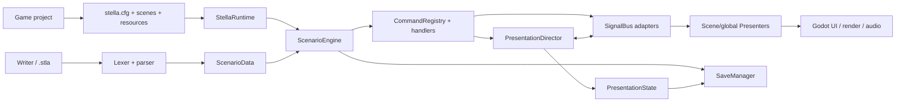
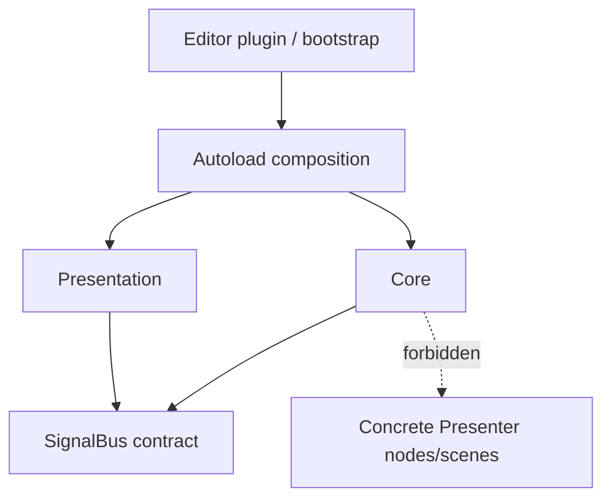
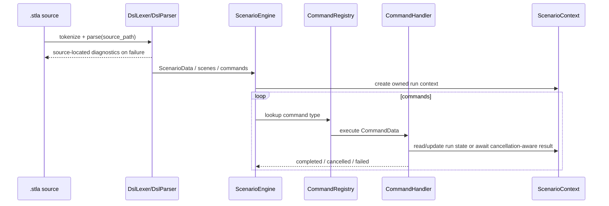
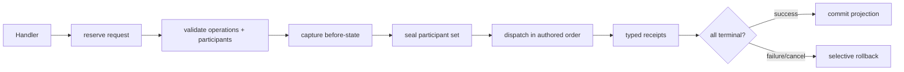

# Stella architecture

This document describes the architecture implemented on `main`. It is the
canonical source for module ownership and runtime data flow. It deliberately
does not duplicate the complete DSL grammar or every Facade method:

- authored syntax and defaults: [DSL.md](DSL.md)
- project integration and public API: [USAGE.md](USAGE.md)
- input ownership: [INPUT_DESIGN.md](INPUT_DESIGN.md)
- architectural assessment and roadmap: [ARCHITECTURE_REVIEW.md](ARCHITECTURE_REVIEW.md)

Source and tests are the executable truth. New features must update the
relevant canonical document in the same change.

## 1. Goals and boundaries

Stella is a Godot 4.6 visual-novel framework with a typed `.stla` authoring
language. Its main architectural goals are:

- keep scenario semantics independent from concrete scene layout;
- provide one composition root and one owner for each mutable runtime concern;
- validate authored input before visible or persistent mutation;
- make blocking commands cancellable across load, navigation, restart and
  scene replacement;
- persist canonical presentation state instead of serializing scene nodes,
  Tweens or callbacks;
- expose stable project APIs without turning compatibility adapters into a
  second execution path.

`core/` is **non-visual runtime logic**, not engine-independent code. It uses
Godot types (`RefCounted`, signals, resources and `Variant`) but must not depend
on concrete Control/Node scene layouts. `presentation/` owns Godot nodes,
rendering, UI and audio behavior.

Downstream games are validation consumers. A missing capability must be fixed
or designed in Stella; games must not encode character layers as backgrounds,
reimplement Stella scheduling, or add hidden compatibility paths to make a
specific package appear supported.

## 2. System context



There are two Autoloads:

- `StellaRuntime` is the composition root, lifecycle coordinator and public
  Facade. It constructs Core services, registers handlers, owns global
  Presenters, manages navigation and bridges public calls to the current run.
- `SignalBus` transports cross-layer requests and public notifications. Some
  typed presentation protocols also keep dispatch-scoped participant state on
  the bus, but the bus does not create another Director or scenario engine.

The plugin installs those Autoloads and selects the non-visual bootstrap scene
only when the host has no project-owned main scene (or still uses Stella's old
default title scene).

## 3. Dependency rules



The intended dependency rules are:

1. Concrete scene and node behavior stays in `presentation/` or `scenes/`.
2. Core commands communicate with Presentation through typed operations or a
   documented SignalBus port, never by searching a scene tree.
3. `StellaRuntime` is the only production composition root. No subsystem may
   construct a parallel ScenarioEngine, PresentationDirector or input router.
4. Persisted state contains values and stable logical resource identities, not
   live Nodes, Callables, Tweens, receipt objects or wall-clock deadlines.
5. Public compatibility signals are notifications/adapters. They must not
   become an alternative completion authority for built-in blocking commands.
6. Native extensions are exceptional implementation details for measured
   Godot API gaps. Their lifecycle must remain behind the same typed Core and
   Presenter ownership model.

## 4. Startup and composition

`StellaRuntime._init()` resolves the startup configuration before host scene
initializers consume it. Configuration resolution is atomic per source:

```text
built-in defaults < res://stella.cfg < res://stella.local.cfg
```

The local layer is for machine-specific development values and is not part of
a distributable project. Tests can explicitly disable implicit local config and
settings reads to remain hermetic.

`StellaRuntime._ready()` then constructs the runtime graph in this order:

1. settings, save, playback, game-state and action services;
2. `PresentationState` and the single `PresentationDirector`;
3. runtime-owned global Presenters (audio, presentation clip and movie);
4. `CommandRegistry`, `ScenarioEngine` and built-in handlers;
5. lifecycle bridges, save providers and state-change observers.

The bootstrap scene enters the resolved title scene after composition and
configuration are ready. Scene-owned Presenters register when their scene enters
the tree and retire their capabilities when it exits.

## 5. Authoring and execution pipeline



The parser owns the mapping from authored syntax to canonical `CommandData`.
Registering a new Handler does not automatically add a new `.stla` directive:
the parser must recognize and validate it first. A new DSL feature normally
touches all of the following:

1. grammar/tokenization and source-located diagnostics;
2. canonical typed data or closed payload schema;
3. Handler registration and execution;
4. cross-layer port and Presenter, when user-visible;
5. save/restore projection, when persistent;
6. parser, lifecycle and integration tests;
7. `DSL.md`, `USAGE.md` and this document when ownership changes.

`ScenarioContext` is the execution-generation token. Replacing or cancelling a
run makes old waiters lose ownership. Blocking handlers must use the shared
cancellation boundary rather than a naked signal/timer await.

## 6. Presentation architecture

Stella currently has two cross-layer presentation styles:

### 6.1 Simple notification path

Straightforward, non-transactional operations can be emitted through a
documented SignalBus signal and consumed by one Presenter. Legacy public signals
also remain observable by extensions. They do not settle typed transactional
commands and must not be used as a second owner.

### 6.2 Typed transactional path

Stage layers, dialogue visibility/page-clear/avatar, chapter indicator, loop-SE,
BGM, presentation clips and movies use typed operations coordinated by the
single `PresentationDirector`. Normal dialogue activation has its own typed
`DialogueRequest` lifecycle and is not silently folded into a presentation
batch.



Important properties:

- A batch has one policy: `JOIN` blocks the scenario; `FIRE_AND_FORGET` releases
  the command but the projection and receipts remain lifecycle-owned.
- Participant membership is captured and sealed before mutation. Late or stale
  Presenters cannot enlarge the barrier.
- Each operation has a stable channel and typed receipt. Generation/request
  checks reject callbacks from replaced scenes or superseded operations.
- Mixed batches preflight all children before the first visible mutation and
  retain authored child order and source locations.
- Skip, explicit finish, navigation and reset act on the current sealed owner;
  one physical input edge is never replayed into the next command.
- On failure, the Director restores the domains still owned by the failing
  transaction instead of resetting unrelated current owners.

`SignalBus` carries the typed request/receipt protocol because Core and
Presentation cannot import each other's concrete objects. `StellaRuntime`
creates private registrar authorities so arbitrary listeners cannot join a
built-in completion quorum.

## 7. Presentation ownership

Runtime-owned Presenters persist across game scenes when their channel must
survive overlays or scene replacement:

- `AudioPresenter`
- `PresentationClipPresenter`
- `MoviePresenter`

Scene-owned Presenters render the current scene and must register/unregister
their typed capabilities deterministically:

- dialogue and dialogue UI;
- named stage layers;
- backgrounds and effects;
- choices and project UI screens;
- chapter indicator and action bindings.

Core stores logical resource IDs and canonical values. Presentation resolves
those IDs to project resources. A game-specific node path or asset encoding must
not leak back into DSL or Core state.

## 8. Canonical state and persistence

`SaveManager` coordinates registered snapshot providers. Scenario cursor,
variables and provider snapshots are validated before a restore is committed.
Providers must offer value snapshots and deterministic restore behavior.

`PresentationState` is the canonical projection for persistent visual/audio
domains. It records values such as:

- background logical ID;
- named stage-layer states;
- dialogue visibility, content and avatar state;
- BGM, loop-SE and movie channel state.

Presenters apply this projection; their transient Tweens, node references and
receipts are not saved. Save/load, rollback, restart and navigation must cancel
old generations before applying the restored projection. New persisted fields
need an explicit version/default/migration policy and tests through the real JSON
boundary, not only in-memory Dictionaries.

Global/monotonic progress and per-save state are separate providers. A provider
must document whether restore replaces, merges or ignores older data.

## 9. Input and action ownership

`InputHandler` translates physical mouse/keyboard/controller input into semantic
intent. `StellaActionRegistry` is the Runtime-owned catalog used by built-in and
project UI buttons. See [INPUT_DESIGN.md](INPUT_DESIGN.md) for exact priority.

The architectural rule is one edge, one owner:

1. non-playing states reject story advance;
2. modal movie/presentation clip may claim the edge;
3. choice or interactive GUI owns its accepted event;
4. hidden UI restoration consumes the edge;
5. Skip/Auto policy runs before normal dialogue advance;
6. the current dialogue/presentation/wait owner receives one stable dispatch
   serial.

Input code does not complete presentation work itself. It dispatches intent to
the current typed owner and consumes the Godot event when that owner accepts it.

## 10. Navigation and cancellation

Navigation is a Runtime transaction, not a direct scene switch from a Handler.
The Runtime validates scenario/save/scene inputs before ownership changes, then
uses generation and suspension capabilities to retire the old run and confirm
the final `SceneTree.scene_changed` result.

All asynchronous continuations must re-check their context/generation after
every await or public signal emission. Reentrant callbacks may start a newer
navigation synchronously; last accepted owner wins and older tails become no-op.

This area is intentionally centralized because scene replacement intersects
ScenarioEngine ownership, Presenter registration, overlays, saves, audio and
game state. The concentration is also a maintainability risk documented in the
architecture review.

## 11. Public and internal surfaces

| Surface | Intended status | Notes |
|---|---|---|
| `.stla` grammar | public, versioned by behavior | closed grammar; invalid input fails with source location |
| `stella.cfg` / project settings schema | public, closed schema | unknown keys fail; local override is development-only |
| `StellaRuntime` documented Facade | public | preferred host integration surface |
| logical resources and presentation profiles | public | concrete schema must be documented and validated |
| save files | persisted compatibility surface | require explicit field/version migration policy |
| documented SignalBus notifications | compatibility/extension surface | not a built-in completion authority |
| `core/data` typed operations and receipts | internal protocol | may evolve with Stella unless explicitly promoted |
| private Runtime/Director methods and registrar capabilities | internal | never call from a game project |

Public API status is currently documented rather than mechanically enforced.
The review recommends adding an explicit API inventory and compatibility tests.

## 12. Extension model

Supported extension shapes are intentionally narrow:

- custom scenes and UI through documented Facade/action/profile contracts;
- custom stage transition providers through the transition registry;
- custom option presentation where the documented Presenter contract permits;
- project-owned logical resources under configured roots;
- new Stella commands implemented end-to-end in the framework.

Directly registering a `CommandHandler` is useful for programmatic
`CommandData`, but it does not extend the closed `.stla` grammar. Treat raw
SignalBus emission, direct mutation of Runtime internals and subclassing an
exact built-in Presenter as unstable unless `USAGE.md` explicitly supports it.

## 13. Verification and architecture fitness

The repository uses GUT unit/integration tests, headless import, rendering pixel
tests and export/PCK probes. `AGENTS.md` owns the full testing policy; the
hermetic entry points are repeated here because they are part of the
architecture fitness boundary:

```bash
godot --audio-driver Dummy --headless --import

STELLA_DISABLE_LOCAL_CONFIG=1 STELLA_DISABLE_IMPLICIT_SETTINGS_LOAD=1 \
  GODOT_BIN=godot tests/run_gut.sh full

STELLA_DISABLE_LOCAL_CONFIG=1 STELLA_DISABLE_IMPLICIT_SETTINGS_LOAD=1 \
  GODOT_BIN=godot tests/run_gut.sh focused \
  res://tests/unit/test_scenario_engine.gd

GODOT_BIN=godot tests/pck_smoke/run_export_smoke.sh
```

Do not invoke GUT's bundled command-line script directly for authoritative CI
evidence; the Stella runner owns the exact manifest, diagnostic accounting and
shutdown tail gate.

Architecture-sensitive changes should prove:

- source-located parser failure and no partial mutation;
- cancellation and stale-callback rejection;
- same-process reset/restart behavior, because Autoloads persist between tests;
- save/load through JSON and restored physical projection;
- one receipt/terminal outcome per accepted operation;
- exported-project behavior for dynamic resources and native components;
- no private game asset/path in public fixtures.

Coverage percentages are not claimed unless produced by a measured coverage
tool for the exact revision.

## 14. Repository map

```text
addons/stella/
  autoload/             StellaRuntime + SignalBus
  core/
    commands/           Command handlers
    data/               Commands, operations, receipts and state values
    input/              Semantic action catalog
    playback/           Auto, Skip, backlog and read state
    presentation/       PresentationDirector and non-node authorities
    save_system/        SaveManager + PresentationState
    scenario_engine/    Run context and command scheduler
    script_parser/      Lexer, parser, profiles and graph builder
    settings/           Settings schema and persistence
  presentation/         Godot Presenters, UI, render and audio
  scenes/               Framework default scenes and bootstrap
  editor/               Editor integration
examples/demo/          Redistributable example project
tests/unit/             Focused contracts
tests/integration/      Cross-layer and lifecycle contracts
docs/                   Public documentation and architecture review
```

## 15. Architectural decisions

The following rules are current decisions, not optional implementation style:

- one `StellaRuntime`, one `ScenarioEngine`, one `PresentationDirector`;
- typed completion for blocking built-in presentation;
- fail-close validation before mutation;
- generation/capability ownership instead of timing delays;
- canonical value snapshots instead of scene serialization;
- project gaps fixed in Stella, never concealed by remake compatibility;
- native code only behind the existing typed lifecycle when Godot's public API
  cannot meet a measured requirement.

The architecture is viable for the current product direction, but its central
objects have accumulated too many responsibilities. The recommended extraction
order and explicit non-goals are in [ARCHITECTURE_REVIEW.md](ARCHITECTURE_REVIEW.md).
