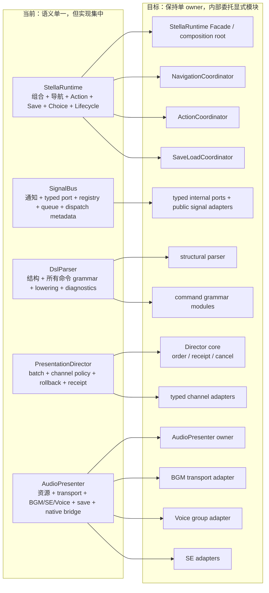

# Stella 架构评审

状态：架构决策与演进建议，不是运行时协议。

评审基线：`main` 的 `7f970d431880a14f53bde24bd0a47cc4ea06f273`，包含 Issue #190
的 marker-synchronized BGM。后续 revision 需要重新运行本文证据命令，不能照抄数字。

## 1. 结论

Stella 的**架构方向合理，应继续演进，不应重写**。

正确的骨架已经形成：剧情执行和具体场景表现分离；阻塞演出有 typed owner、receipt 和取消；
存档保存 canonical value；Runtime 只有一个组合根；原生音频执行器也被约束在既有 Presenter /
Director 生命周期内。

真正的问题是**职责集中度已经越过舒适区**，而不是底层模型错误。`StellaRuntime`、
`SignalBus`、`DslParser`、`PresentationDirector` 和现在的 `AudioPresenter` 都承载了多个独立
状态机。每项规则单独看大多防御充分，但它们组合后的重入、取消、存档和 same-process 状态空间
越来越难审查。

因此建议是：

> 保留单 Runtime / Engine / Director 的语义所有权，从现在开始把内部职责拆成 Runtime-owned
> coordinator、typed channel adapter 和 command grammar module；禁止再把完整新状态机直接堆进
> 五个中心文件。

## 2. 总体评分

| 领域 | 评估 | 依据 |
|---|---|---|
| 剧情与渲染分离 | 良好 | Core Handler 不搜索具体场景树，Presenter 拥有 Node |
| Runtime 所有权 | 方向正确、实现过载 | 单组合根/世代模型正确，但 Runtime 协调过多领域 |
| 表现事务 | 强但复杂 | 单 Director、sealed participant、typed receipt、选择性回滚 |
| DSL 正确性 | 校验强、模块化弱 | fail-close 与 canonical lowering 完整，单 parser 承担过多 grammar |
| 存读档 | 方向良好、中等风险 | canonical projection 正确，schema/JSON validator 仍分散 |
| 输入与 Action | 良好 | 稳定 action ID、一次输入一个 owner |
| 音频架构 | 能力强、维护风险高 | 单 transport 语义正确，但 AudioPresenter 与 native ABI 复杂度很高 |
| 扩展性 | 混合 | 有 registry/profile seam，部分 built-in admission 仍依赖 exact script/private capability |
| 公开 API 稳定性 | 不够显式 | 文档有分级，但没有版本化 inventory 和自动兼容 gate |
| 可测试性 | 行为覆盖强 | unit/integration/export 很深；Autoload 和大 owner 让隔离成本高 |
| 运营与发布 | 较高 | 三平台 native 冷构建、ABI、第三方 notice、PCK/export matrix |

## 3. 当前结构与目标结构

当前所有权无需推翻，但内部实现需要从“大对象内的隐式分区”演进成“小类型表达的显式分区”。



目标图中的模块都由原 owner 构造并持有：它们不是新 Autoload、不是第二 scheduler，也不扩大
公共 API。拆分的目的，是让依赖、state 和测试边界由类型表达，而不是靠同一个五千行文件中的
注释和命名约定表达。

## 4. 证据快照

这些数字是风险线索，不是代码行数 KPI：

| 文件/领域 | 基线行数 |
|---|---:|
| `StellaRuntime` | 5,395 |
| `SignalBus` | 5,418 |
| `DslParser` | 4,555 |
| `PresentationDirector` | 2,844 |
| `AudioPresenter` | 5,088 |
| `SaveManager` + `PresentationState` | 1,474 |
| Marker BGM C++ executor | 1,680 |

当前 checkout 还包含 153 个 Stella GDScript 文件、63 个 `core/data` typed class、135 个
SignalBus signal，以及 123 个 GUT 测试脚本。数量本身不是缺陷；风险在于多个独立 lifecycle
protocol 仍集中在少数 owner 中。

复现命令：

```bash
wc -l \
  addons/stella/autoload/stella_runtime.gd \
  addons/stella/autoload/signal_bus.gd \
  addons/stella/core/script_parser/dsl_parser.gd \
  addons/stella/core/presentation/presentation_director.gd \
  addons/stella/presentation/audio/audio_presenter.gd \
  addons/stella/core/save_system/save_manager.gd \
  addons/stella/core/save_system/presentation_state.gd \
  native/marker_bgm/src/stella_marker_bgm.cpp

rg --files addons/stella -g '*.gd' | wc -l
rg '^signal ' addons/stella/autoload/signal_bus.gd | wc -l
rg --files tests -g 'test_*.gd' | wc -l
```

## 5. 必须保留的设计

### 5.1 单一组合根和语义所有权

保留一个 Runtime、ScenarioEngine 和 PresentationDirector，可以防止子系统争夺剧情游标或
同一表现 channel。内部拆分不能变成平行 manager、Autoload 或 scheduler。

### 5.2 类型化事务表现

`reserve → validate → snapshot → seal → apply → receipt → settle` 是 mixed visual/audio
组合的正确模型。JOIN 得到真实 completion barrier，load/navigation 得到 stale callback 边界。
应该抽出 per-channel policy，而不是弱化该模型。

### 5.3 规范值快照

保存逻辑资源和 channel state，而不是 Node/Tween/player，是正确边界。restore preflight、
generation retirement 和 JSON 实际边界必须保留。

### 5.4 封闭作者契约

未知 DSL/config 字段必须失败，不能静默退化。Stella 的目标就是暴露引擎能力差距；不支持的
行为应在 Stella 中修复，而不是由 remake importer 或项目 Presenter 猜测兼容。

### 5.5 受控原生执行器

#190 的原生方案符合“例外但受控”的边界：一个 player/playback、固定内存、无第二 scheduler、
三平台构建和导出验证。后续 native 功能必须达到同等证据，不能因已经有 C++ 就默认扩大 native
表面。

## 6. 主要风险

### R1 — Autoload 职责集中（高）

`StellaRuntime` 同时承担组合根、Facade、导航、scene validator、Action、save/load、choice policy
和 lifecycle bridge。`SignalBus` 同时承担公开通知、typed transport、participant registry、队列
和 dispatch metadata。

后果：

- 无关功能共享可变全局生命周期；
- 同进程测试顺序更容易影响结果；
- 一项新功能需要理解数千行重入规则；
- 所有权更多靠注释而不是小类型表达。

### R2 — 解析器职责集中（高）

`DslParser` 同时处理 block structure、所有命令 grammar、canonical lowering、diagnostics 和部分
semantic validation。新增命令继续扩大一个 parse loop；quote/option 规则容易在命令之间分叉。

### R3 — `AudioPresenter` 与原生 ABI 复杂度（高）

#190 在保持架构纯净的前提下解决了真实能力缺口，但 `AudioPresenter` 已增长到与 Runtime/Bus
同量级。它同时处理 BGM、loop-SE、one-shot SE、Voice/DSP、physical player、save snapshot、
native FFI、callback event drain 和 teardown。

此外，native path 引入：

- Godot/godot-cpp ABI pin；
- stb_vorbis 来源与许可证责任；
- macOS/Linux/Windows compiler matrix；
- debug/release artifact 和 PCK/export smoke；
- 实时线程固定内存与 callback 证明责任。

这不是否定 native 方案，而是说明下一步优先拆分 AudioPresenter 内部 adapter，而不是再直接加入
新的音频状态机。

### R4 — 两种表现通信风格并存（中高）

simple SignalBus notification 与 typed Director transaction 同时存在，迁移期可以接受，但目前
分类没有被机械强制。未来 Handler 可能错误地等待兼容 signal，或让两条路径写同一 domain。

### R5 — 持久化模式分散（中）

多个 domain 已有 typed value，但 save/JSON 边界仍使用嵌套 Dictionary，validator/default 分散
在 provider 中。新增字段容易出现内存、JSON 和 physical restore 三套规则不一致。

### R6 — 扩展承诺与真实扩展缝隙不完全一致（中高）

注册 Handler 不会扩展 closed `.stla` parser；部分 built-in Presenter admission 依赖 exact script
或 private capability；raw SignalBus 可观察但不是 canonical completion path。缺少版本化 API
清单时，宿主容易依赖未来需要变化的内部实现。

### R7 — 架构主要靠行为测试保护（中）

测试覆盖了大量 lifecycle 行为，但依赖方向、公开 API inventory、单 Director composition、
DSL 文档完整性和 native boundary 主要靠 CR 发现，静态 architecture fitness gate 仍不足。

## 7. 推荐演进顺序

### 阶段 A：先把边界变成可检查事实

1. 建立版本化 public API inventory：DSL、config、Facade、公开 signal、resource schema、save
   schema version；
2. 为单 Director、typed receipt、SignalBus 兼容角色、canonical save projection、native policy
   编写 ADR；
3. 增加静态适应度测试：
   - Core 不 import 具体 Presenter/scene；
   - 只有 Runtime 构造 Director 和 registrar authority；
   - 每个 registered Handler 都有 parser/contract/doc 覆盖；
   - compatibility signal 不能 settle built-in typed request；
   - native executor 不能引用 story/save/Director owner；
4. 提取共享 tokenizer、option 和 source diagnostic helper，停止增加命令专用 quote parser。

### 阶段 B：拆分运行时，但保留外观接口

由 `StellaRuntime` 创建并持有内部服务：

- `RuntimeComposition`：只负责构造与注册；
- `NavigationCoordinator`：scenario/scene handoff 与 generation；
- `ActionCoordinator`：catalog、confirmation、Presenter binding；
- `SaveLoadCoordinator`：preflight 与 provider transaction 顺序；
- `ChoiceSessionCoordinator`：choice 与 Auto suspension 生命周期。

这是机械提取：不增加 Autoload、signal bus、scheduler 或公开 API。

### 阶段 C：按通道拆分表现协议和音频适配器

- Director 只保留 batch ownership、authored order、receipt accounting 和 cancellation；
- Stage/Dialogue/BGM/Movie 等 validation/apply/rollback 进入 typed channel adapter；
- SignalBus 的 participant/queue mechanics 进入内部 typed port，公开 signal 只做 adapter；
- AudioPresenter 保留唯一 owner 和 Godot node lifecycle，把 BGM transport、marker native bridge、
  Voice group/DSP、loop-SE/one-shot SE 拆成明确依赖的内部 adapter。

### 阶段 D：模块化语法

保留唯一公开 `DslParser.parse()`，但让 structural parser 只处理 chapter/scene/block；命令 grammar
module 共享一个 tokenizer/diagnostic API，返回 typed canonical data，不修改 runtime state，也不
注册 Handler。

## 8. 明确不做什么

- 不重写 ScenarioEngine，不改成 ECS；
- 不为音频、电影或项目内容增加第二 Runtime/Director；
- 不引入项目专属 KAG/legacy grammar，除非正式成为 Stella 公共 DSL；
- 不把人物/舞台状态编码成背景；
- 不用任意 sleep、polling 或 wall-clock 协调竞态；
- 不让 native layer 拥有剧情或演出 scheduler；
- 不在内部拆分过程中批量破坏公开 API；
- 不以减少行数为目标，目标是缩小可变状态和 owner 边界。

## 9. 决策清单

继续采用当前架构的前提是项目接受：

- 保留单 owner typed lifecycle；
- 停止把完整新状态机直接加入五个中心文件；
- 明确区分 public、compatibility 和 internal API；
- 把 save schema、DSL 和 native ABI 当作版本化产品；
- remake 暴露的能力缺口必须在 Stella 修复；
- feature delivery 与内部模块化并行推进。

如果拒绝这些约束，短期功能开发仍可能很快，但 CR、same-process 测试、跨场景生命周期和三平台
发布成本会持续上升。当前推荐决策是：**不重写；立即开始渐进式模块化，并优先处理 Runtime、
SignalBus、Parser 和 AudioPresenter 的集中度。**
