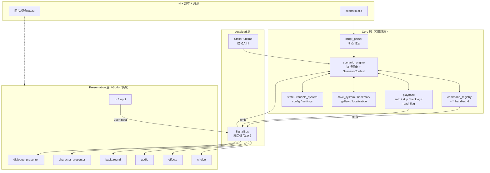

# Stella — Godot AVG / Galgame 框架架构设计

> 框架名称：**Stella（夏目）**
> 仓库：`github.com/butter-stella/stella`
> 引擎：Godot 4 + GDScript

## Context

基于 Godot 的视觉小说框架。自用为主，后期开源。要求架构质量高、扩展性好。

## 已确认的决策

- **脚本格式**：自定义 DSL（`.stla`），引擎直接解析为内部数据结构
- **架构**：三层分离（Core / Presentation / Plugin），Core 层尽量与 Godot API 解耦
- **语言**：GDScript 为主，性能敏感部分可用 Rust（gdext）扩展
- **开发范围**：完整规划，按优先级分步执行

---

## 一、架构总览

```
┌─────────────────────────────────────────────────┐
│              Plugin Layer (编辑器插件层)           │
│  节点式剧情编辑器 | 资源浏览器 | 实时预览面板      │
├─────────────────────────────────────────────────┤
│           Presentation Layer (表现层/Godot)       │
│  对话系统 | 立绘系统 | 背景系统 | 音频系统         │
│  UI系统 | CG鉴赏 | 转场/特效系统                  │
├─────────────────────────────────────────────────┤
│              Core Layer (核心层)                   │
│  脚本解析器 | 剧情引擎 | 变量系统 | 存档系统        │
│  资源抽象 | 命令注册表 | 信号总线                   │
└─────────────────────────────────────────────────┘
```

Core 与 Presentation 通过 Godot 信号（Signal）解耦。Core 层可独立单元测试。

### 1.1 模块依赖与数据流



**数据流说明**：
- 正向：`.stla` → `script_parser` → `scenario_engine` 调度 → `command_registry` 分发到各 `*_handler` → 通过 `SignalBus` 广播给 Presentation 层 presenter
- 反向：用户输入（点击/选择）从 `presentation/input` 经 `SignalBus` 回到 `scenario_engine` 推进剧情
- `playback` 子模块（auto/skip/backlog/read_flag）状态独立，与 engine 协作并通过 SignalBus 与 UI 联动

---

## 二、核心设计

### 2.1 命令模式 — 整个框架的基石

```gdscript
# 命令处理器基类
class_name CommandHandler extends RefCounted

func get_command_type() -> String:
    return ""

func execute(data: CommandData, context: ScenarioContext) -> void:
    pass

func rollback(data: CommandData, context: ScenarioContext) -> void:
    pass
```

```gdscript
# 命令注册表
class_name CommandRegistry extends RefCounted

var _handlers: Dictionary = {}  # String -> CommandHandler

func register(handler: CommandHandler) -> void:
    _handlers[handler.get_command_type()] = handler

func get_handler(command_type: String) -> CommandHandler:
    return _handlers.get(command_type)
```

新增指令只需继承 `CommandHandler`，注册到 `CommandRegistry`，符合开闭原则。

### 2.2 剧情引擎

主循环：`LoadScenario → SetScene → FetchCommand → Dispatch → WaitForCompletion → Next`

```
core/
├── scenario_engine.gd        -- 主引擎
├── scenario_context.gd       -- 运行时上下文（场景、指令指针、调用栈）
├── command_data.gd           -- 指令数据
├── command_registry.gd       -- 命令注册表
└── wait_controller.gd        -- 等待控制（点击/动画/选择）
```

```gdscript
# ScenarioEngine 核心流程
class_name ScenarioEngine extends RefCounted

signal scenario_started(scenario_id: String)
signal scenario_ended(scenario_id: String)
signal scene_changed(scene_id: String)
signal command_executed(command_data: CommandData)

var context: ScenarioContext
var registry: CommandRegistry
var wait_controller: WaitController

func load_scenario(data: ScenarioData) -> void:
    context = ScenarioContext.new(data)
    scenario_started.emit(data.id)

func run() -> void:
    while not context.is_finished:
        if context.pending_jump:
            _jump_to_scene(context.pending_jump)
            context.pending_jump = ""
            continue

        var cmd := context.current_command()
        if cmd == null:
            _advance_to_next_scene()
            continue

        var handler := registry.get_handler(cmd.type)
        if handler:
            await handler.execute(cmd, context)
            command_executed.emit(cmd)

        context.advance()

    scenario_ended.emit(context.scenario_data.id)
```

### 2.3 信号总线

利用 Godot 原生信号机制，通过 Autoload 单例实现全局事件总线：

```gdscript
# autoload/signal_bus.gd
extends Node

# 对话
signal show_dialogue(character: String, text: String, voice: String, mode: String)
signal hide_dialogue()
signal advance_requested()

# 立绘
signal char_show(character: String, expression: String, position: String)
signal char_hide(character: String)
signal char_expression_changed(character: String, expression: String)
signal char_anim_requested(character: String, anim: String, intensity: String)
signal char_move_requested(character: String, position: String, duration: float)

# 背景
signal bg_changed(asset: String, transition: String, duration: float)

# 音频
signal bgm_play(asset: String, fade_duration: float)
signal bgm_stop(fade_duration: float)
signal se_play(asset: String, loop: bool)
signal se_stop(asset: String)
signal voice_play(asset: String)
signal voice_started(character: String, asset: String)
signal voice_progress(progress: float, current_time: float)
signal voice_finished()

# 选择
signal choice_show(prompt: String, options: Array)
signal choice_selected(option_id: String)

# CG
signal cg_show(asset: String, mode: String, transition: String, duration: float)
signal cg_hide(transition: String, duration: float)

# 特效
signal effect_requested(effect_type: String, params: Dictionary)
signal fade_requested(direction: String, duration: float)

# 系统
signal scenario_started_event(scenario_id: String)
signal scenario_ended_event(scenario_id: String)
signal scene_changed_event(scene_id: String)
signal variable_changed(var_name: String, value: Variant)
signal settings_changed(key: String, value: Variant)
```

### 2.4 变量系统

三个作用域：
- `global`：跨存档永久变量（CG 解锁、已读标记）
- `scenario`：当前存档变量（好感度、flag）
- `temp`：临时变量（不入存档）

```gdscript
class_name VariableStore extends RefCounted

enum Scope { GLOBAL, SCENARIO, TEMP }

var _stores: Dictionary = {
    Scope.GLOBAL: {},
    Scope.SCENARIO: {},
    Scope.TEMP: {},
}

func set_var(name: String, value: Variant, scope: int = Scope.SCENARIO) -> void:
    _stores[scope][name] = value
    SignalBus.variable_changed.emit(name, value)

func get_var(name: String, default: Variant = null) -> Variant:
    # 优先级：Temp → Scenario → Global
    for scope in [Scope.TEMP, Scope.SCENARIO, Scope.GLOBAL]:
        if _stores[scope].has(name):
            return _stores[scope][name]
    return default

func capture_snapshot() -> Dictionary:
    return {
        "scenario": _stores[Scope.SCENARIO].duplicate(),
        "global": _stores[Scope.GLOBAL].duplicate(),
    }

func restore_snapshot(snapshot: Dictionary) -> void:
    _stores[Scope.SCENARIO] = snapshot["scenario"].duplicate()
    _stores[Scope.GLOBAL] = snapshot["global"].duplicate()
```

ExpressionEvaluator 支持：比较（>=, >, <, <=, ==, !=）、逻辑（&&, ||, !）、算术运算。

### 2.5 存档系统

各子系统通过统一的快照机制实现存档/读档：

```gdscript
class_name SaveManager extends RefCounted

var _providers: Array = []  # Array[SnapshotProvider]
var _save_dir: String = "user://saves/"

func register_provider(provider) -> void:
    _providers.append(provider)

func save(slot_id: int) -> void:
    var data := {}
    for provider in _providers:
        data[provider.get_provider_id()] = provider.capture_snapshot()
    data["timestamp"] = Time.get_unix_time_from_system()

    var path := _save_dir + "save_%d.json" % slot_id
    var file := FileAccess.open(path, FileAccess.WRITE)
    file.store_string(JSON.stringify(data))

func load_save(slot_id: int) -> void:
    var path := _save_dir + "save_%d.json" % slot_id
    var file := FileAccess.open(path, FileAccess.READ)
    var data: Dictionary = JSON.parse_string(file.get_as_text())

    for provider in _providers:
        var id := provider.get_provider_id() as String
        if data.has(id):
            provider.restore_snapshot(data[id])
```

快照协议（duck typing）：
```gdscript
# 任何需要存档的子系统实现这三个方法
func get_provider_id() -> String: ...
func capture_snapshot() -> Dictionary: ...
func restore_snapshot(snapshot: Dictionary) -> void: ...
```

### 2.6 选择系统

选择的本质是「暂停引擎 → 等待玩家做出选择 → 返回选中的 option id」。

```gdscript
class_name ChoicePresenter extends Control

func get_style() -> String:
    return "text"

func show_and_wait(data: ChoiceData) -> String:
    # 子类实现具体 UI，返回选中的 option id
    return ""
```

框架内置 `TextChoicePresenter` 作为默认实现。游戏项目注册自定义 Presenter（如 `MapChoicePresenter`）即可扩展新的选择风格。

**DSL 示例 — 不同风格**：

```
# 经典文字选项
@choice "你该怎么回应？"
  - "你好，我叫..." -> scene_002a {sakura_affection += 5}
  - "......" -> scene_002b

# 地图选点（通过 extra 参数传递坐标）
@choice "去哪里？" #style:map #bg:map_school
  - "图书馆" -> scene_library #x:0.3 #y:0.6
  - "天台" -> scene_rooftop #x:0.7 #y:0.2
```

### 2.7 指令并行执行

```
@parallel
  @bg bg_sunset dissolve 1.0
  @show sakura smile center
  @anim kaito shake
@end
```

引擎遇到 `parallel` 指令时，同时启动所有子指令，`await` 全部完成后继续。

---

## 三、表现层

### 3.1 对话系统

- 打字机效果：`RichTextLabel` + `visible_characters` 逐字递增
- 内联标签：`{wait:0.5}` 暂停、`{speed:0.5}` 变速
- 句内表情切换：`[expr:surprised]` 在打字到达该位置时触发表情变更
- Backlog 数据管理

**对话框模式**：

| 模式 | 说明 |
|------|------|
| `adv`（默认） | 底部对话框，标准 Galgame 模式 |
| `nvl` | 全屏文本，文字逐行累积，适合独白、旁白、信件 |
| `overlay` | 无对话框，文字直接叠在画面上（内心独白、回忆闪回） |

**对话框头像同步**：
- 有立绘时：自动同步当前立绘表情
- CG/无立绘场景：通过 `#face:happy` 参数独立指定

**文字显示控制**：
- `CharacterInterval`：每字显示间隔（毫秒），0=瞬间显示
- `PunctuationPause`：标点额外停顿（毫秒）
- `{wait:500}` 内联插入停顿
- `{speed:30}` 临时改变字符间隔

### 3.1.1 SD 插画

SD 插画用于对话中插入 Q 版角色小图、表情包、反应图等演出效果：

```
@cg sakura_chibi_angry sd
@cg sakura_chibi_laugh sd 1.5s    // 自动消失
```

### 3.2 立绘系统

- 渲染模式：整张替换 / 分层合成（身体底图 + 表情差分叠加）
- 位置预设（left/center/right + 自定义坐标）
- 入场/退场动画（fade、slide）
- 通过 Godot `Tween` 实现所有动画效果

**立绘动画预设**：

| 预设 | 效果 | 典型用途 |
|------|------|---------|
| `jump` | 上下弹跳 | 惊讶、开心 |
| `shake` | 左右震动 | 受惊、愤怒 |
| `nod` | 小幅下移回弹 | 点头 |
| `bounce` | 缩放弹跳 | 兴奋 |
| `fade_in` / `fade_out` | 透明度渐变 | 入场/退场 |
| `slide_in` / `slide_out` | 从屏幕外滑入/滑出 | 入场/退场 |

支持自定义动画：继承 `CharacterAnimator` 基类扩展。

**Live2D 支持**（后期扩展）：通过 `CharacterRenderer` 基类抽象渲染方式，新增 `Live2DRenderer` 实现。角色配置中 `render_mode` 字段区分 `sprite` / `layered` / `live2d`。

### 3.3 背景系统

- 双缓冲（front/back `TextureRect`）
- 转场效果基于 Shader（fade/dissolve/wipe/pixelate/blur），可扩展
- 通过 `Tween` + `ShaderMaterial` 参数驱动转场动画

### 3.4 音频系统

- BGM：淡入淡出、交叉混合（双 `AudioStreamPlayer`）
- SE：多通道并行（`AudioStreamPlayer` 池）
- Voice：对话同步，角色独立音量控制
- 语音未播完可阻止自动推进

### 3.5 CG 系统

通过 `@cg` 指令统一管理：

| 模式 | 关键字 | 行为 |
|------|--------|------|
| 全屏 | （默认） | 替换背景层，自动隐藏立绘，点击推进后恢复 |
| SD | `sd` | 小图弹出在对话框旁，不影响背景和立绘 |
| 动态 | `animated` | 全屏 CG + 附加动画效果（粒子、摇晃等） |
| 差分 | `asset:variant` | 切换同一张 CG 的不同状态 |

### 3.6 游戏设置系统

框架提供设置数据模型、持久化、信号通知。UI 由游戏项目自行实现。

```gdscript
# core/game_settings.gd
class_name GameSettings extends Resource

# ═══ 文字显示 ═══
@export var character_interval: int = 50        # 每字显示间隔（毫秒）
@export var punctuation_pause: int = 200        # 标点额外停顿（毫秒）
@export var click_to_complete: bool = true      # 打字中点击先显示完整文本
@export var text_window_opacity: float = 0.8    # 文本框透明度

# ═══ 自动播放 ═══
@export var auto_play_delay: float = 1.5        # 文本显示完后等待时间（秒）
@export var auto_play_wait_voice: bool = true   # 等语音播完再推进
@export var auto_play_pause_on_choice: bool = true

# ═══ 快进 ═══
@export var skip_interval: int = 50             # 快进时每条对话停留时间（毫秒）
@export var skip_only_read: bool = true         # 仅跳过已读文本
@export var skip_unread_confirm: bool = true    # 快进遇到未读时弹确认
@export var skip_stop_on_choice: bool = true

# ═══ 音量 ═══
@export var master_volume: float = 1.0
@export var bgm_volume: float = 0.8
@export var se_volume: float = 1.0
@export var system_se_volume: float = 1.0
@export var voice_volume: float = 1.0
@export var character_voice_volume: Dictionary = {}   # character_id -> float
@export var character_voice_enabled: Dictionary = {}  # character_id -> bool

# ═══ 语音行为 ═══
@export var voice_continue_on_advance: bool = false   # 推进后语音继续播放
@export var voice_replay_on_backlog: bool = true      # Backlog 中可重播语音

# ═══ 画面 ═══
@export var fullscreen: bool = false
@export var effect_enabled: bool = true               # 转场/特效开关

# ═══ 操作 ═══
@export var key_bindings: Dictionary = {}             # action_name -> key
```

持久化使用 `user://settings.json`，各子系统订阅 `SignalBus.settings_changed` 信号动态响应。

### 3.7 播放控制

- **AutoPlayController**：文本显示完后按设定延迟自动推进，语音播放中暂缓
- **SkipController**：快进模式，可配置仅跳已读
- **ReadFlagManager**：记录已读对话（基于 scenario_id + scene_id + command_index），持久化到 global 变量
- **BacklogManager**：记录对话历史，支持语音重播

### 3.8 UI 系统

- 标题画面、选项分支、Backlog、存读档界面
- 自动播放 / 快进（仅已读/全部）
- 游戏状态机管理宏观流程

**游戏状态机**：

```
Title → Playing → Paused → Playing
                → SaveLoad → Playing
                → Settings → Playing
                → Backlog → Playing
Playing → Title（返回标题）
```

### 3.9 跨端支持

**输入抽象** — 将具体输入映射为语义动作：

```gdscript
# 通过 Godot InputMap 统一管理
enum InputAction {
    ADVANCE,         # 推进对话（点击/触摸/手柄A）
    CANCEL,          # 取消/返回（右键/返回键/手柄B）
    SHOW_MENU,       # 打开菜单
    HISTORY_PREV,    # 回看上一条（滚轮上/上滑）
    HISTORY_NEXT,    # 回看下一条（滚轮下/下滑）
    TOGGLE_AUTO,     # 切换自动播放
    TOGGLE_SKIP,     # 切换快进
    HIDE_UI,         # 隐藏文本框
    QUICK_SAVE,      # 快速存档
    QUICK_LOAD,      # 快速读档
}
```

利用 Godot 内置的 `InputMap` + `InputEvent` 体系，PC/移动/手柄自动适配。

---

## 四、高级功能

### 4.1 语音驱动差分切换

一句对话中，角色表情随语音/文字进度自动切换。

编剧在文本中用 `[expr:xxx]` 内联标记切换点：

```
sakura「我本来很开心的...[surprised]但是听到这个消息之后...[cry]呜呜...」 #voice:sakura_042
```

**双定位模式**：

| 字段 | 来源 | 用途 |
|------|------|------|
| `at_char` | DSL 解析自动生成 | 无语音时：打字机到达该字符位置触发切换 |
| `at` | 编辑器波形工具手动标注 | 有语音时：精确秒数，优先级高于 at_char |

### 4.2 语音播放进度

框架提供语音播放状态的实时数据，游戏项目可据此实现进度条 UI：

```gdscript
class_name VoicePlaybackInfo extends RefCounted

var is_playing: bool
var current_time: float
var total_duration: float
var progress: float        # 0~1
var character_name: String
var voice_asset_id: String
```

### 4.3 语音收藏系统

游戏中收藏语音 → 收藏界面浏览/重播 → 可跳转回对应场景继续游玩。依赖快照机制，收藏时自动捕获状态快照。

### 4.4 本地化系统

对话文本用 `text_key` 引用本地化表，支持导出 CSV 供翻译。可利用 Godot 内置的 `TranslationServer` 配合自定义的剧本本地化方案。

### 4.5 编辑器插件

基于 Godot `EditorPlugin` 实现：

- 节点式剧情编辑器（`GraphEdit` + `GraphNode`）
- 宏观视图：每个节点 = 一个场景，连线 = 跳转
- 微观视图：选中场景后，侧面板编辑指令序列
- 资源浏览器
- 实时预览

### 4.6 Live2D 支持

通过 `CharacterRenderer` 基类扩展，新增 `Live2DRenderer`。GDCubism 插件提供 Godot 上的 Live2D 运行时。

---

## 五、项目目录结构

```
stella/
├── project.godot
├── addons/
│   └── stella/                        -- 框架（Godot Plugin）
│       ├── plugin.cfg
│       ├── core/                       -- 核心层
│       │   ├── script_parser/
│       │   │   ├── dsl_token.gd
│       │   │   ├── dsl_lexer.gd
│       │   │   ├── dsl_parser.gd
│       │   │   └── dsl_parse_error.gd
│       │   ├── scenario_engine/
│       │   │   ├── scenario_engine.gd
│       │   │   ├── scenario_context.gd
│       │   │   └── wait_controller.gd
│       │   ├── commands/
│       │   │   ├── command_handler.gd       -- 基类
│       │   │   ├── command_registry.gd
│       │   │   ├── dialogue_handler.gd
│       │   │   ├── bg_handler.gd
│       │   │   ├── char_show_handler.gd
│       │   │   ├── char_hide_handler.gd
│       │   │   ├── char_expr_handler.gd
│       │   │   ├── choice_handler.gd
│       │   │   ├── jump_handler.gd
│       │   │   ├── condition_handler.gd
│       │   │   ├── set_handler.gd
│       │   │   ├── bgm_handler.gd
│       │   │   ├── se_handler.gd
│       │   │   ├── fade_handler.gd
│       │   │   ├── wait_handler.gd
│       │   │   ├── cg_handler.gd
│       │   │   ├── anim_handler.gd
│       │   │   ├── move_handler.gd
│       │   │   └── parallel_handler.gd
│       │   ├── data/
│       │   │   ├── scenario_data.gd
│       │   │   ├── scene_data.gd
│       │   │   ├── command_data.gd
│       │   │   └── choice_data.gd
│       │   ├── variable_system/
│       │   │   ├── variable_store.gd
│       │   │   └── expression_evaluator.gd
│       │   ├── save_system/
│       │   │   └── save_manager.gd
│       │   └── settings/
│       │       ├── game_settings.gd
│       │       └── settings_manager.gd
│       ├── presentation/               -- 表现层
│       │   ├── dialogue/
│       │   │   ├── dialogue_presenter.gd
│       │   │   ├── dialogue_presenter.tscn
│       │   │   ├── text_animator.gd
│       │   │   └── backlog_manager.gd
│       │   ├── character/
│       │   │   ├── character_presenter.gd
│       │   │   ├── character_renderer.gd    -- 基类
│       │   │   ├── sprite_renderer.gd
│       │   │   ├── layered_renderer.gd
│       │   │   └── character_animator.gd
│       │   ├── background/
│       │   │   ├── background_presenter.gd
│       │   │   ├── background_presenter.tscn
│       │   │   └── shaders/
│       │   │       ├── fade.gdshader
│       │   │       ├── dissolve.gdshader
│       │   │       └── wipe.gdshader
│       │   ├── audio/
│       │   │   ├── bgm_controller.gd
│       │   │   ├── se_controller.gd
│       │   │   └── voice_controller.gd
│       │   ├── choice/
│       │   │   ├── choice_presenter.gd      -- 基类
│       │   │   ├── text_choice_presenter.gd
│       │   │   └── text_choice_presenter.tscn
│       │   ├── cg/
│       │   │   └── cg_presenter.gd
│       │   ├── effects/
│       │   │   └── screen_effects.gd
│       │   └── ui/
│       │       ├── title_screen.gd
│       │       ├── save_load_screen.gd
│       │       ├── settings_screen.gd
│       │       ├── backlog_screen.gd
│       │       └── game_state_machine.gd
│       ├── autoload/
│       │   ├── signal_bus.gd
│       │   └── stella_runtime.gd          -- 框架入口，初始化所有子系统
│       └── editor/                         -- 编辑器插件
│           ├── scenario_editor.gd
│           ├── graph_view/
│           └── inspectors/
├── game/                                   -- 游戏内容（示例/模板）
│   ├── scenarios/                          -- .stla 剧本
│   ├── characters/                         -- 角色配置
│   ├── art/
│   │   ├── backgrounds/
│   │   ├── characters/
│   │   ├── cg/
│   │   └── ui/
│   ├── audio/
│   │   ├── bgm/
│   │   ├── se/
│   │   └── voice/
│   ├── scenes/                             -- Godot 场景文件
│   └── scripts/                            -- 游戏项目自定义扩展
└── tests/                                  -- GUT 测试
    ├── unit/
    │   ├── test_dsl_lexer.gd
    │   ├── test_dsl_parser.gd
    │   ├── test_scenario_engine.gd
    │   ├── test_variable_store.gd
    │   ├── test_expression_evaluator.gd
    │   ├── test_command_registry.gd
    │   ├── test_save_manager.gd
    │   ├── test_game_settings.gd
    │   └── test_command_handlers.gd
    ├── integration/
    │   ├── test_dsl_to_engine.gd
    │   ├── test_save_load.gd
    │   └── test_full_scenario.gd
    └── fixtures/
        ├── test_basic.stla
        └── test_all_commands.stla
```

---

## 六、技术选型

| 类别 | 选择 | 说明 |
|------|------|------|
| 引擎 | Godot 4 | 开源、2D/UI 强、GDScript 一等公民 |
| 语言 | GDScript | 融入生态，文档丰富，社区活跃 |
| 性能扩展 | Rust（gdext） | 安全高效，用于解析器优化等 |
| 文本渲染 | RichTextLabel + BBCode | 内置富文本，支持自定义效果 |
| 缓动动画 | Tween | Godot 内置，API 简洁 |
| 资源管理 | Godot Resource 系统 | 内置延迟加载、引用计数 |
| 音频 | AudioStreamPlayer | 内置，支持多通道 |
| 转场 Shader | GDShader | Godot 着色器语言 |
| 测试 | GUT | GDScript 测试框架 |
| 编辑器 | EditorPlugin + GraphEdit | Godot 官方编辑器扩展方式 |
| 可选 | GDCubism | Live2D Cubism for Godot |

---

## 七、开发路线图

### 执行原则

- **TDD**：先写测试，再写实现
- **串行**：Phase 之间有依赖的必须串行
- **并行**：同一 Phase 内独立模块可并行实现
- **每个 Sprint 结束后人工 review + 集成测试**

---

### Sprint 1 — 核心骨架

串行：必须先完成，后续所有工作依赖此阶段产出。

| 任务 | 产出 |
|------|------|
| Godot 项目脚手架：addons/stella 目录结构、plugin.cfg、GUT 配置 | 可运行的空项目 |
| SignalBus（Autoload）+ 核心数据模型（ScenarioData/SceneData/CommandData/ChoiceData） | 所有模块的对接契约 |
| CommandHandler 基类 + CommandRegistry | 命令系统基础 |

**验收**：项目可运行，GUT 测试框架可执行，数据模型测试通过。

---

### Sprint 2 — 核心引擎

| 任务 | 依赖 |
|------|------|
| ScenarioEngine 主循环 + ScenarioContext + WaitController | Sprint 1 |
| VariableStore + ExpressionEvaluator | Sprint 1 |
| 基础命令处理器：dialogue/bg/char_show/char_hide/choice/jump/condition/set | Sprint 1 |

**验收**：用 InMemoryScenarioLoader 构造测试数据，引擎可执行完整指令序列。

**里程碑：核心引擎可运行。**

---

### Sprint 3 — DSL 解析器

| 任务 | 依赖 |
|------|------|
| DslLexer — 词法分析（.stla → Token 流） | Sprint 1 数据模型 |
| DslParser — 语法解析（Token 流 → ScenarioData） | DslLexer |
| DslScenarioLoader + DSL → Engine 集成测试 | DslParser + Sprint 2 |

**验收**：DSL 剧本可被引擎加载并执行，端到端测试通过。

**里程碑：DSL 驱动引擎。**

---

### Sprint 4 — 基础表现层

| 任务 | 依赖 |
|------|------|
| StellaRuntime（Autoload 入口） | Sprint 2 |
| DialoguePresenter（对话框 + 打字机效果） | Sprint 2 |
| BackgroundPresenter（背景显示 + fade 转场） | Sprint 2 |
| CharacterPresenter（立绘显示/隐藏/表情切换） | Sprint 2 |
| TextChoicePresenter（默认选项 UI） | Sprint 2 |
| InputHandler — 输入 → SignalBus 信号 | Sprint 1 |

**验收**：用 DSL 剧本驱动完整演出 — 背景、立绘、对话、选择分支。

**里程碑：视觉小说形式可演出。**

---

### Sprint 5 — 游戏体验完善

| 任务 | 依赖 |
|------|------|
| SaveManager + 各子系统快照实现 | Sprint 4 |
| GameSettings + SettingsManager | Sprint 4 |
| AutoPlayController + SkipController + ReadFlagManager | Sprint 4 |
| BacklogManager（含语音重播） | Sprint 4 |
| GameStateMachine（标题/游戏中/暂停/存读档） | Sprint 4 |
| 音频系统（BgmController/SeController/VoiceController） | Sprint 2 |

**验收**：完整游戏循环 — 标题 → 新游戏 → 存档 → 读档 → 设置 → 快进/自动。

**里程碑：完整游戏循环。**

---

### Sprint 6 — 表现增强

| 任务 | 依赖 |
|------|------|
| 更多转场 Shader（dissolve/wipe/pixelate/blur） | Sprint 4 背景系统 |
| 立绘动画（jump/shake/nod/bounce）+ @move 指令 | Sprint 4 立绘系统 |
| CG 系统（全屏/SD/动态/差分） | Sprint 4 |
| 屏幕特效（闪白/震动/模糊） | Sprint 4 |
| NVL/Overlay 对话模式 | Sprint 4 对话系统 |

**里程碑：丰富演出效果。**

---

### Sprint 7 — 高级扩展

| 任务 | 依赖 |
|------|------|
| 语音驱动表情切换（ExpressionTimeline） | Sprint 5 音频 + Sprint 4 立绘 |
| 语音收藏系统 | Sprint 5 存档系统 |
| CG/音乐鉴赏、场景回放 | Sprint 5 存档系统（global 变量） |
| 本地化系统 | Sprint 3 DSL |

**里程碑：全部高级功能可用。**

---

### Sprint 8 — 编辑器插件 + 开源准备

| 任务 | 依赖 |
|------|------|
| 节点图剧情编辑器（GraphEdit） | Sprint 3 数据模型 |
| 属性面板 + 资源选择器 | 编辑器 |
| 示例项目（含完整短篇 demo 剧本） | 全部 |
| CI 配置（GitHub Actions + GUT） | 全部 |

**里程碑：编辑器可用 + 开源发布。**

---

### 时间总结

| Sprint | 内容 | 里程碑 |
|--------|------|--------|
| Sprint 1 | 核心骨架 + 数据模型 | 项目可运行 |
| Sprint 2 | 引擎 + 变量 + 基础命令 | 核心引擎可运行 |
| Sprint 3 | DSL 解析器 | DSL 驱动引擎 |
| Sprint 4 | 基础表现层 | 视觉小说可演出 |
| Sprint 5 | 存档/设置/播放控制/音频 | 完整游戏循环 |
| Sprint 6 | 转场/动画/CG/特效 | 丰富演出效果 |
| Sprint 7 | 语音联动/收藏/鉴赏/本地化 | 高级功能 |
| Sprint 8 | 编辑器 + 开源准备 | 发布 |

---

## 八、测试策略

### 测试框架

使用 **GUT**（Godot Unit Test），通过 `addons/gut` 安装。

### 测试分类

| 类型 | 用途 | 位置 |
|------|------|------|
| 单元测试 | 纯逻辑（Core 层全部） | `tests/unit/` |
| 集成测试 | DSL → Engine 端到端 | `tests/integration/` |
| 场景测试 | 表现层行为 | `tests/integration/` |

### 测试覆盖目标

| 层 | 目标覆盖率 | 说明 |
|----|-----------|------|
| Core 层 | ≥ 90% | 纯逻辑，必须高覆盖 |
| Presentation 层 | ≥ 70% | 行为逻辑可测，视觉效果靠人工验收 |
| Plugin 层 | ≥ 60% | 序列化必测，GUI 交互难自动化 |
| 集成 | 关键路径 100% | 测试剧本覆盖所有指令类型和流程分支 |

### 测试示例

```gdscript
# tests/unit/test_variable_store.gd
extends GutTest

var store: VariableStore

func before_each():
    store = VariableStore.new()

func test_set_and_get():
    store.set_var("hp", 100)
    assert_eq(store.get_var("hp"), 100)

func test_scope_priority():
    store.set_var("flag", "global", VariableStore.Scope.GLOBAL)
    store.set_var("flag", "scenario", VariableStore.Scope.SCENARIO)
    store.set_var("flag", "temp", VariableStore.Scope.TEMP)
    assert_eq(store.get_var("flag"), "temp")  # Temp 优先

func test_snapshot_restore():
    store.set_var("hp", 100)
    var snapshot = store.capture_snapshot()
    store.set_var("hp", 50)
    store.restore_snapshot(snapshot)
    assert_eq(store.get_var("hp"), 100)
```

### CI 配置

```yaml
# .github/workflows/tests.yml
name: Tests
on: [push, pull_request]
jobs:
  test:
    runs-on: ubuntu-latest
    steps:
      - uses: actions/checkout@v4
      - uses: chickensoft-games/setup-godot@v2
        with:
          version: 4.4.1
      - run: godot --headless --script addons/gut/gut_cmdln.gd -gexit
```

---

## 九、设计模式汇总

| 模式 | 应用 |
|------|------|
| **命令模式** | 剧本指令抽象与执行 |
| **信号/观察者** | Core ↔ Presentation 层间通信（Godot Signal） |
| **状态机** | 游戏宏观流程（标题/游戏中/暂停/存档） |
| **策略模式** | 转场效果、文字动画、立绘渲染方式可插拔 |
| **快照/备忘录** | 存档系统状态捕获与恢复 |
| **Autoload 单例** | 全局服务注册与访问（替代 ServiceLocator） |

---

## 十、前期需预留的扩展点

| 扩展功能 | 需预留的扩展点 |
|----------|---------------|
| 语音差分联动 | `CommandData` 支持 `expression_timeline` 字段；`CharacterPresenter` 支持外部触发表情切换 |
| 语音收藏 | 快照机制（存档系统本身就有）；对话系统预留收藏触发点 |
| 编辑器跳转 | `ScenarioEngine` 暴露 `jump_to_scene(scene_id)` 方法 |
| Live2D | `CharacterRenderer` 基类抽象渲染方式；角色配置支持 `render_mode` 字段 |
| Rust 扩展 | DSL 解析器的接口保持稳定，后续可用 Rust 重写性能热点 |
